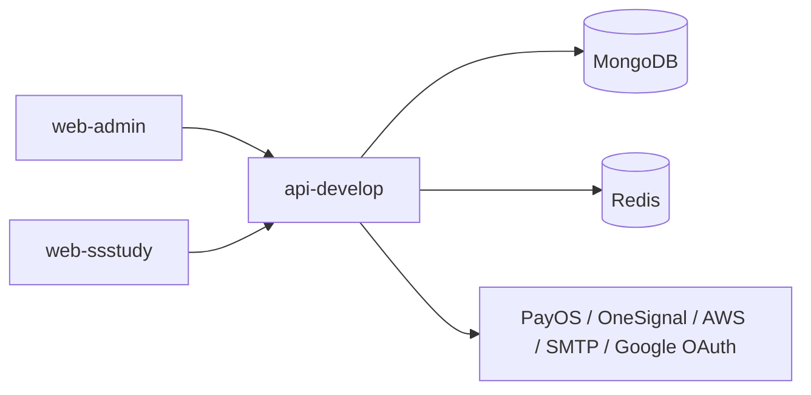

# SSStudy SRS AS-IS

## 1. Thông tin tài liệu
- Tên tài liệu: SSStudy SRS AS-IS (Reverse-engineered)
- Phiên bản: 0.1
- Trạng thái: AS-IS Reverse-engineered
- Danh sách source đã phân tích:
  - api-develop
  - web-admin
  - web-ssstudy
  - ssstudy-docs
- Phạm vi và giới hạn của tài liệu:
  - Dựa hoàn toàn trên source code hiện có và cấu hình hiện tại.
  - Không dùng giả định nghiệp vụ mới.
  - Nội dung chưa đủ bằng chứng được ghi là [CẦN XÁC NHẬN].
  - Nội dung có dấu hiệu bất nhất, thiếu xử lý hoặc khó bảo trì được ghi là [RỦI RO / TECHNICAL DEBT].

## 2. Mục đích tài liệu
- Tài liệu hạ tầng và vận hành liên quan:
  - [SSStudy Infrastructure AS-IS and Target Recommendation](../03-infrastructure/SSSTUDY-INFRASTRUCTURE-AS-IS-AND-TARGET.md)
- Mục tiêu sử dụng:
  - Làm nền tảng cho bảo trì, sửa lỗi, onboarding, QA/UAT và phân tích tác động khi thay đổi hệ thống.
  - Hỗ trợ rà soát module hiện tại trước khi refactor hoặc xây dựng lại.
- Đối tượng sử dụng:
  - BA, Developer, QA, người tiếp quản hệ thống.
- Các giới hạn khi reverse-engineer từ source cũ:
  - Một số logic nghiệp vụ phức tạp chưa được chứng minh đầy đủ bằng tài liệu hoặc test.
  - Một số route/API có thể tồn tại nhưng chưa được frontend gọi trực tiếp.
  - Một số trạng thái dữ liệu và role/permission còn chưa đủ bằng chứng để kết luận chính xác.

## 3. Tổng quan hệ thống SSStudy
- Mục tiêu hệ thống suy ra từ source:
  - Hỗ trợ quản trị nội dung và vận hành nền tảng học tập trực tuyến thông qua các module: người dùng, lớp học, tài liệu, đề thi, sách/khóa học, thanh toán, nội dung tĩnh và blog.
  - Cung cấp giao diện riêng cho quản trị viên và cho người dùng/học viên.
- Các nhóm người dùng:
  - Quản trị viên và quản lý: được xác định thông qua role trong backend và màn hình admin.
  - Giáo viên, hỗ trợ, nhân viên nội dung: được xác định qua role và scope.
  - Học viên: đăng ký, đăng nhập, xem khóa học/tài liệu/đề thi, thanh toán, xem lịch sử đơn hàng.
- Các phân hệ chính:
  - Xác thực và tài khoản.
  - Quản lý người dùng và phân quyền.
  - Quản lý lớp học và khóa học.
  - Quản lý tài liệu.
  - Quản lý đề thi và bài kiểm tra.
  - Quản lý sách, mã sách và khóa học liên quan.
  - Thanh toán, giỏ hàng và đơn hàng.
  - Blog, tin tức, trang giới thiệu và cấu hình hệ thống.
- Mối quan hệ giữa api-develop, web-admin và web-ssstudy:
  - web-admin và web-ssstudy đều gọi backend qua API.
  - api-develop là điểm tiếp nhận request, thực hiện auth/authorization rồi điều phối controller/service/model.
  - Bằng chứng: api-develop/app/routes/routes.js, web-admin/src/config/api.js, web-ssstudy/src/services/api.ts.

## 4. Kiến trúc hệ thống hiện trạng
### 4.1 Công nghệ và kiến trúc Backend
- Backend hiện tại là Node.js + Express.js.
- Kiến trúc tập trung theo controller -> service -> model.
- Routing tập trung tại api-develop/app/routes/routes.js.
- Authentication và authorization được thực hiện bằng middleware riêng:
  - CheckToken: kiểm tra token
  - CheckScope: kiểm tra scope theo controller/action
- Bằng chứng:
  - api-develop/app.js
  - api-develop/app/routes/routes.js
  - api-develop/app/routes/CheckToken.js
  - api-develop/app/routes/CheckScope.js
  - api-develop/app/controllers/AuthController.js

### 4.2 Công nghệ và kiến trúc web-admin
- web-admin là React 16 với React Router v5.
- Dùng Redux cho state auth và các module nghiệp vụ.
- Routing chính được định nghĩa trong Master.js, và auth gating bằng PrivateRoute.
- Bằng chứng:
  - web-admin/package.json
  - web-admin/src/App.js
  - web-admin/src/components/Master.js
  - web-admin/src/routing/PrivateRoute.js
  - web-admin/src/redux/auth/action.js

### 4.3 Công nghệ và kiến trúc web-ssstudy
- web-ssstudy là Next.js 16 với App Router.
- Dùng service layer để gọi API và quản lý auth cookie/local storage.
- Route được tổ chức theo thư mục src/app và component riêng cho từng module.
- Bằng chứng:
  - web-ssstudy/package.json
  - web-ssstudy/src/services/api.ts
  - web-ssstudy/src/services/authService.ts
  - web-ssstudy/src/app/auth/signin/page.tsx

### 4.4 Cơ chế frontend gọi backend
- web-admin sử dụng axios với base URL từ web-admin/src/config/api.js.
- web-ssstudy sử dụng axios instance từ web-ssstudy/src/services/api.ts.
- Backend định nghĩa các endpoint ở api-develop/app/routes/routes.js.
- Một số endpoint public được đưa vào danh sách publicRoutes trong routes.js, còn lại cần token/scope.

### 4.5 Authentication và authorization
- Hệ thống sử dụng token trong header Authorization, đồng thời có cơ chế lấy token từ cookie/localStorage ở frontend.
- Backend kiểm tra token bằng CheckToken.verify().
- Backend kiểm tra scope bằng CheckScope.checkUserScope() dựa trên config/user_scopes.json.
- Bằng chứng:
  - api-develop/app/routes/CheckToken.js
  - api-develop/app/routes/CheckScope.js
  - api-develop/config/user_scopes.json
  - api-develop/config/app.js
  - web-ssstudy/src/services/api.ts
  - web-admin/src/redux/auth/action.js

### 4.6 Cấu hình môi trường/tích hợp ngoài
- Có cấu hình môi trường cho development/staging/production ở web-ssstudy.
- Backend có cấu hình app, config, môi trường và dependency cho MongoDB, Redis, PayOS, OneSignal, AWS SDK, SMTP, Google OAuth.
- Bằng chứng:
  - api-develop/config/app.js
  - api-develop/package.json
  - web-ssstudy/src/config/environments/development.ts
  - web-ssstudy/src/config/environments/production.ts
  - web-ssstudy/src/config/environments/staging.ts

## 5. Vai trò và phân quyền

| Role | Permission | Chức năng/màn hình áp dụng | API liên quan | Bằng chứng source | Ghi chú |
|---|---|---|---|---|---|
| ADMIN | Được phép truy cập toàn bộ theo logic check scope | Màn hình quản trị chính, quản lý nội dung, người dùng, đơn hàng, cấu hình | /auth/signin, /user/profile, /classroom-list, /book/*, /order/*, /blog/* | api-develop/config/app.js, api-develop/config/user_scopes.json, api-develop/app/routes/CheckScope.js | Quyền được xác nhận qua role ADMIN có toàn quyền trong config |
| MANAGER | Scope rộng cho quản trị nội dung và vận hành | Quản lý lớp học, document, question, registration, setting, testing, message, bill, report_bug | /classroom/*, /document/*, /question/*, /setting/*, /bill/* | api-develop/config/user_scopes.json | Scope được xác định rõ trong config |
| TEACHER | Scope cho nội dung và quản lý lớp học | Quản lý bài giảng, lớp học, đề thi, câu hỏi, review, user, bill | /chapter/*, /classroom/*, /exam/*, /question/* | api-develop/config/user_scopes.json | Scope được xác định rõ |
| SUPPORTER | Scope hỗ trợ nội dung và lớp học | Hỗ trợ quản lý lớp học, tài liệu, câu hỏi, review | /classroom/*, /document/*, /exam/* | api-develop/config/user_scopes.json | Scope được xác định rõ |
| STUDENT | [CẦN XÁC NHẬN] | Đăng nhập, xem lớp học/tài liệu/đề thi, đặt hàng, xem lịch sử | /auth/signin, /order/list, /cart/*, /classroom-list | api-develop/app/controllers/AuthController.js, web-ssstudy/src/services/authService.ts | Role student có bằng chứng trong đăng ký và auth, nhưng mapping scope cụ thể chưa đầy đủ |
| ACCOUNTANT / SALE_MANAGER / SALE_STAFF / MEDIA / TRAINING_STAFF | [CẦN XÁC NHẬN] | [CẦN XÁC NHẬN] | [CẦN XÁC NHẬN] | api-develop/config/app.js | Có khai báo role nhưng chưa thấy mapping chức năng rõ trong source |

## 6. Danh sách phân hệ nghiệp vụ
### 6.1 Authentication & Account
- Mục đích nghiệp vụ: đăng ký, đăng nhập, reset mật khẩu, lấy thông tin tài khoản.
- Actor sử dụng: học viên, quản trị viên, giáo viên.
- Màn hình Admin liên quan: /login, /profile, /changepassword.
- Màn hình người dùng liên quan: /auth/signin, /auth/signup, /auth/forgot-password, /account/change-password.
- API chính: /auth/signin, /auth/signup, /forgot-password, /user/profile, /user/update-profile, /user/change-password.
- Dữ liệu/entity chính: User, Token, Key.
- Mức độ xác minh: Đã xác nhận.
- Bằng chứng: AuthController.js, web-admin/src/redux/auth/action.js, web-ssstudy/src/services/authService.ts.

### 6.2 Classroom & Course Management
- Mục đích nghiệp vụ: quản lý lớp học, khóa học, nhóm lớp, thành viên, mã truy cập, báo cáo.
- Actor sử dụng: admin, teacher, supporter, student.
- Màn hình Admin liên quan: /classroom-online, /classroom-offline, /classroom/group, /classroom/:id/report, /classroom/:id/member.
- Màn hình người dùng liên quan: /khoa-hoc, /khoa-hoc/[id], /sach-id/[alias]/khoa-hoc.
- API chính: /classroom-list, /classroom-view, /classroom-group-list, /classroom-reviews, /classroom-chapter-category.
- Dữ liệu/entity chính: Classroom, ClassroomGroup, StudentClassroom, ClassroomCode, ClassroomReview, ChapterClassroom.
- Mức độ xác minh: Đã xác nhận.
- Bằng chứng: ClassroomController.js, web-admin/src/components/Master.js, web-ssstudy/src/app/khoa-hoc.

### 6.3 Learning Content & Document
- Mục đích nghiệp vụ: quản lý chapter, category, lesson, tài liệu và nội dung học tập.
- Actor sử dụng: admin, teacher, supporter, student.
- Màn hình Admin liên quan: /chapter, /lesson, /document, /document-category.
- Màn hình người dùng liên quan: /tai-lieu, /tai-lieu/[id], /lesson, /khoa-hoc.
- API chính: /document/list-public, /document/detail, /document/show, /chapter/list, /category/list.
- Dữ liệu/entity chính: Chapter, Category, Document, DocumentCategory.
- Mức độ xác minh: Đã xác nhận.
- Bằng chứng: DocumentController.js, ChapterController.js, CategoryController.js.

### 6.4 Exam & Testing
- Mục đích nghiệp vụ: quản lý đề thi, câu hỏi, bài kiểm tra và chấm điểm.
- Actor sử dụng: admin, teacher, student.
- Màn hình Admin liên quan: /exam, /exam-word, /testing, /question.
- Màn hình người dùng liên quan: /thi-thu, /thi-thu/word-exam/[id], /thi-thu/result/[id].
- API chính: /exam/*, /exam-word/*, /testing/*, /question/*.
- Dữ liệu/entity chính: Exam, ExamWord, Question, QuestionWord, Testing, UserTesting, ScoreWordHistory.
- Mức độ xác minh: Đã xác nhận.
- Bằng chứng: ExamWordController.js, routes.js, web-ssstudy/src/app/thi-thu.

### 6.5 Book & Book ID / Course Bundles
- Mục đích nghiệp vụ: quản lý sách, mã sách, khóa học gắn với sách, mã truy cập sách.
- Actor sử dụng: admin, student.
- Màn hình Admin liên quan: /book, /book-id, /book-id-course.
- Màn hình người dùng liên quan: /sach, /sach/[alias], /sach-id, /sach-id/[alias].
- API chính: /book/*, /book-id/*, /book-id-course/*.
- Dữ liệu/entity chính: Book, BookId, BookIdCourse, BookReview.
- Mức độ xác minh: Đã xác nhận.
- Bằng chứng: routes.js, web-ssstudy/src/app/sach, web-ssstudy/src/app/sach-id.

### 6.6 Order, Cart & Payment
- Mục đích nghiệp vụ: thêm vào giỏ hàng, tạo đơn hàng, thanh toán, xem lịch sử đơn hàng.
- Actor sử dụng: student, admin.
- Màn hình Admin liên quan: /order, /credit, /coupon.
- Màn hình người dùng liên quan: /gio-hang, /thanh-toan/[id], /account/order-history.
- API chính: /cart/*, /order/*, /credit/*.
- Dữ liệu/entity chính: Cart, CartItem, Order, OrderItem, CreditLog, OrderPaymentCode.
- Mức độ xác minh: Đã xác nhận.
- Bằng chứng: OrderController.js, web-ssstudy/src/app/gio-hang/page.tsx, web-ssstudy/src/app/account/order-history/page.tsx.

### 6.7 Blog, Content Pages & Configuration
- Mục đích nghiệp vụ: hiển thị blog, bài viết, tin tức, nội dung tĩnh, cấu hình giao diện.
- Actor sử dụng: admin, user.
- Màn hình Admin liên quan: /blog, /blog-category, /settings, /teachers-team, /admin-ceo.
- Màn hình người dùng liên quan: /ban-tin, /tin-tuc/[alias]/[slug], /gioi-thieu, /giao-vien.
- API chính: /blog/*, /blog-category/*, /about/*, /page/*, /ceo-page/*, /teachers-team/*.
- Dữ liệu/entity chính: BlogPost, BlogCategory, Page, Setting, TeachersTeam, CeoPage.
- Mức độ xác minh: Đã xác nhận.
- Bằng chứng: routes.js, web-ssstudy/src/app/tin-tuc/[alias]/[slug]/page.tsx, web-admin/src/components/Master.js.

### 6.8 Book / Book ID / Course Bundle
- Mục đích nghiệp vụ: quản lý sách, mã sách, khóa học bundle và ownership.
- Actor sử dụng: admin, student.
- Màn hình Admin liên quan: /book, /book-id, /book-id-course.
- Màn hình người dùng liên quan: /sach, /sach-id, /account/my-course.
- API chính: /book/*, /book-id/*, /book-id-course/*.
- Dữ liệu/entity chính: Book, BookId, BookIdCourse, StudentBookId.
- Mức độ xác minh: Đã xác nhận.
- Bằng chứng: BookController.js, BookIdController.js, BookIdCourseController.js.

## 7. Danh sách module SRS AS-IS
- [docs/01-srs/modules/01-authentication-tai-khoan-phan-quyen.md](modules/01-authentication-tai-khoan-phan-quyen.md)
- [docs/01-srs/modules/02-classroom-khoa-hoc.md](modules/02-classroom-khoa-hoc.md)
- [docs/01-srs/modules/03-document-tai-lieu.md](modules/03-document-tai-lieu.md)
- [docs/01-srs/modules/04-exam-testing.md](modules/04-exam-testing.md)
- [docs/01-srs/modules/05-order-cart-payment.md](modules/05-order-cart-payment.md)
- [docs/01-srs/modules/06-content-pages-configuration.md](modules/06-content-pages-configuration.md)
- [docs/01-srs/modules/07-book-book-id.md](modules/07-book-book-id.md)

## 8. Trạng thái hoàn thiện SRS AS-IS
- Danh sách module hoàn thành: Authentication, Classroom, Document, Exam, Order/Cart/Payment, Content pages/blog/configuration và Book/Book ID/Course bundle.
- Module/chức năng chưa đủ bằng chứng: các endpoint phụ trợ về report-bug, bill, link-payment, iframe, message, action-log và label vẫn ở mức [CẦN XÁC NHẬN]; chưa tạo module 08 riêng vì phạm vi chưa đủ bằng chứng và chưa có workflow độc lập rõ ràng.
- Route/API/entity chưa map: một số route web-admin/web-ssstudy và endpoint backend vẫn chưa được gắn vào module SRS đầy đủ, đặc biệt ở các module phụ trợ và các route nội dung/notification chưa có caller frontend rõ ràng.
- Rủi ro ưu tiên cao: PayOS webhook/state machine thanh toán, ownership/book-id lifecycle, content config JSON và scope permission admin CRUD cho module 06/07.
- Câu hỏi cần xác nhận với nghiệp vụ: scope role chi tiết, coupon rule, trạng thái thanh toán thực tế, lifecycle book-id bundle, và quy trình xử lý report/link-payment/bill.
- Đề xuất bước tiếp theo sau reverse-engineering: ưu tiên xác nhận payment/webhook, scope permission và ownership logic trước khi mở rộng SRS hoặc refactor hệ thống.

## 9. Mức độ hoàn thiện SRS AS-IS
- Phần có bằng chứng rõ: auth, classroom, document, exam, order/cart/payment, content/blog/configuration và book/book-id/course bundle.
- Phần cần xác nhận nghiệp vụ: scope role chi tiết, coupon rule, lifecycle payment và ownership/book-id rules.
- Phần chưa thể reverse-engineer hoàn toàn: reporting/import-export/integration/scheduler và các endpoint phụ trợ chưa có caller frontend rõ ràng.
- Thứ tự đề xuất xử lý rủi ro cao: PayOS/webhook và state machine thanh toán -> permission/scope mapping -> content config và book-id ownership -> reporting/integration phụ trợ.

## 10. Danh sách màn hình
### 7.1 Màn hình web-admin

| Tên màn hình | Route | Component/Page | Mục đích | Chức năng chính | API sử dụng | Role/Permission | Bằng chứng source | Ghi chú |
|---|---|---|---|---|---|---|---|---|
| Đăng nhập admin | /login | Login | Đăng nhập vào khu vực quản trị | Gửi auth/signin | /auth/signin | [CẦN XÁC NHẬN] | web-admin/src/components/Login.js, web-admin/src/redux/auth/action.js | Có route login ở App.js |
| Dashboard | / | Home | Trang chủ admin | Tổng quan hệ thống | [CẦN XÁC NHẬN] | [CẦN XÁC NHẬN] | web-admin/src/components/Master.js | Route có nhưng chi tiết chưa xác định |
| Quản lý lớp học | /classroom-online, /classroom-offline | Classroom, ClassroomOffline | Quản lý lớp học | List, edit, detail, member, report | /classroom-list, /classroom-view | Scope theo role | web-admin/src/components/Master.js, ClassroomController.js | Có nhiều thao tác admin |
| Quản lý đề thi | /exam, /exam-word | Exam, ExamWordList | Quản lý đề thi | List/create/edit/report | /exam/*, /exam-word/* | Scope theo role | web-admin/src/components/Master.js | Có route riêng |
| Quản lý tài liệu | /document, /document-category | Document, DocumentCategory | Quản lý tài liệu | List/create/edit/category | /document/* | Scope theo role | web-admin/src/components/Master.js | Có route riêng |
| Quản lý đơn hàng | /order | Order | Quản lý đơn hàng | List/detail/status | /order/* | Scope theo role | web-admin/src/components/Master.js, OrderController.js | Có route riêng |
| Quản lý nội dung tĩnh | /settings, /blog, /blog-category | Setting, Blog, BlogCategory | Quản lý cấu hình, blog, page | Cập nhật nội dung | /setting/*, /blog/* | Scope theo role | web-admin/src/components/Master.js | Có route riêng |

### 7.2 Màn hình web-ssstudy

| Tên màn hình | Route | Component/Page | Mục đích | Chức năng chính | API sử dụng | Role/Permission | Bằng chứng source | Ghi chú |
|---|---|---|---|---|---|---|---|---|
| Đăng nhập người dùng | /auth/signin | page.tsx | Đăng nhập học viên | Kiểm tra thông tin, lưu token/cookie | /auth/signin | Public/Authenticated | web-ssstudy/src/app/auth/signin/page.tsx | Có validation client-side |
| Đăng ký | /auth/signup | page.tsx | Tạo tài khoản mới | Validate và submit signup | /auth/signup | Public | web-ssstudy/src/app/auth/signup/page.tsx | Có validation bằng yup |
| Khóa học | /khoa-hoc, /khoa-hoc/[id] | Course pages | Xem danh sách/chi tiết khóa học | List/filter/detail | /classroom-list, /classroom-view | Public/Authenticated | web-ssstudy/src/app/khoa-hoc | Dùng service courseService |
| Sách | /sach, /sach/[alias] | Book pages | Xem sách và chi tiết | List/detail | /book/list, /book/detail | Public | web-ssstudy/src/app/sach | Dùng bookService |
| Tài liệu | /tai-lieu, /tai-lieu/[id] | Document pages | Xem tài liệu | List/detail/show | /document/list-public, /document/detail | Public/Authenticated | web-ssstudy/src/app/tai-lieu | Dùng documentService |
| Thi thử | /thi-thu, /thi-thu/word-exam/[id] | Exam pages | Làm bài thi/thử | List, start, result | /exam-word/*, /testing/* | Authenticated | web-ssstudy/src/app/thi-thu | Có route result |
| Giỏ hàng | /gio-hang | page.tsx | Quản lý đơn hàng trước khi thanh toán | Thêm/xóa/sửa sản phẩm | /cart/* | Authenticated | web-ssstudy/src/app/gio-hang/page.tsx | Có flow thanh toán tiếp |
| Lịch sử đơn hàng | /account/order-history | page.tsx | Xem đơn hàng | List/detail | /order/list, /order/detail | Authenticated | web-ssstudy/src/app/account/order-history/page.tsx | Có mapping API |
| Tin tức | /ban-tin, /tin-tuc/[alias]/[slug] | Blog pages | Xem bài viết/tin tức | List/detail | /blog/list-public, /blog/detail | Public | web-ssstudy/src/app/ban-tin, web-ssstudy/src/app/tin-tuc | Dùng blogService |
| Giáo viên | /giao-vien, /giao-vien/[alias] | Teacher pages | Xem thông tin giáo viên | List/detail | /teachers-team/detail, /teacher-list | Public | web-ssstudy/src/app/giao-vien | Dùng teacher list service |

## 8. Luồng nghiệp vụ tổng quan
### 8.1 Đăng nhập/đăng xuất
- Actor: student, admin, teacher.
- Điều kiện bắt đầu: người dùng nhập email/số điện thoại/mã học sinh và mật khẩu hoặc dùng Google auth.
- Luồng chính:
  1. Frontend thu thập thông tin đăng nhập.
  2. Gửi request tới /auth/signin hoặc /auth/google-auth.
  3. Backend kiểm tra thông tin và tạo token.
  4. Frontend lưu token/cookie và chuyển hướng.
- Luồng thay thế/ngoại lệ:
  - Sai thông tin => backend trả lỗi.
  - Token không hợp lệ => middleware CheckToken trả 401.
- API và backend liên quan: /auth/signin, /auth/google-auth, /forgot-password, CheckToken, AuthController.
- Kết quả xử lý: người dùng được xác thực và có thể gọi các API cần auth.
- Bằng chứng source: AuthController.js, web-ssstudy/src/app/auth/signin/page.tsx, web-admin/src/redux/auth/action.js.
- Điểm cần xác nhận: flow logout thực tế ở frontend có thể không được thể hiện đầy đủ trong source hiện tại.

### 8.2 Đăng ký tài khoản
- Actor: học viên mới.
- Điều kiện bắt đầu: người dùng nhập email, password, phone, fullname.
- Luồng chính:
  1. Frontend gửi /auth/signup.
  2. Backend validate email/phone/password.
  3. Nếu hợp lệ, tạo User với role student và trả token.
- Luồng thay thế/ngoại lệ:
  - số điện thoại/email đã tồn tại => trả lỗi.
  - password không đúng format => trả lỗi.
- API và backend liên quan: /auth/signup, AuthController.signup.
- Kết quả xử lý: tài khoản student được tạo.
- Bằng chứng source: AuthController.js.
- Điểm cần xác nhận: quy trình kích hoạt email xác thực chưa thấy trong source hiện tại.

### 8.3 Quản lý lớp học và khóa học
- Actor: admin/teacher/supporter/student.
- Điều kiện bắt đầu: có dữ liệu classroom, subject, teacher, member.
- Luồng chính:
  1. FE gọi /classroom-list hoặc /classroom-view.
  2. Backend lọc theo nhiều tham số như keyword, subject, teacher, price, level.
  3. Trả về danh sách lớp và tổng số bản ghi.
  4. Admin/teacher có thể mở các màn hình member/report/code.
- Luồng thay thế/ngoại lệ:
  - Không có dữ liệu => trả list rỗng.
  - Giá trị filter không hợp lệ => code xử lý mặc định.
- API và backend liên quan: /classroom-list, /classroom-view, /classroom-group-list, ClassroomController.
- Kết quả xử lý: danh sách, chi tiết, báo cáo lớp học và mã truy cập được phục vụ.
- Bằng chứng source: ClassroomController.js, web-admin/src/components/Master.js.
- Điểm cần xác nhận: flow enroll hoặc join classroom chưa được chứng minh đầy đủ qua route hiện tại.

### 8.4 Quản lý tài liệu và nội dung học tập
- Actor: admin/teacher/supporter/student.
- Điều kiện bắt đầu: có tài liệu được tạo và gắn với category/classroom.
- Luồng chính:
  1. FE gọi /document/list-public hoặc /document/detail.
  2. Backend filter theo main_category/sub_category/document_type.
  3. Trả về danh sách và chi tiết tài liệu.
- Luồng thay thế/ngoại lệ:
  - Tài liệu không tồn tại => trả lỗi.
  - Tài liệu Pro chưa phát hành => trả lỗi hoặc kiểm soát theo classroom.
- API và backend liên quan: /document/list-public, /document/detail, /document/show, DocumentController.
- Kết quả xử lý: người dùng xem tài liệu hoặc admin quản lý danh mục/tài liệu.
- Bằng chứng source: DocumentController.js, web-ssstudy/src/app/tai-lieu.
- Điểm cần xác nhận: quyền xem tài liệu Pro/Free và điều kiện classroom chưa được mô tả đầy đủ trong source.

### 8.5 Quản lý đề thi và bài kiểm tra
- Actor: admin/teacher/student.
- Điều kiện bắt đầu: có exam/exam-word/testing được tạo.
- Luồng chính:
  1. FE gọi /exam-word/list hoặc /exam-word/get-by-id.
  2. Backend lấy đề thi và câu hỏi liên quan.
  3. FE cho phép làm bài và nộp bài.
- Luồng thay thế/ngoại lệ:
  - Mật khẩu đề thi không đúng => checkPassword.
  - Có đáp án/giải thích => route explanation/scoring.
- API và backend liên quan: /exam-word/list, /exam-word/get-by-id, /exam-word/check-password, /exam-word/scoring, /exam-word/report, ExamWordController.
- Kết quả xử lý: bài thi được lấy, chấm điểm và báo cáo kết quả.
- Bằng chứng source: routes.js, ExamWordController.js, web-ssstudy/src/app/thi-thu.
- Điểm cần xác nhận: workflow nộp bài và lưu kết quả cụ thể cần kiểm tra sâu hơn.

### 8.6 Thanh toán và đơn hàng
- Actor: student, admin.
- Điều kiện bắt đầu: có giỏ hàng hoặc đơn hàng mới.
- Luồng chính:
  1. FE gọi /cart/add hoặc /cart/detail.
  2. FE tạo đơn hàng qua /order/create.
  3. Backend tạo order và xử lý thanh toán qua payment info hoặc PayOS.
- Luồng thay thế/ngoại lệ:
  - Thanh toán ngân hàng chưa hoàn thành => status PENDING.
  - PayOS link tạo lỗi => code catch và trả dữ liệu không đầy đủ.
- API và backend liên quan: /cart/*, /order/*, /credit/*, OrderController.js, CreditController.js.
- Kết quả xử lý: đơn hàng được tạo và có thể thanh toán.
- Bằng chứng source: OrderController.js, web-ssstudy/src/app/gio-hang/page.tsx.
- Điểm cần xác nhận: trạng thái và nghiệp vụ hoàn tất đơn hàng cần kiểm tra sâu hơn.

### 8.7 Blog và nội dung tĩnh
- Actor: admin, user.
- Điều kiện bắt đầu: có bài viết, category hoặc page content.
- Luồng chính:
  1. FE gọi /blog/list-public, /blog/detail, /blog-category/list-public.
  2. Backend trả dữ liệu nội dung.
  3. FE render trang tin tức/giới thiệu/giáo viên.
- Luồng thay thế/ngoại lệ:
  - Không có dữ liệu => response rỗng.
- API và backend liên quan: /blog/*, /blog-category/*, /about/*, /page/*.
- Kết quả xử lý: nội dung được hiển thị trên web-ssstudy và quản lý bởi admin.
- Bằng chứng source: routes.js, web-ssstudy/src/app/ban-tin, web-admin/src/components/setting.

## 9. Mapping UI – API – Backend

| Màn hình | Route | Chức năng | API | Method | Controller | Service | Entity/Table | Role/Permission | Tình trạng xác minh | Ghi chú |
|---|---|---|---|---|---|---|---|---|---|---|
| Đăng nhập admin | /login | Đăng nhập quản trị | /auth/signin | POST | AuthController | UserService | User, Token | Role-based scope | Đã xác nhận | Có frontend và backend |
| Đăng nhập người dùng | /auth/signin | Đăng nhập học viên | /auth/signin | POST | AuthController | UserService | User, Token | Public/Authenticated | Đã xác nhận | Có validation và cookie/token |
| Đăng ký | /auth/signup | Tạo tài khoản | /auth/signup | POST | AuthController | UserService | User | Public | Đã xác nhận | Validate phone/email/password |
| Khóa học | /khoa-hoc | Xem khóa học | /classroom-list | POST | ClassroomController | ClassroomService | Classroom | Public/Authenticated | Đã xác nhận | Có filter keyword/subject/price |
| Chi tiết khóa học | /khoa-hoc/[id] | Xem chi tiết lớp học | /classroom-view | POST | ClassroomController | ClassroomService | Classroom | Public/Authenticated | Đã xác nhận | Có route riêng |
| Tài liệu | /tai-lieu | Xem danh sách tài liệu | /document/list-public | POST | DocumentController | UploadService/DocumentModel | Document | Public/Authenticated | Đã xác nhận | Có filter và pagination |
| Tài liệu chi tiết | /tai-lieu/[id] | Xem tài liệu | /document/detail | POST | DocumentController | UploadService | Document | Public/Authenticated | Đã xác nhận | Có quyền Pro/Free logic |
| Thi thử | /thi-thu | Danh sách đề thi | /exam-word/list | POST | ExamWordController | ExamWord | ExamWord | Authenticated | Đã xác nhận | Có route list |
| Thi thử chi tiết | /thi-thu/word-exam/[id] | Làm bài thi | /exam-word/get-by-id | GET | ExamWordController | ExamWord | ExamWord, QuestionWord | Authenticated | Đã xác nhận | Có check password/scoring |
| Giỏ hàng | /gio-hang | Tạo/chỉnh sửa giỏ hàng | /cart/* | POST | CartController | CartService | Cart, CartItem | Authenticated | Đã xác nhận | Có add/detail/update |
| Đơn hàng | /account/order-history | Xem lịch sử đơn hàng | /order/list, /order/detail | POST | OrderController | OrderService | Order, OrderItem | Authenticated | Đã xác nhận | Có filter và paging |
| Thanh toán | /thanh-toan/[id] | Thanh toán đơn hàng | /order/payment-info, /order/payment_payos | POST | OrderController | OrderService, CreditService | Order, OrderPaymentCode | Authenticated | Đã xác nhận | Có PayOS integration |
| Blog | /ban-tin | Xem danh sách bài viết | /blog/list-public | POST | BlogController | BlogService | BlogPost | Public | Đã xác nhận | Có list-public |
| Blog chi tiết | /tin-tuc/[alias]/[slug] | Xem chi tiết bài viết | /blog/detail | POST | BlogController | BlogService | BlogPost | Public | Đã xác nhận | Có detail route |

## 10. Đối tượng dữ liệu nghiệp vụ chính
- User: tài khoản người dùng, gồm thông tin cá nhân, nhóm vai trò, trạng thái, số dư, mã học sinh.
- Classroom: lớp học, khóa học, có thông tin giáo viên, môn học, nhóm, mức giá, trạng thái.
- Subject / Chapter / Category: tổ chức nội dung học tập theo môn/chương/danh mục.
- Document / DocumentCategory: tài liệu và phân loại tài liệu.
- Exam / ExamWord / Question / QuestionWord: đề thi, câu hỏi, dạng word exam.
- Testing / UserTesting: bài kiểm tra và kết quả làm bài.
- Book / BookId / BookIdCourse: sách, mã sách và bundle khóa học liên quan.
- Cart / CartItem / Order / OrderItem: giỏ hàng và đơn hàng.
- CreditLog / Billing / BillingHistory: tích điểm, thanh toán và lịch sử tài chính.
- BlogPost / BlogCategory / Page / Setting / TeachersTeam / CeoPage: nội dung tĩnh và cấu hình website.
- Quan hệ dữ liệu:
  - User có thể liên quan tới Classroom qua StudentClassroom hoặc teacher_id.
  - Order liên quan tới OrderItem và User.
  - BookId/BookIdCourse liên quan tới Book/Classroom.
  - Document có thể gắn với classroom/category.
- Trạng thái/enum/flag quan trọng:
  - appConfig.STATUS.ACTIVE/INACTIVE
  - appConfig.TESTING_STATUS.PENDING/DONE
  - appConfig.USER_GROUP
  - appConfig.QUESTION_TYPE
  - appConfig.EXAM_TYPE / EXAM_CREATING_TYPE
- Module và API sử dụng:
  - Auth, Classroom, Order, Document, ExamWord, Blog.
- Nội dung chưa chắc chắn:
  - Một số quan hệ dữ liệu và trạng thái nghiệp vụ chưa có đủ bằng chứng để mô tả chi tiết.
  - [CẦN XÁC NHẬN] về các trạng thái đơn hàng hoặc trạng thái lớp học cụ thể.

## 11. Yêu cầu phi chức năng nhận diện được
### 11.1 Bảo mật
- Có kiểm tra token và scope ở backend.
- Có validation cho signup và password.
- Bằng chứng: CheckToken.js, CheckScope.js, AuthController.js.

### 11.2 Phân quyền
- Quyền được kiểm soát bằng config/user_scopes.json và middleware CheckScope.
- Bằng chứng: CheckScope.js, user_scopes.json.

### 11.3 Logging
- Có middleware logging sau auth, và có logError trong controller.
- Bằng chứng: api-develop/app/routes/routes.js, các controller sử dụng logError.

### 11.4 Exception handling
- Controller thường bắt exception và trả về response lỗi.
- Bằng chứng: AuthController.js, ClassroomController.js, OrderController.js.

### 11.5 Upload/download/import/export
- Có upload bằng multer và upload service.
- Có export/import trong một số module như book-id/exam-word.
- Bằng chứng: routes.js, UploadService.js, BookIdController.js, ExamWordController.js.

### 11.6 Pagination/filter/search
- Nhiều controller có page/limit/filter/keyword/sort.
- Bằng chứng: ClassroomController.js, DocumentController.js, OrderController.js.

### 11.7 Cache/scheduler/job
- Có node-schedule và Redis service.
- Có startSuspensionWorker và AutoIncrementService tại startup.
- Bằng chứng: api-develop/app.js, ScheduleService.js, BookIdSuspensionService.js, AutoIncrementService.js.

### 11.8 Cấu hình môi trường
- Có config riêng cho môi trường và file .env/.env.staging/.env.production trong web-ssstudy.
- Bằng chứng: web-ssstudy/.env*, web-ssstudy/src/config/environments/*.

### 11.9 Build/deploy
- Có package.json scripts build/start và Docker/Jenkins files ở từng source.
- Bằng chứng: api-develop/package.json, web-admin/package.json, web-ssstudy/package.json, Dockerfile/Jenkinsfile.

## 12. Technical debt và rủi ro
- Rủi ro bảo mật:
  - Token và scope được kiểm soát, nhưng frontend vẫn có fallback lưu token vào localStorage/cookie ở web-ssstudy; điều này có thể làm tăng exposure của token.
  - Bằng chứng: web-ssstudy/src/app/auth/signin/page.tsx, web-ssstudy/src/services/api.ts.
- Rủi ro dữ liệu:
  - Một số trạng thái và enum chưa được mô tả đầy đủ qua schema/documentation hiện tại.
  - Bằng chứng: api-develop/app/models và api-develop/config/app.js.
- API/màn hình chưa map được:
  - Nhiều endpoint trong routes.js chưa được xác nhận là có frontend caller hay không.
  - Bằng chứng: api-develop/app/routes/routes.js.
- Validation không đồng nhất:
  - FE và BE đều có validation, nhưng không thấy một layer validation chung thống nhất ở toàn hệ thống.
  - Bằng chứng: AuthController.js, web-ssstudy/src/app/auth/signin/page.tsx.
- Hard-code/configuration khó bảo trì:
  - Có nhiều URL, token, thông tin ngân hàng và cấu hình nhúng trực tiếp trong config/app.js.
  - Bằng chứng: api-develop/config/app.js.
- Logic trùng lặp:
  - web-admin và web-ssstudy đều triển khai luồng auth và màn hình tương tự, nhưng không thấy một shared contract/abstraction thống nhất.
  - Bằng chứng: web-admin/src/redux/auth/action.js, web-ssstudy/src/services/authService.ts.
- Thiếu xử lý lỗi:
  - Một số controller có catch lỗi nhưng vẫn có trường hợp trả response không đồng nhất.
  - Bằng chứng: OrderController.js, ExamWordController.js.
- Thiếu kiểm tra quyền:
  - Quyền được kiểm soát ở backend, nhưng phạm vi chi tiết của từng role chưa được mapping đầy đủ vào từng màn hình/endpoint.
  - Bằng chứng: user_scopes.json, web-admin/src/components/Master.js.

## 13. Câu hỏi cần xác nhận
### 13.1 Nghiệp vụ
- Quy trình phê duyệt, hoàn thành và hủy đơn hàng có đúng với mong đợi kinh doanh không?
- Quy định truy cập tài liệu Pro/Free và classroom-based access có phải là nghiệp vụ chính thức không?
- Các luồng teacher/supporter/admin phân công và quản trị lớp học có được quy định rõ không?

### 13.2 Dữ liệu
- Các trạng thái của Order, Classroom, ExamWord và Testing có ý nghĩa nghiệp vụ chính xác như thế nào?
- Các quan hệ giữa User-Classroom-BookId-Order có cần được làm rõ không?
- Các enum và flag như EXAM_TYPE, QUESTION_TYPE, TESTING_STATUS có được dùng thống nhất không?

### 13.3 Phân quyền
- Role STUDENT và các role khác có scope cụ thể nào trên từng endpoint không?
- Có màn hình admin nào hiện đang hiển thị/ẩn chức năng dựa trên role nhưng chưa thấy rule rõ ở backend không?

### 13.4 API/tích hợp
- Các endpoint không thấy frontend gọi có đang được dùng bởi hệ thống khác, cron job, mobile app, hoặc tích hợp nội bộ không?
- PayOS, OneSignal, AWS và Google OAuth có được cấu hình như thế nào ở môi trường production?

### 13.5 Vận hành/deploy
- Môi trường staging/production có cấu hình khác nhau và có tác động gì tới auth/API không?
- Có quy trình backup/monitoring cho MongoDB/Redis không được thấy trong source hiện tại?
