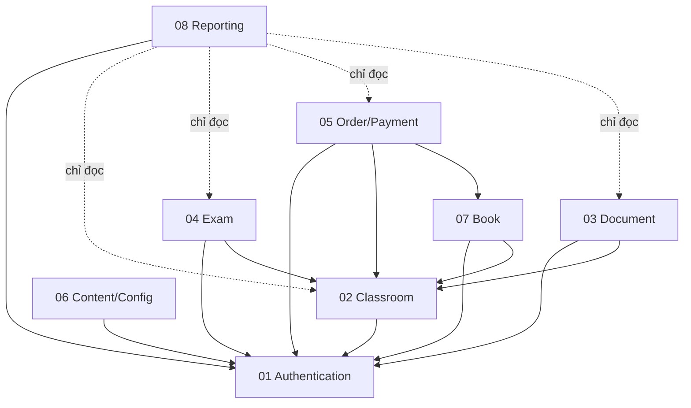

# Kế hoạch đặc tả module — SSStudy

## 1. Tổng quan 8 module

| STT | Module | Mục tiêu nghiệp vụ | Màn hình quản trị đề xuất | Màn hình người học đề xuất | API chính đề xuất | Model dữ liệu chính | Phụ thuộc module | Độ ưu tiên |
|---|---|---|---|---|---|---|---|---|
| 1 | Authentication / Tài khoản / Phân quyền | Xác thực người dùng, phân quyền truy cập, quản lý hồ sơ và mật khẩu | `/admin/login`, `/admin/users`, `/admin/roles` | `/login`, `/signup`, `/forgot-password`, `/profile` | `POST /api/auth/login`, `POST /api/auth/register`, `GET /api/users/me` | User, Role, Permission, RefreshToken | Không phụ thuộc | Cao — nền tảng toàn hệ thống |
| 2 | Classroom / Khóa học | Quản lý khóa học, chương, bài học, thành viên và tiến độ học | `/admin/courses`, `/admin/courses/{id}/members` | `/courses`, `/courses/{id}`, `/courses/{id}/curriculum` | `GET /api/courses`, `POST /api/courses/{id}/enroll` | Course, Chapter, Enrollment, Review | Authentication | Cao |
| 3 | Document / Tài liệu | Quản lý tài liệu, danh mục và quyền truy cập nội dung | `/admin/documents`, `/admin/document-categories` | `/documents`, `/documents/{id}` | `GET /api/documents`, `GET /api/documents/{id}` | Document, DocumentCategory, FileAsset | Authentication, Classroom | Trung bình |
| 4 | Exam / Kiểm tra | Quản lý đề thi, câu hỏi, lượt làm bài và kết quả | `/admin/exams`, `/admin/questions` | `/exams`, `/exams/{id}`, `/exams/{id}/attempt` | `GET /api/exams`, `POST /api/exams/{id}/attempts`, `POST /api/attempts/{id}/submit` | Exam, Question, ExamAttempt, ExamResult | Authentication, Classroom | Trung bình |
| 5 | Order / Giỏ hàng / Thanh toán | Quản lý giỏ hàng, đơn hàng, thanh toán, coupon và ví credit | `/admin/orders`, `/admin/coupons`, `/admin/credits` | `/cart`, `/checkout`, `/account/orders`, `/account/credit` | `GET /api/cart`, `POST /api/orders`, `POST /api/webhooks/payments` | Cart, Order, OrderItem, PaymentTransaction, CreditWallet, Coupon | Authentication, Classroom, Book | Cao |
| 6 | Content / Cấu hình | Quản lý blog, trang tĩnh, banner và cấu hình hệ thống | `/admin/blog`, `/admin/pages`, `/admin/settings` | `/blog`, `/blog/{alias}/{slug}`, `/about`, `/teachers` | `GET /api/blog/posts`, `GET /api/pages/{slug}` | BlogPost, BlogCategory, PageContent, SiteConfig | Authentication | Cao |
| 7 | Book / Mã kích hoạt | Quản lý sách, mã kích hoạt và bundle khóa học | `/admin/books`, `/admin/book-codes` | `/books`, `/books/{alias}`, `/activate` | `GET /api/books`, `POST /api/book-codes/activate` | Book, BookCode, Bundle, Activation | Authentication, Classroom, Order | Trung bình |
| 8 | Reporting / Import / Export / Scheduler | Báo cáo vận hành, import/export dữ liệu, job định kỳ và cấu hình tích hợp | `/admin/reports`, `/admin/imports`, `/admin/exports`, `/admin/jobs` | Không có màn hình người học | `GET /api/admin/reports/*`, `POST /api/admin/imports/*`, `GET /api/admin/jobs` | ReportDefinition, ImportBatch, ExportRequest, JobExecution, IntegrationConfig | Authentication và tất cả module (chỉ đọc) | Cao |

---

## 2. Thứ tự phát triển đề xuất

### Giai đoạn 1 — Nền tảng (bắt buộc hoàn thành trước)
1. **Authentication** — nền tảng cho toàn bộ hệ thống; mọi API bảo mật đều phụ thuộc
2. **Classroom** — module trung tâm; Document, Exam, Book đều tham chiếu

### Giai đoạn 2 — Nội dung học tập
3. **Document** — tài liệu học, quyền truy cập PRO
4. **Exam** — đề thi, làm bài, chấm điểm
5. **Content/Config** — blog, trang tĩnh, cấu hình website

### Giai đoạn 3 — Thương mại
6. **Order/Payment** — giỏ hàng, thanh toán, coupon
7. **Book** — sách, mã kích hoạt, bundle

### Giai đoạn 4 — Vận hành
8. **Reporting** — báo cáo, import/export, scheduler, tích hợp

---

## 3. Dependency giữa các module

---

## 4. Nguyên tắc đặc tả module

Mỗi module SRS phải có đầy đủ:

1. **Mục tiêu nghiệp vụ** — module này giải quyết vấn đề gì
2. **Phạm vi chức năng** — danh sách đầy đủ các chức năng cần có
3. **Ngoài phạm vi** — không làm gì để tránh hiểu nhầm
4. **Actor** — ai sử dụng module này
5. **Permission** — danh sách mã permission cần có
6. **Danh sách chức năng** — bảng với mã chức năng, actor, màn hình, API, model, rule, priority
7. **Thiết kế dữ liệu** — domain model đề xuất với field chi tiết, quan hệ, index
8. **Thiết kế kiến trúc module** — các thành phần cần có, dependency, nguyên tắc
9. **Yêu cầu giao diện** — màn hình đề xuất cho admin và người học
10. **API đề xuất** — bảng API với method, endpoint, auth, permission, request, response, rule
11. **Use case nghiệp vụ** — mỗi use case có luồng chính, thay thế và lỗi
12. **User story** — Given/When/Then rõ ràng, priority, test scenario
13. **Luồng nghiệp vụ chi tiết** — mô tả bước-by-bước các luồng quan trọng
14. **Business rule áp dụng** — tham chiếu mã BR-* từ `business-rules.md`
15. **Validation** — các rule validation cho đầu vào
16. **State machine** — nếu có đối tượng có nhiều trạng thái
17. **Xử lý lỗi** — các lỗi có thể xảy ra và cách xử lý
18. **Acceptance criteria** — điều kiện để chức năng được chấp nhận
19. **Test/UAT scenario** — kịch bản kiểm thử đầy đủ
20. **Phụ thuộc module khác** — module này phụ thuộc gì, ai phụ thuộc module này
21. **Câu hỏi cần xác nhận** — các điểm chưa rõ cần xác nhận với stakeholder

---

## 5. Trạng thái hoàn thành

| Module | Trạng thái | Ghi chú |
|---|---|---|
| 01 Authentication | Có nội dung cơ bản | Cần bổ sung use case chi tiết, domain model đầy đủ |
| 02 Classroom | Có nội dung cơ bản | Cần bổ sung use case chi tiết |
| 03 Document | Có nội dung | Cần rà soát văn phong |
| 04 Exam | Có nội dung | Cần rà soát văn phong |
| 05 Order/Payment | Có nội dung | Cần bổ sung domain model đầy đủ |
| 06 Content/Config | Có nội dung | Cần rà soát văn phong |
| 07 Book | Có nội dung | Cần rà soát văn phong |
| 08 Reporting | Có nội dung | Cần bổ sung đầy đủ theo yêu cầu |
