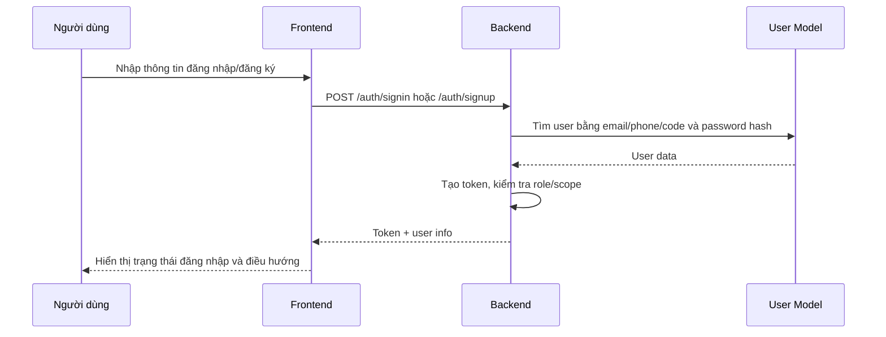

# 1. Thông tin module
- Tên module: Authentication / tài khoản / phân quyền
- Mục tiêu nghiệp vụ: cho phép người dùng đăng nhập, đăng ký, khôi phục mật khẩu, xem/cập nhật hồ sơ và truy cập các API được phép theo token và scope.
- Phạm vi đặc tả: các chức năng xác thực và phân quyền trực tiếp được chứng minh từ source: đăng nhập, đăng ký, đăng nhập Google, khôi phục mật khẩu, xem hồ sơ, cập nhật hồ sơ, đổi mật khẩu, kiểm tra token và scope.
- Source liên quan:
  - [api-develop/app/controllers/AuthController.js](../../../../api-develop/app/controllers/AuthController.js)
  - [api-develop/app/controllers/UserController.js](../../../../api-develop/app/controllers/UserController.js)
  - [api-develop/app/routes/routes.js](../../../../api-develop/app/routes/routes.js)
  - [api-develop/app/routes/CheckToken.js](../../../../api-develop/app/routes/CheckToken.js)
  - [api-develop/app/routes/CheckScope.js](../../../../api-develop/app/routes/CheckScope.js)
  - [api-develop/config/app.js](../../../../api-develop/config/app.js)
  - [api-develop/config/user_scopes.json](../../../../api-develop/config/user_scopes.json)
  - [api-develop/app/models/User.js](../../../../api-develop/app/models/User.js)
  - [web-admin/src/redux/auth/action.js](../../../../web-admin/src/redux/auth/action.js)
  - [web-admin/src/routing/PrivateRoute.js](../../../../web-admin/src/routing/PrivateRoute.js)
  - [web-admin/src/components/Master.js](../../../../web-admin/src/components/Master.js)
  - [web-ssstudy/src/services/authService.ts](../../../../web-ssstudy/src/services/authService.ts)
  - [web-ssstudy/src/app/auth/signin/page.tsx](../../../../web-ssstudy/src/app/auth/signin/page.tsx)
- Màn hình liên quan:
  - web-admin: /login, /profile, /changepassword
  - web-ssstudy: /auth/signin, /auth/signup, /auth/forgot-password, /account/change-password
- API liên quan:
  - /auth/signin
  - /auth/signup
  - /auth/google-auth
  - /forgot-password
  - /user/profile
  - /user/update-profile
  - /user/change-password
  - /auth/userinfo
- Entity/table/dữ liệu liên quan:
  - User
- Mức độ xác minh: Cao

# 2. Actor và phân quyền

| Actor/Role | Permission | Chức năng được phép | Điều kiện truy cập | Bằng chứng source | Ghi chú |
|---|---|---|---|---|---|
| STUDENT | Đăng nhập vào public site | Đăng nhập, đăng ký, khôi phục mật khẩu, xem/cập nhật hồ sơ, đổi mật khẩu | Bắt buộc có email/phone/code và password hợp lệ; được phép login vào public site | [api-develop/app/controllers/AuthController.js](../../../../api-develop/app/controllers/AuthController.js), [web-ssstudy/src/app/auth/signin/page.tsx](../../../../web-ssstudy/src/app/auth/signin/page.tsx) | Hệ thống cho phép đăng nhập bằng email/phone/code |
| ADMIN | Truy cập admin | Đăng nhập admin với role ADMIN và các role quản trị khác | Backend kiểm tra permissions gồm ADMIN, TEACHER, MANAGER, SUPPORTER, ACCOUNTANT, EDITOR, SALE_MANAGER, SALE_STAFF, MEDIA, TRAINING_STAFF khi site=admin | [api-develop/app/controllers/AuthController.js](../../../../api-develop/app/controllers/AuthController.js), [web-admin/src/redux/auth/action.js](../../../../web-admin/src/redux/auth/action.js) | Role và site được truyền trong body login |
| TEACHER / MANAGER / SUPPORTER / ACCOUNTANT / EDITOR / SALE_MANAGER / SALE_STAFF / MEDIA / TRAINING_STAFF | Truy cập admin theo role | Đăng nhập vào admin nếu role được phép | Backend kiểm tra permissions khi site=admin | [api-develop/app/controllers/AuthController.js](../../../../api-develop/app/controllers/AuthController.js), [api-develop/config/app.js](../../../../api-develop/config/app.js) | Các role này được liệt kê trong login permissions |
| Any authenticated user | Truy cập API cần token | Xem profile, cập nhật profile, đổi mật khẩu | Middleware CheckToken bắt buộc token hợp lệ; CheckScope xác minh scope | [api-develop/app/routes/routes.js](../../../../api-develop/app/routes/routes.js), [api-develop/app/routes/CheckToken.js](../../../../api-develop/app/routes/CheckToken.js), [api-develop/app/routes/CheckScope.js](../../../../api-develop/app/routes/CheckScope.js) | Public routes được liệt kê riêng |

# 3. Danh sách chức năng

| Mã chức năng | Tên chức năng | Actor | Màn hình/Route | API | Controller/Service | Trạng thái xác minh |
|---|---|---|---|---|---|---|
| AUTH-01 | Đăng nhập người dùng | STUDENT / ADMIN / TEACHER / MANAGER / SUPPORTER / ACCOUNTANT / EDITOR / SALE_MANAGER / SALE_STAFF / MEDIA / TRAINING_STAFF | /auth/signin, /login | /auth/signin | AuthController.signin, UserService.generateNewToken | Đã xác nhận |
| AUTH-02 | Đăng ký tài khoản | Người dùng mới | /auth/signup | /auth/signup | AuthController.signup | Đã xác nhận |
| AUTH-03 | Đăng nhập bằng Google | Người dùng | /auth/signin | /auth/google-auth | AuthController.signInGoogle | Đã xác nhận |
| AUTH-04 | Khôi phục mật khẩu | Người dùng | /auth/forgot-password | /forgot-password | UserController.forgottenPass | Đã xác nhận |
| AUTH-05 | Xem thông tin hồ sơ | Người dùng đã đăng nhập | /profile | /user/profile | UserController.profile | Đã xác nhận |
| AUTH-06 | Cập nhật hồ sơ | Người dùng đã đăng nhập | /profile | /user/update-profile | UserController.updateProfile | Đã xác nhận |
| AUTH-07 | Đổi mật khẩu | Người dùng đã đăng nhập | /account/change-password, /changepassword | /user/change-password | UserController.changePassword | Đã xác nhận |
| AUTH-08 | Kiểm tra token và scope | Middleware hệ thống | Tất cả route cần xác thực | N/A | CheckToken.verify, CheckScope.checkUserScope | Đã xác nhận |

# 4. Đặc tả chi tiết từng chức năng

## AUTH-01 Đăng nhập người dùng

### Mục đích
Cho phép người dùng đăng nhập bằng email, số điện thoại hoặc mã học sinh và lấy token để tiếp tục sử dụng các API cần xác thực.

### Actor / quyền sử dụng
- STUDENT trên web-ssstudy
- ADMIN, TEACHER, MANAGER, SUPPORTER, ACCOUNTANT, EDITOR, SALE_MANAGER, SALE_STAFF, MEDIA, TRAINING_STAFF trên web-admin

### Điều kiện trước
- Người dùng có tài khoản tồn tại trong cơ sở dữ liệu User.
- Tài khoản chưa bị xóa, chưa bị block, chưa ở trạng thái VERIFY-EMAIL.

### Điểm khởi đầu
- Route: /auth/signin
- Màn hình: /auth/signin (web-ssstudy), /login (web-admin)
- Button/action hoặc API trigger: submit form đăng nhập

### Dữ liệu đầu vào

| Trường dữ liệu | Kiểu dữ liệu | Bắt buộc | Validation | Nguồn dữ liệu | Ghi chú |
|---|---|---|---|---|---|
| email | string | Có | Chuyển về lowercase, dùng để tìm theo code/phone/email | Form đăng nhập | Trong AuthController.signin, field params.email |
| password | string | Có | Mã hóa MD5 trước khi so sánh | Form đăng nhập | Mật khẩu được mã hóa trước khi lưu và so sánh |
| site | string | Không | Nếu là admin thì giới hạn permissions | Frontend web-admin | Body có site: admin |

### Luồng chính
1. Người dùng → Frontend nhập email/phone/code và password.
2. Frontend → API /auth/signin gửi payload gồm email và password, và site cho admin.
3. API → Controller AuthController.signin.
4. Controller → Service/UserModel kiểm tra tài khoản theo điều kiện $or trên code/phone/email và password đã mã hóa.
5. Controller → UserService.generateNewToken tạo token mới.
6. Response → Frontend nhận token và thông tin user.
7. Frontend → lưu token vào cookie/localStorage và điều hướng vào trang phù hợp.

### Luồng thay thế / ngoại lệ
- Nếu không tìm thấy user phù hợp, trả lỗi LOGIN_INFO_ERROR.
- Nếu tài khoản bị BLOCKED/DEACTIVE/BLOCKED_ON_VIDEO, trả lỗi tài khoản vô hiệu.
- Nếu tài khoản ở trạng thái VERIFY-EMAIL, trả lỗi chưa xác minh email.
- Nếu role không nằm trong permissions phù hợp với site, trả lỗi không có quyền truy cập.

### Validation và business rule
- Frontend validation: web-ssstudy dùng yup để kiểm tra email/phone/code và bắt buộc password.
- Backend validation: tìm kiếm user theo code/phone/email; so sánh password đã mã hóa; kiểm tra status và permission.
- Điều kiện nghiệp vụ: user_group phải nằm trong whitelist permissions theo site.
- Trạng thái/flag/enum ảnh hưởng xử lý: user.status, user.user_group.
- Thông báo lỗi nếu xác định được: "Tài khoản của bạn không có quyền truy cập", "Tài khoản của bạn chưa được xác minh email", "Tài khoản của bạn đã bị vô hiệu".

### API liên quan

| Endpoint | Method | Request DTO/params | Response | Controller | Service | Repository/Entity | Exception/lỗi có thể có |
|---|---|---|---|---|---|---|---|
| /auth/signin | POST | { email, password, site? } | token, user_id, code, fullname, email, level, phone, avatar, user_group | AuthController.signin | UserService.generateNewToken | User | LOGIN_INFO_ERROR, tài khoản bị block, không có quyền |

### Màn hình liên quan

| Tên màn hình | Route | Component/Page | Field hiển thị | Action/Button | API gọi | Điều kiện hiển thị | Role/Permission |
|---|---|---|---|---|---|---|---|
| Đăng nhập người dùng | /auth/signin | [web-ssstudy/src/app/auth/signin/page.tsx](../../../../web-ssstudy/src/app/auth/signin/page.tsx) | emailOrPhone, password | Submit | /auth/signin | Chỉ hiện khi chưa đăng nhập | Public |
| Đăng nhập admin | /login | [web-admin/src/components/Master.js](../../../../web-admin/src/components/Master.js) | email/phone/password | Submit | /auth/signin | Chỉ hiện khi chưa authenticated | Public/role-based |

### Dữ liệu và trạng thái
- Entity/table/model liên quan: User
- Quan hệ dữ liệu: User có user_group và status để quyết định login.
- Trạng thái/enum/flag: status ACTIVE/VERIFY-EMAIL/BLOCKED/DEACTIVE/BLOCKED_ON_VIDEO; user_group theo appConfig.USER_GROUP.
- Điều kiện tạo/sửa/xóa/khóa/phê duyệt: không áp dụng trực tiếp trong login.

### Quy tắc phân quyền
- Backend phân quyền theo site và user_group.
- Truy cập admin chỉ được cấp cho danh sách permissions được định nghĩa trong AuthController.signin.

### Logging/audit nếu có
- Không thấy logging riêng cho login trong file hiện tại; có middleware logging global ở router.

### Bằng chứng từ source
- [api-develop/app/controllers/AuthController.js](../../../../api-develop/app/controllers/AuthController.js)
- [api-develop/app/routes/routes.js](../../../../api-develop/app/routes/routes.js)
- [web-ssstudy/src/app/auth/signin/page.tsx](../../../../web-ssstudy/src/app/auth/signin/page.tsx)
- [web-admin/src/redux/auth/action.js](../../../../web-admin/src/redux/auth/action.js)

### [CẦN XÁC NHẬN]
- Không thấy luồng logout/refresh token/expire token rõ ràng trong source hiện tại.

### [RỦI RO / TECHNICAL DEBT]
- Frontend lưu token ở cookie/localStorage và có fallback client-side cookie; có thể tăng rủi ro bảo mật và gây inconsistency giữa các môi trường.

## AUTH-02 Đăng ký tài khoản

### Mục đích
Tạo tài khoản mới cho người dùng với role STUDENT và hash mật khẩu trước khi lưu.

### Actor / quyền sử dụng
- Người dùng mới

### Điều kiện trước
- Email/phone/password phải thỏa điều kiện validation.

### Điểm khởi đầu
- Route: /auth/signup
- Màn hình: /auth/signup
- Button/action hoặc API trigger: submit form đăng ký

### Dữ liệu đầu vào

| Trường dữ liệu | Kiểu dữ liệu | Bắt buộc | Validation | Nguồn dữ liệu | Ghi chú |
|---|---|---|---|---|---|
| fullname | string | Có | Không được rỗng | Form đăng ký | Truyền vào docUser.fullname |
| email | string | Có | Phải đúng định dạng email | Form đăng ký | Chuyển lowercase |
| phone | string | Có | Phải hợp lệ và duy nhất | Form đăng ký | Nếu không có thì trả lỗi |
| password | string | Có | Phải đúng format mật khẩu | Form đăng ký | Mã hóa bằng MD5 |
| dob/address/classroom/school/type | optional | Không | Không thấy validation chuyên sâu | Form đăng ký | Có thể truyền và lưu |

### Luồng chính
1. Người dùng → Frontend gửi thông tin đăng ký.
2. Frontend → API /auth/signup.
3. API → AuthController.signup.
4. Controller → ValidateHelper và BaseHelper kiểm tra email/phone/password và tính toán alias.
5. Controller → UserModel.findOne kiểm tra email/phone tồn tại.
6. Controller → UserModel.create tạo User với user_group STUDENT và status ACTIVE hoặc VERIFY-EMAIL tùy flow.
7. Controller → UserService.generateNewToken trả token.
8. Response → Frontend nhận token và thông tin user.

### Luồng thay thế / ngoại lệ
- Email/phone đã tồn tại: trả lỗi cụ thể.
- Mật khẩu không hợp lệ: trả lỗi PASS_INVALID.
- Nếu phone không hợp lệ: trả lỗi PHONE_INVALID.

### Validation và business rule
- Frontend validation: web-ssstudy dùng yup cho signup.
- Backend validation: ValidateHelper.isEmail, BaseHelper.passwordValidate, BaseHelper.getPhone.
- Điều kiện nghiệp vụ: email/phone unique trong User, role mặc định STUDENT.
- Trạng thái/flag/enum: user_group STUDENT; status ACTIVE/VERIFY-EMAIL.

### API liên quan

| Endpoint | Method | Request DTO/params | Response | Controller | Service | Repository/Entity | Exception/lỗi có thể có |
|---|---|---|---|---|---|---|---|
| /auth/signup | POST | { fullname, email, phone, password, ... } | token, user_id, fullname, email, phone, user_group | AuthController.signup | UserService.generateNewToken | User | Email/phone đã tồn tại, mật khẩu không hợp lệ |

### Màn hình liên quan

| Tên màn hình | Route | Component/Page | Field hiển thị | Action/Button | API gọi | Điều kiện hiển thị | Role/Permission |
|---|---|---|---|---|---|---|---|
| Đăng ký tài khoản | /auth/signup | [web-ssstudy/src/app/auth/signup/page.tsx](../../../../web-ssstudy/src/app/auth/signup/page.tsx) | fullname, email, phone, password | Submit | /auth/signup | Public | Public |

### Dữ liệu và trạng thái
- Entity/table/model liên quan: User
- Trạng thái/enum/flag: status ACTIVE hoặc VERIFY-EMAIL theo flow signup qua email verification.

### Quy tắc phân quyền
- Mặc định tạo tài khoản với user_group STUDENT.

### Logging/audit nếu có
- Không thấy logging riêng cho signup; có middleware logging global.

### Bằng chứng từ source
- [api-develop/app/controllers/AuthController.js](../../../../api-develop/app/controllers/AuthController.js)
- [web-ssstudy/src/app/auth/signup/page.tsx](../../../../web-ssstudy/src/app/auth/signup/page.tsx)

### [CẦN XÁC NHẬN]
- Flow xác minh email và activation status có một số nhánh khác nhau nhưng chưa thấy toàn bộ UI hoặc route verify-email được map rõ trong web-ssstudy.

## AUTH-03 Đăng nhập bằng Google

### Mục đích
Cho phép người dùng đăng nhập bằng Google thông qua credential token.

### Actor / quyền sử dụng
- Người dùng có tài khoản Google

### Điều kiện trước
- Frontend phải gửi credential và client_id tới backend.

### Điểm khởi đầu
- Route: /auth/google-auth
- Màn hình: /auth/signin
- Button/action hoặc API trigger: nút đăng nhập Google

### Dữ liệu đầu vào

| Trường dữ liệu | Kiểu dữ liệu | Bắt buộc | Validation | Nguồn dữ liệu | Ghi chú |
|---|---|---|---|---|---|
| credential | string | Có | Google ID token | Google auth provider | Dùng verifyIdToken |
| client_id | string | Có | Không thấy validation rõ | Frontend | Truyền từ client |

### Luồng chính
1. Frontend gửi credential và client_id tới /auth/google-auth.
2. AuthController.signInGoogle dùng google-auth-library verifyIdToken.
3. Nếu tìm thấy user theo email/phone/code, đăng nhập lại và tạo token mới.
4. Nếu không tìm thấy user, tạo mới User với user_group STUDENT và status ACTIVE.
5. Trả về token và thông tin user.

### Luồng thay thế / ngoại lệ
- Google token không hợp lệ: lỗi từ verifyIdToken dẫn tới response error.
- User không tồn tại: tạo mới tài khoản mới.

### Validation và business rule
- Backend dùng Google SDK để verify token.
- Nếu user đã tồn tại thì cập nhật last_login và status ACTIVE.

### API liên quan

| Endpoint | Method | Request DTO/params | Response | Controller | Service | Repository/Entity | Exception/lỗi có thể có |
|---|---|---|---|---|---|---|---|
| /auth/google-auth | POST | { credential, client_id } | token, user info | AuthController.signInGoogle | google-auth-library | User | Google token không hợp lệ |

### Màn hình liên quan

| Tên màn hình | Route | Component/Page | Field hiển thị | Action/Button | API gọi | Điều kiện hiển thị | Role/Permission |
|---|---|---|---|---|---|---|---|
| Đăng nhập người dùng | /auth/signin | [web-ssstudy/src/app/auth/signin/page.tsx](../../../../web-ssstudy/src/app/auth/signin/page.tsx) | Google login button | Submit | /auth/google-auth | Public | Public |

### Dữ liệu và trạng thái
- Entity/table/model liên quan: User
- Trạng thái/enum/flag: trạng thái ACTIVE sau khi đăng nhập bằng Google.

### Quy tắc phân quyền
- Không thấy phân quyền role riêng cho Google auth ngoài việc tạo tài khoản student mặc định.

### Logging/audit nếu có
- Không thấy logging riêng; có middleware logging global.

### Bằng chứng từ source
- [api-develop/app/controllers/AuthController.js](../../../../api-develop/app/controllers/AuthController.js)
- [web-ssstudy/src/services/authService.ts](../../../../web-ssstudy/src/services/authService.ts)

### [CẦN XÁC NHẬN]
- Không thấy UI cụ thể cho Google login trong source hiện tại ngoài service và backend endpoint.

## AUTH-04 Khôi phục mật khẩu

### Mục đích
Gửi email reset password và cập nhật mật khẩu mới cho người dùng.

### Actor / quyền sử dụng
- Người dùng đã có tài khoản

### Điều kiện trước
- Email tồn tại trong hệ thống và trạng thái là ACTIVE.

### Điểm khởi đầu
- Route: /forgot-password hoặc /user/forgot-password
- Màn hình: /auth/forgot-password
- Button/action hoặc API trigger: submit form khôi phục mật khẩu

### Dữ liệu đầu vào

| Trường dữ liệu | Kiểu dữ liệu | Bắt buộc | Validation | Nguồn dữ liệu | Ghi chú |
|---|---|---|---|---|---|
| email | string | Có | Không rỗng, dùng query user | Form khôi phục mật khẩu | Gửi tới UserController.forgottenPass |

### Luồng chính
1. Frontend gửi email tới /forgot-password.
2. Backend UserController.forgottenPass kiểm tra người dùng active.
3. Tạo password mới ngẫu nhiên và gửi mail reset password.
4. Cập nhật password đã hash vào User.
5. Trả về result và thông báo thành công.

### Luồng thay thế / ngoại lệ
- Nếu không tồn tại user: trả lỗi EMAIL_NOT_EXISTS.
- Nếu gửi mail thất bại: trả lỗi chưa gửi được email.

### Validation và business rule
- Chỉ user có status ACTIVE và deleted_at null mới được xử lý.
- Password mới được hash bằng MD5 trước khi lưu.

### API liên quan

| Endpoint | Method | Request DTO/params | Response | Controller | Service | Repository/Entity | Exception/lỗi có thể có |
|---|---|---|---|---|---|---|---|
| /forgot-password | POST | { email } | result, message | UserController.forgottenPass | MailService.resetPassword | User | EMAIL_NOT_EXISTS, gửi mail thất bại |

### Màn hình liên quan

| Tên màn hình | Route | Component/Page | Field hiển thị | Action/Button | API gọi | Điều kiện hiển thị | Role/Permission |
|---|---|---|---|---|---|---|---|
| Quên mật khẩu | /auth/forgot-password | [web-ssstudy/src/app/auth/forgot-password/page.tsx](../../../../web-ssstudy/src/app/auth/forgot-password/page.tsx) | email | Submit | /forgot-password | Public | Public |

### Dữ liệu và trạng thái
- Entity/table/model liên quan: User
- Trạng thái/enum/flag: status ACTIVE

### Quy tắc phân quyền
- Không có role check riêng; chỉ cần tồn tại user active.

### Logging/audit nếu có
- Không thấy logging riêng; có middleware logging global.

### Bằng chứng từ source
- [api-develop/app/controllers/UserController.js](../../../../api-develop/app/controllers/UserController.js)
- [api-develop/app/routes/routes.js](../../../../api-develop/app/routes/routes.js)

### [CẦN XÁC NHẬN]
- Chưa thấy frontend admin hoặc web-ssstudy route forgot password có component rõ ràng trong thư mục được đọc, nhưng route đã được liệt kê trong route inventory.

## AUTH-05 Xem thông tin hồ sơ

### Mục đích
Trả về thông tin hồ sơ đang đăng nhập dựa trên token.

### Actor / quyền sử dụng
- Người dùng đã đăng nhập

### Điều kiện trước
- Token hợp lệ và middleware CheckToken đã xác minh.

### Điểm khởi đầu
- Route: /user/profile
- Màn hình: /profile
- Button/action hoặc API trigger: load profile khi vào trang profile

### Dữ liệu đầu vào
- Không có body phức tạp; dùng req.user.user_id từ token.

### Luồng chính
1. Frontend gọi /user/profile sau khi đã đăng nhập.
2. Backend UserController.profile dùng req.user.user_id.
3. Lấy User theo _id và trạng thái ACTIVE.
4. Trả về thông tin profile.

### Luồng thay thế / ngoại lệ
- Nếu không tìm thấy user: trả lỗi USER_NOT_EXIST.
- Nếu token không hợp lệ: middleware CheckToken trả 401 trước khi tới controller.

### Validation và business rule
- Chỉ user đang active mới được trả profile.
- Profile không phải là full admin profile; controller chỉ projection một số field.

### API liên quan

| Endpoint | Method | Request DTO/params | Response | Controller | Service | Repository/Entity | Exception/lỗi có thể có |
|---|---|---|---|---|---|---|---|
| /user/profile | POST | {} | user profile | UserController.profile | N/A | User | Token invalid, user không tồn tại |

### Màn hình liên quan

| Tên màn hình | Route | Component/Page | Field hiển thị | Action/Button | API gọi | Điều kiện hiển thị | Role/Permission |
|---|---|---|---|---|---|---|---|
| Profile | /profile | [web-admin/src/components/Profile.js](../../../../web-admin/src/components/Profile.js) | fullname, email, phone, avatar | Load profile | /user/profile | Authenticated | Any authenticated user |

### Dữ liệu và trạng thái
- Entity/table/model liên quan: User

### Quy tắc phân quyền
- Cần token hợp lệ; CheckScope không áp dụng ở route này vì route không nằm trong scope checklist? Trong router, route này sẽ chạy check scope nếu không public.

### Logging/audit nếu có
- Không thấy logging riêng.

### Bằng chứng từ source
- [api-develop/app/controllers/UserController.js](../../../../api-develop/app/controllers/UserController.js)
- [web-admin/src/redux/auth/action.js](../../../../web-admin/src/redux/auth/action.js)

### [CẦN XÁC NHẬN]
- Web-ssstudy có route profile chưa được đọc sâu trong phạm vi này; logic profile trên user site chưa được chứng minh đầy đủ.

## AUTH-06 Cập nhật hồ sơ

### Mục đích
Cho phép người dùng cập nhật thông tin cá nhân như fullname, phone, email, address, avatar.

### Actor / quyền sử dụng
- Người dùng đã đăng nhập

### Điều kiện trước
- Token hợp lệ.

### Điểm khởi đầu
- Route: /user/update-profile
- Màn hình: /profile
- Button/action hoặc API trigger: submit form cập nhật hồ sơ

### Dữ liệu đầu vào

| Trường dữ liệu | Kiểu dữ liệu | Bắt buộc | Validation | Nguồn dữ liệu | Ghi chú |
|---|---|---|---|---|---|
| fullname | string | Không | Không rỗng nếu truyền | Form profile | Update user.fullname |
| phone | string | Không | Chuyển về format chuẩn và kiểm tra unique | Form profile | BaseHelper.getPhone |
| email | string | Không | Kiểm tra unique | Form profile | Nếu trùng thì lỗi |
| address/classroom/level/school/code/dob | optional | Không | Không thấy validation chuyên sâu | Form profile | Có thể update |
| avatar_base64/files | file | Không | Upload qua UploadService | Form upload avatar | Có support upload file |

### Luồng chính
1. Frontend gửi thông tin profile cập nhật và possible file upload.
2. Backend UserController.updateProfile đọc req.user.user_id.
3. Kiểm tra uniqueness cho phone/email nếu có.
4. Cập nhật dữ liệu vào User.
5. Trả về thông tin user đã cập nhật.

### Luồng thay thế / ngoại lệ
- Phone/email đã tồn tại: trả lỗi.
- User không tồn tại: trả lỗi USER_NOT_EXIST.

### Validation và business rule
- Email/phone phải unique nếu thay đổi.
- Avatar có thể upload dưới dạng base64 hoặc files.

### API liên quan

| Endpoint | Method | Request DTO/params | Response | Controller | Service | Repository/Entity | Exception/lỗi có thể có |
|---|---|---|---|---|---|---|---|
| /user/update-profile | POST | { fullname, phone, email, ... , avatar_base64/files } | updated user | UserController.updateProfile | UploadService | User | Phone/email đã tồn tại |

### Màn hình liên quan

| Tên màn hình | Route | Component/Page | Field hiển thị | Action/Button | API gọi | Điều kiện hiển thị | Role/Permission |
|---|---|---|---|---|---|---|---|
| Profile | /profile | [web-admin/src/components/Profile.js](../../../../web-admin/src/components/Profile.js) | profile fields | Save | /user/update-profile | Authenticated | Any authenticated user |

### Dữ liệu và trạng thái
- Entity/table/model liên quan: User

### Quy tắc phân quyền
- Quyền được kiểm soát bằng token và scope, không có role riêng cho update profile.

### Logging/audit nếu có
- Không thấy logging riêng.

### Bằng chứng từ source
- [api-develop/app/controllers/UserController.js](../../../../api-develop/app/controllers/UserController.js)
- [web-admin/src/redux/auth/action.js](../../../../web-admin/src/redux/auth/action.js)

### [CẦN XÁC NHẬN]
- Chưa thấy form cập nhật hồ sơ trên web-ssstudy trong phạm vi đọc sâu hiện tại.

## AUTH-07 Đổi mật khẩu

### Mục đích
Cho phép người dùng đổi mật khẩu nếu nhập đúng mật khẩu cũ và xác nhận mật khẩu mới.

### Actor / quyền sử dụng
- Người dùng đã đăng nhập

### Điều kiện trước
- Token hợp lệ.
- Người dùng nhập mật khẩu cũ, mật khẩu mới, xác nhận đúng.

### Điểm khởi đầu
- Route: /user/change-password
- Màn hình: /account/change-password (web-ssstudy), /changepassword (web-admin)
- Button/action hoặc API trigger: submit đổi mật khẩu

### Dữ liệu đầu vào

| Trường dữ liệu | Kiểu dữ liệu | Bắt buộc | Validation | Nguồn dữ liệu | Ghi chú |
|---|---|---|---|---|---|---|
| password | string | Có | Mật khẩu cũ | Form đổi mật khẩu | So sánh với password hash hiện tại |
| new_password | string | Có | BaseHelper.passwordValidate | Form đổi mật khẩu | Mật khẩu mới |
| confirm | string | Có | Phải bằng new_password | Form đổi mật khẩu | Nên match |

### Luồng chính
1. Frontend gửi password cũ, new_password, confirm.
2. Backend UserController.changePassword kiểm tra mật khẩu cũ và new password.
3. Nếu hợp lệ, hash password mới và cập nhật vào User.
4. Xóa key cũ và tạo token mới.
5. Trả về token mới.

### Luồng thay thế / ngoại lệ
- Thiếu password cũ/mới/confirm: trả lỗi.
- Mật khẩu cũ không chính xác: trả lỗi cụ thể.
- Mật khẩu mới không hợp lệ: trả lỗi PASS_INVALID.
- Mật khẩu confirm không đúng: trả lỗi xác nhận không chính xác.

### Validation và business rule
- Backend kiểm tra old password và new password bằng BaseHelper.passwordValidate.
- Token mới được tạo sau khi đổi mật khẩu.

### API liên quan

| Endpoint | Method | Request DTO/params | Response | Controller | Service | Repository/Entity | Exception/lỗi có thể có |
|---|---|---|---|---|---|---|---|
| /user/change-password | POST | { password, new_password, confirm } | { token } | UserController.changePassword | UserService.generateNewToken | User | Mật khẩu cũ không chính xác, confirm không đúng |

### Màn hình liên quan

| Tên màn hình | Route | Component/Page | Field hiển thị | Action/Button | API gọi | Điều kiện hiển thị | Role/Permission |
|---|---|---|---|---|---|---|---|
| Đổi mật khẩu | /account/change-password | [web-ssstudy/src/app/account/change-password/page.tsx](../../../../web-ssstudy/src/app/account/change-password/page.tsx) | current password/new password/confirm | Submit | /user/change-password | Authenticated | Any authenticated user |
| Đổi mật khẩu admin | /changepassword | [web-admin/src/components/Changepassword.js](../../../../web-admin/src/components/Changepassword.js) | current password/new password/confirm | Submit | /user/change-password | Authenticated | Any authenticated user |

### Dữ liệu và trạng thái
- Entity/table/model liên quan: User
- Trạng thái/enum/flag: user.status và password hash.

### Quy tắc phân quyền
- Cần đăng nhập và token hợp lệ.

### Logging/audit nếu có
- Không thấy logging riêng.

### Bằng chứng từ source
- [api-develop/app/controllers/UserController.js](../../../../api-develop/app/controllers/UserController.js)
- [web-admin/src/components/Changepassword.js](../../../../web-admin/src/components/Changepassword.js)

### [CẦN XÁC NHẬN]
- Route /account/change-password trên web-ssstudy được liệt kê trong route inventory, nhưng file page cụ thể chưa được đọc sâu trong phạm vi này.

## AUTH-08 Kiểm tra token và scope

### Mục đích
Bảo vệ các route cần đăng nhập và kiểm tra role/permission trước khi cho phép request đi tiếp.

### Actor / quyền sử dụng
- Middleware hệ thống

### Điều kiện trước
- Request tới route không nằm trong publicRoutes.

### Điểm khởi đầu
- Route: toàn bộ router chính trong [api-develop/app/routes/routes.js](../../../../api-develop/app/routes/routes.js)
- Màn hình: không trực tiếp
- Button/action hoặc API trigger: mọi request tới protected endpoint

### Dữ liệu đầu vào

| Trường dữ liệu | Kiểu dữ liệu | Bắt buộc | Validation | Nguồn dữ liệu | Ghi chú |
|---|---|---|---|---|---|
| authorization header | string | Có cho protected route | Phải bắt đầu bằng Bearer | Request header | Dùng để decode token |
| originalUrl | string | Có | Chuyển thành controller/action để lookup scope | Request URL | Dùng trong CheckScope |

### Luồng chính
1. Request đi vào router middleware.
2. Router kiểm tra URL có nằm trong publicRoutes không.
3. Nếu không public, CheckToken.verify đọc token từ header Authorization.
4. Nếu token hợp lệ, CheckScope.checkUserScope đọc role và scope tương ứng từ user_scopes.json.
5. Nếu scope phù hợp, request được cho phép tiếp tục.
6. Nếu token/scope không hợp lệ, trả 401/403.

### Luồng thay thế / ngoại lệ
- Không có Authorization header: 401.
- Token không hợp lệ/expired: 401.
- Scope không phù hợp: 403.

### Validation và business rule
- Scope được phân theo controller/action và role.
- ADMIN có quyền true.
- Các role khác dùng mapping từ user_scopes.json.

### API liên quan
- N/A; middleware toàn cục

### Màn hình liên quan
- Không trực tiếp

### Dữ liệu và trạng thái
- Entity/table/model liên quan: User, token payload

### Quy tắc phân quyền
- Quyền được xác định ở middleware, không ở UI.

### Logging/audit nếu có
- Có middleware LoggingMiddleware.

### Bằng chứng từ source
- [api-develop/app/routes/routes.js](../../../../api-develop/app/routes/routes.js)
- [api-develop/app/routes/CheckToken.js](../../../../api-develop/app/routes/CheckToken.js)
- [api-develop/app/routes/CheckScope.js](../../../../api-develop/app/routes/CheckScope.js)
- [api-develop/config/user_scopes.json](../../../../api-develop/config/user_scopes.json)

### [CẦN XÁC NHẬN]
- Không thấy mapping scope cho STUDENT và các role phụ trợ ở đầu file user_scopes.json trong phạm vi đọc được.

### [RỦI RO / TECHNICAL DEBT]
- CheckScope dựa vào controller/action từ URL và có nhiều route/URL không rõ ràng; việc này có thể dẫn tới false positive/false negative khi route đổi tên hoặc cấu trúc URL thay đổi.

# 5. Sơ đồ luồng

# 6. Mapping chức năng – UI – API – Backend – dữ liệu

| Chức năng | Web Admin | Web SSStudy | Route | API | Controller | Service | Entity/Table | Permission | Trạng thái xác minh | Ghi chú |
|---|---|---|---|---|---|---|---|---|---|---|
| Đăng nhập | /login | /auth/signin | /auth/signin | /auth/signin | AuthController.signin | UserService.generateNewToken | User | site-based permissions | Đã xác nhận | Có validation trên FE và BE |
| Đăng ký | N/A | /auth/signup | /auth/signup | /auth/signup | AuthController.signup | UserService.generateNewToken | User | Public | Đã xác nhận | Dùng role STUDENT |
| Google auth | N/A | /auth/signin | /auth/google-auth | /auth/google-auth | AuthController.signInGoogle | google-auth-library | User | Public | Đã xác nhận | Dùng Google SDK |
| Quên mật khẩu | N/A | /auth/forgot-password | /forgot-password | /forgot-password | UserController.forgottenPass | MailService.resetPassword | User | Public | Đã xác nhận | Gửi mail reset password |
| Profile | /profile | /account/profile | /user/profile | /user/profile | UserController.profile | N/A | User | Authenticated | Đã xác nhận | Lấy user từ token |
| Update profile | /profile | /account/profile | /user/update-profile | /user/update-profile | UserController.updateProfile | UploadService | User | Authenticated | Đã xác nhận | Có upload avatar |
| Đổi mật khẩu | /changepassword | /account/change-password | /user/change-password | /user/change-password | UserController.changePassword | UserService.generateNewToken | User | Authenticated | Đã xác nhận | Có tạo token mới |
| Check token/scope | N/A | N/A | toàn bộ protected route | middleware | CheckToken/CheckScope | UserService | User | Role/scope | Đã xác nhận | Chạy trên toàn bộ router |

# 7. Test scenario gợi ý từ hành vi hiện trạng

| Mã test | Chức năng | Tiền điều kiện | Bước thực hiện | Kết quả mong đợi theo source | API/dữ liệu kiểm tra | Ghi chú |
|---|---|---|---|---|---|---|
| AUTH-T01 | Đăng nhập thành công bằng email | Tồn tại user ACTIVE | Gửi /auth/signin với email/password | Trả 200 và token | User với email/password đúng | Validate từ backend |
| AUTH-T02 | Đăng nhập thất bại vì password sai | Tồn tại user ACTIVE | Gửi /auth/signin với email/password sai | Trả lỗi LOGIN_INFO_ERROR | User không đổi | Không tạo token |
| AUTH-T03 | Đăng ký tài khoản mới | Email/phone chưa tồn tại | Gửi /auth/signup với đầy đủ dữ liệu | Trả 200 và user mới | User được tạo với user_group=STUDENT | Dùng password hash |
| AUTH-T04 | Đăng ký duplicate email/phone | Email/phone đã tồn tại | Gửi /auth/signup lại | Trả lỗi đã tồn tại | User không tạo mới | Dựa trên findOne |
| AUTH-T05 | Đổi mật khẩu thành công | Token hợp lệ, mật khẩu cũ đúng | Gửi /user/change-password | Trả 200 và token mới | User.password được cập nhật | Cần deleteKey và tạo token mới |
| AUTH-T06 | Truy cập route protected mà không có token | Không có Authorization header | Gọi protected route | Trả 401 | CheckToken.verify false | Router middleware chặn |
| AUTH-T07 | Truy cập route protected với scope không phù hợp | Token hợp lệ nhưng role không có scope | Gọi protected route | Trả 403 | CheckScope false | Dựa vào user_scopes.json |
