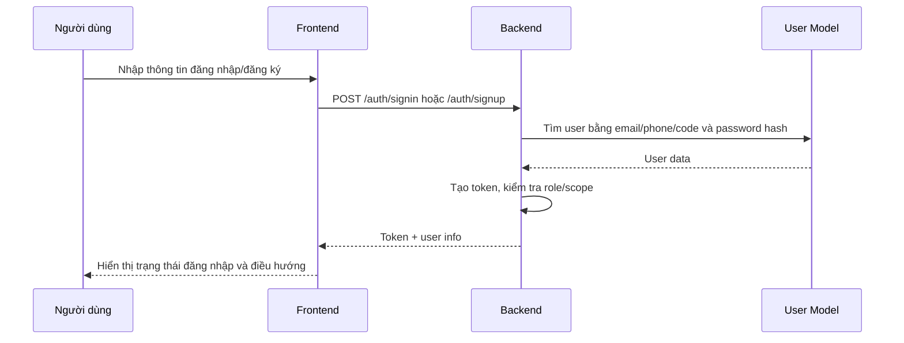

# Authentication — SRS mục tiêu

Mục tiêu: Cung cấp giải pháp xác thực, ủy quyền và quản lý tài khoản để bảo mật toàn bộ hệ thống SSStudy. Tài liệu này mô tả yêu cầu nghiệp vụ, API đề xuất, domain model, kiến trúc module, UI, use case và user story để triển khai module từ đầu.

- Tên module: Authentication / Account / Authorization
- Mục tiêu nghiệp vụ: Đăng ký, đăng nhập, đăng xuất, refresh token, quản lý profile, quên mật khẩu, quản lý role/permission, cơ chế khóa tài khoản và policy mật khẩu.
- Phạm vi: triển khai backend stateless access token (short-lived access token + refresh token), session/refresh management, password management, account lifecycle, và admin user management.

# 2. Actors and Roles

| Actor/Role | Typical permissions | Notes |
|---|---|---|
| Guest (unauthenticated) | Access public content, register, request password reset | Can access public APIs only |
| Student (authenticated) | Access enrolled courses, attempt exams, purchase products, manage profile | Needs valid access token |
| Teacher | Create/manage course content for own classrooms, view students progress | Scoped permissions for content and grading |
| Admin / Operator | Manage users, roles, site configuration, financial operations | Elevated permissions; audit required |
| Support / Finance | View orders/payments and perform refunds within scope | Restricted by permission sets |

Permissions model: Role-based with optional fine-grained permissions (Role + Permission). Rules and invariants reference `BR-AUTH-*` IDs in business-rules.md.

# 3. Feature list

| Mã chức năng | Tên chức năng | Actor | Màn hình đề xuất | API đề xuất | Dịch vụ nghiệp vụ cần có | Dữ liệu/model liên quan | Quy tắc áp dụng | Priority |
|---|---|---|---|---|---|---|---|---|
| AUTH-01 | Đăng nhập (credential) | Guest | `/login` | `POST /api/auth/login` | AuthService: validate credentials, issue tokens | User, RefreshToken | BR-AUTH-001, BR-AUTH-002 | Must |
| AUTH-02 | Đăng ký tài khoản | Guest | `/signup` | `POST /api/auth/register` | RegistrationService: create user, trigger email verification | User | BR-AUTH-003 | Must |
| AUTH-03 | Đăng xuất / Revoke refresh | Authenticated | n/a | `POST /api/auth/logout` | SessionService: revoke refresh token | RefreshToken, Session | BR-AUTH-004 | Must |
| AUTH-04 | Refresh token | Authenticated | n/a | `POST /api/auth/refresh` | TokenService: rotate refresh token, issue new access token | RefreshToken | BR-AUTH-005 | Must |
| AUTH-05 | Quên mật khẩu / Reset | Guest | `/forgot-password` | `POST /api/auth/forgot-password` / `POST /api/auth/reset-password` | PasswordService: create reset token, validate and update password | PasswordResetToken | BR-AUTH-006 | Must |
| AUTH-06 | Profile read/update | Authenticated | `/profile` | `GET /api/users/me` / `PUT /api/users/me` | UserService: validate updates, unique checks | User | BR-AUTH-007 | Should |
| AUTH-07 | Admin user management | Admin | `/admin/users` | `GET/POST/PUT/DELETE /api/admin/users` | AdminUserService: user lifecycle management | User, Role, Permission | BR-AUTH-008 | Should |
| AUTH-08 | Password policy & account lock | System | n/a | n/a (applied by services) | SecurityService: enforce policy, lockout, unlock | User, AuditLog | BR-AUTH-009 | Must |

# 4. Đặc tả chi tiết từng chức năng

## AUTH-01 Đăng nhập người dùng

### Mục đích
Cho phép người dùng đăng nhập bằng email, số điện thoại hoặc mã học sinh và lấy token để tiếp tục sử dụng các API cần xác thực.

### Actor / quyền sử dụng
- STUDENT trên web-ssstudy
- ADMIN, TEACHER, MANAGER, SUPPORTER, ACCOUNTANT, EDITOR, SALE_MANAGER, SALE_STAFF, MEDIA, TRAINING_STAFF trên web-admin

### Điều kiện trước
- Người dùng có tài khoản tồn tại trong cơ sở dữ liệu User.
- Tài khoản chưa bị xóa, chưa bị block, chưa ở trạng thái VERIFY-EMAIL.

### Điểm khởi đầu
- Route: /auth/signin
- Màn hình: /auth/signin (web-ssstudy), /login (web-admin)
- Button/action hoặc API trigger: submit form đăng nhập

### Dữ liệu đầu vào

| Trường dữ liệu | Kiểu dữ liệu | Bắt buộc | Validation | Nguồn dữ liệu | Ghi chú |
|---|---|---|---|---|---|
| email | string | Có | Chuyển về lowercase, dùng để tìm theo code/phone/email | Form đăng nhập | Trong AuthController.signin, field params.email |
| password | string | Có | Mã hóa MD5 trước khi so sánh | Form đăng nhập | Mật khẩu được mã hóa trước khi lưu và so sánh |
| site | string | Không | Nếu là admin thì giới hạn permissions | Frontend web-admin | Body có site: admin |

### Luồng chính
1. Người dùng → Frontend nhập email/phone/code và password.
2. Frontend → API /auth/signin gửi payload gồm email và password, và site cho admin.
3. API → Controller AuthController.signin.
4. Controller → Service/UserModel kiểm tra tài khoản theo điều kiện $or trên code/phone/email và password đã mã hóa.
5. Controller → UserService.generateNewToken tạo token mới.
6. Response → Frontend nhận token và thông tin user.
7. Frontend → lưu token vào cookie/localStorage và điều hướng vào trang phù hợp.

### Luồng thay thế / ngoại lệ
- Nếu không tìm thấy user phù hợp, trả lỗi LOGIN_INFO_ERROR.
- Nếu tài khoản bị BLOCKED/DEACTIVE/BLOCKED_ON_VIDEO, trả lỗi tài khoản vô hiệu.
- Nếu tài khoản ở trạng thái VERIFY-EMAIL, trả lỗi chưa xác minh email.
- Nếu role không nằm trong permissions phù hợp với site, trả lỗi không có quyền truy cập.

### Validation và business rule
- Frontend validation: web-ssstudy dùng yup để kiểm tra email/phone/code và bắt buộc password.
- Backend validation: tìm kiếm user theo code/phone/email; so sánh password đã mã hóa; kiểm tra status và permission.
- Điều kiện nghiệp vụ: user_group phải nằm trong whitelist permissions theo site.
- Trạng thái/flag/enum ảnh hưởng xử lý: user.status, user.user_group.
- Thông báo lỗi nếu xác định được: "Tài khoản của bạn không có quyền truy cập", "Tài khoản của bạn chưa được xác minh email", "Tài khoản của bạn đã bị vô hiệu".

## API đề xuất

| Mã API | Method | Endpoint đề xuất | Mục đích | Auth required | Permission | Request chính | Response chính | Business rule | Ghi chú |
|---|---:|---|---|---:|---|---|---|---|---|
| API-AUTH-001 | POST | `/api/auth/login` | Đăng nhập bằng email/phone + password | No | No | { identifier, password } | { accessToken, expiresIn, refreshToken, user } | BR-AUTH-001 | Access token short-lived (~15m) |
| API-AUTH-002 | POST | `/api/auth/refresh` | Lấy access token mới bằng refresh token | Yes (refresh token) | No | { refreshToken } | { accessToken, refreshToken } | BR-AUTH-005 | Rotate refresh tokens |
| API-AUTH-003 | POST | `/api/auth/logout` | Thu hồi refresh token | Yes | No | { refreshToken } | { ok: true } | BR-AUTH-004 | Idempotent revoke |
| API-AUTH-004 | POST | `/api/auth/register` | Tạo user mới và gửi verify email | No | No | { fullname, email, phone?, password } | { userId, next: 'verify-email' } | BR-AUTH-003 | Email verification optional/configurable |
| API-AUTH-005 | POST | `/api/auth/forgot-password` | Tạo reset token and send email | No | No | { email } | { ok: true } | BR-AUTH-006 | Token expiry short (e.g., 1h) |
| API-AUTH-006 | POST | `/api/auth/reset-password` | Reset password using token | No | No | { token, newPassword } | { ok: true } | BR-AUTH-006 | Invalidate existing sessions on reset |
| API-AUTH-007 | GET | `/api/users/me` | Lấy profile người dùng hiện tại | Yes | No | - | { user } | BR-AUTH-007 | Projection excludes sensitive fields |
| API-AUTH-008 | PUT | `/api/users/me` | Cập nhật profile | Yes | No | { fullname, phone, ... } | { user } | BR-AUTH-007 | Unique phone/email checks |
| API-AUTH-009 | GET | `/api/admin/users` | Danh sách user (admin) | Yes | `user:read` | { page, q } | { items, total } | BR-AUTH-008 | Audit log for admin actions |

Notes:
- All auth endpoints should follow a consistent error contract defined in CLAUDE.md.
- Tokens: use JWT for accessToken and stored opaque refreshToken with rotation and revocation list.

## Thiết kế dữ liệu / Domain model đề xuất

### Model chính

| Model | Mục đích | Field quan trọng | Quan hệ | Ghi chú |
|---|---|---|---|---|
| User | Đại diện người dùng | id, email, phone, passwordHash, fullname, status, roles | roles -> Role | status: ACTIVE, PENDING_VERIFY, LOCKED, SUSPENDED |
| Role | Tập hợp quyền | id, name, permissions[] | many-to-many với User | Role-based access control |
| Permission | Quyền chi tiết | id, name, description | liên kết Role | Quy tắc kèm BR ids |
| RefreshToken | Quản lý phiên | id, userId, token, issuedAt, expiresAt, revoked | belongsTo User | Store hashed token or use opaque id |
| PasswordResetToken | Reset flow | token, userId, expiresAt, used | belongsTo User | Single-use, short expiry |

### Field ví dụ: User

| Field | Kiểu dữ liệu đề xuất | Bắt buộc | Ý nghĩa | Validation | Ghi chú |
|---|---|---|---|---|---|
| id | UUID | Có | PK | - | - |
| email | string | Có | Dùng để login/communication | email format, lowercase, unique | Optional phone-only registration supported |
| phone | string | Không | Số điện thoại | normalized, unique if present | E.164 preferred |
| passwordHash | string | Có | Hash mật khẩu | Argon2id/Bcrypt recommended | Never return in API |
| fullname | string | Có | Tên hiển thị | trim | - |
| status | enum | Có | Account lifecycle | one of ACTIVE,PENDING_VERIFY,LOCKED,SUSPENDED | - |
| roles | array<Role> | Có | Role assignment | default: [STUDENT] | - |

### Index/constraint đề xuất

| Model/Table | Index/Constraint | Mục đích |
|---|---|---|
| User(email) | unique | Fast lookup and prevent duplicates |
| User(phone) | unique partial | If phone used, ensure uniqueness |
| RefreshToken(token) | unique | Token revocation lookup |

## Thiết kế kiến trúc module

### Thành phần cần có

| Thành phần | Vai trò | Ghi chú triển khai |
|---|---|---|
| API layer | Expose auth endpoints and validate requests | Minimal logic; delegate to application services |
| Application service | Orchestrate use cases (register, login, refresh) | Transaction boundaries and retries |
| Domain service | Password policy, token policy, account lockout | Pure domain logic, testable |
| Repository | Abstract DB access for User/Token | Allow swapping DB implementations |
| Token provider | Issue/verify tokens | Use secure signing and rotation policy |
| Email/Notification adapter | Send verification and reset emails | Queue/send asynchronously |

### Dependency
- Depends on: Email service, Secrets manager, Observability (logging/metrics).
- Other modules may depend on Authentication (all protected routes).

### Nguyên tắc triển khai
- Do not embed business rules in HTTP handlers; keep handlers thin.
- Enforce validation at API boundary and domain invariants in services.
- Store refresh tokens server-side or use revocation strategy.
- Audit important actions (login failure, password reset, admin updates).

## Yêu cầu giao diện (UI)

| Màn hình | Route đề xuất | Actor | Mục đích | Thành phần chính | Action chính | API sử dụng | Permission | Ghi chú |
|---|---|---|---|---|---|---|---|---|
| Đăng nhập | /login | Guest | Cho phép login | Form identifier/password, 2FA prompt | Submit login | POST /api/auth/login | None | Support remember-me optional |
| Đăng ký | /signup | Guest | Tạo tài khoản | Form signup | Submit register | POST /api/auth/register | None | Email verification optional/configurable |
| Quên mật khẩu | /forgot-password | Guest | Khởi tạo reset | Form email | Submit | POST /api/auth/forgot-password | None | Rate limit requests |
| Profile | /profile | Authenticated | Xem và sửa profile | Profile form, avatar upload | Save | GET/PUT /api/users/me | Authenticated | Validate unique phone/email |
| Admin: User list | /admin/users | Admin | Quản lý người dùng | Table, filters, actions | Ban/unban | GET /api/admin/users | user:read | Audit actions |

## Use cases (example)

### UC-AUTH-001 — User login with credentials
- Mục tiêu: Người dùng đăng nhập và nhận access token.
- Actor chính: Guest
- Điều kiện trước: Người dùng đã đăng ký; account status = ACTIVE
- Trigger: Submit login form
- Luồng chính: 1) Validate input 2) Validate credentials 3) Issue access & refresh tokens 4) Return profile
- Luồng lỗi: Invalid credentials -> return error; locked account -> specific error
- Business rules: BR-AUTH-001 (password check), BR-AUTH-009 (lockout)
- Permission: none
- Acceptance criteria: valid credentials return tokens; invalid credentials return standardized error

### UC-AUTH-002 — Refresh access token
- Mục tiêu: Thay mới access token bằng refresh token
- Actor chính: Authenticated (has refresh token)
- Trigger: Client calls /api/auth/refresh
- Luồng chính: validate refresh token, rotate and return new tokens
- Acceptance criteria: old refresh invalidated, new tokens issued

## User stories (examples)

### US-AUTH-001 — Login
- Với vai trò: Guest
- Tôi muốn: đăng nhập bằng email/phone và mật khẩu
- Để: truy cập các tính năng yêu cầu đăng nhập
- Priority: Must
- Given: tài khoản tồn tại và active
- When: tôi gửi credential hợp lệ
- Then: nhận access token và profile
- UI note: show error on invalid login
- API note: POST /api/auth/login

### US-AUTH-002 — Register and verify email
- Với vai trò: Guest
- Tôi muốn: đăng ký tài khoản và nhận email xác thực
- Để: kích hoạt account trước khi sử dụng tính năng protected
- Priority: Must

### US-AUTH-003 — Forgot password
- Với vai trò: Guest
- Tôi muốn: yêu cầu reset password qua email
- Để: lấy lại truy cập khi quên mật khẩu
- Priority: Must

## Test / UAT scenarios (high level)
- Successful login with valid credential returns access token.
- Refresh token rotation invalidates previous refresh.
- Password reset flow: request -> receive token -> reset -> old sessions invalidated.

## Migration / Notes
- If migrating from legacy system, map existing users into `User` model and issue forced password reset if hash algorithm incompatible. Record migration notes in `docs/legacy-notes.md` (optional).

### Màn hình liên quan

| Tên màn hình | Route | Component/Page | Field hiển thị | Action/Button | API gọi | Điều kiện hiển thị | Role/Permission |
|---|---|---|---|---|---|---|---|
| Đăng nhập người dùng | /auth/signin | [web-ssstudy/src/app/auth/signin/page.tsx](../../../../web-ssstudy/src/app/auth/signin/page.tsx) | emailOrPhone, password | Submit | /auth/signin | Chỉ hiện khi chưa đăng nhập | Public |
| Đăng nhập admin | /login | [web-admin/src/components/Master.js](../../../../web-admin/src/components/Master.js) | email/phone/password | Submit | /auth/signin | Chỉ hiện khi chưa authenticated | Public/role-based |

### Dữ liệu và trạng thái
- Entity/table/model liên quan: User
- Quan hệ dữ liệu: User có user_group và status để quyết định login.
- Trạng thái/enum/flag: status ACTIVE/VERIFY-EMAIL/BLOCKED/DEACTIVE/BLOCKED_ON_VIDEO; user_group theo appConfig.USER_GROUP.
- Điều kiện tạo/sửa/xóa/khóa/phê duyệt: không áp dụng trực tiếp trong login.

### Quy tắc phân quyền
- Backend phân quyền theo site và user_group.
- Truy cập admin chỉ được cấp cho danh sách permissions được định nghĩa trong AuthController.signin.

### Logging/audit nếu có
- Không thấy logging riêng cho login trong file hiện tại; có middleware logging global ở router.

### Bằng chứng từ source
- [api-develop/app/controllers/AuthController.js](../../../../api-develop/app/controllers/AuthController.js)
- [api-develop/app/routes/routes.js](../../../../api-develop/app/routes/routes.js)
- [web-ssstudy/src/app/auth/signin/page.tsx](../../../../web-ssstudy/src/app/auth/signin/page.tsx)
- [web-admin/src/redux/auth/action.js](../../../../web-admin/src/redux/auth/action.js)

### [Open question / verify]

### Quy tắc phân quyền
- Không có role check riêng; chỉ cần tồn tại user active.

### Logging/audit nếu có
- Không thấy logging riêng; có middleware logging global.

### Bằng chứng từ source
- [api-develop/app/controllers/UserController.js](../../../../api-develop/app/controllers/UserController.js)
- [api-develop/app/routes/routes.js](../../../../api-develop/app/routes/routes.js)

### [Open question / verify]
- Chưa thấy frontend admin hoặc web-ssstudy route forgot password có component rõ ràng trong thư mục được đọc, nhưng route đã được liệt kê trong route inventory.

## AUTH-05 Xem thông tin hồ sơ

### Mục đích
Trả về thông tin hồ sơ đang đăng nhập dựa trên token.

### Actor / quyền sử dụng
- Người dùng đã đăng nhập

### Điều kiện trước
- Token hợp lệ và middleware CheckToken đã xác minh.

### Điểm khởi đầu
- Route: /user/profile
- Màn hình: /profile
- Button/action hoặc API trigger: load profile khi vào trang profile

### Dữ liệu đầu vào
- Không có body phức tạp; dùng req.user.user_id từ token.

### Luồng chính
1. Frontend gọi /user/profile sau khi đã đăng nhập.
2. Backend UserController.profile dùng req.user.user_id.
3. Lấy User theo _id và trạng thái ACTIVE.
4. Trả về thông tin profile.

### Luồng thay thế / ngoại lệ
- Nếu không tìm thấy user: trả lỗi USER_NOT_EXIST.
- Nếu token không hợp lệ: middleware CheckToken trả 401 trước khi tới controller.

### Validation và business rule
- Chỉ user đang active mới được trả profile.
- Profile không phải là full admin profile; controller chỉ projection một số field.

### API liên quan

| Endpoint | Method | Request DTO/params | Response | Controller | Service | Repository/Entity | Exception/lỗi có thể có |
|---|---|---|---|---|---|---|---|
| /user/profile | POST | {} | user profile | UserController.profile | N/A | User | Token invalid, user không tồn tại |

### Màn hình liên quan

| Tên màn hình | Route | Component/Page | Field hiển thị | Action/Button | API gọi | Điều kiện hiển thị | Role/Permission |
|---|---|---|---|---|---|---|---|
| Profile | /profile | [web-admin/src/components/Profile.js](../../../../web-admin/src/components/Profile.js) | fullname, email, phone, avatar | Load profile | /user/profile | Authenticated | Any authenticated user |

### Dữ liệu và trạng thái
- Entity/table/model liên quan: User

### Quy tắc phân quyền
- Cần token hợp lệ; CheckScope không áp dụng ở route này vì route không nằm trong scope checklist? Trong router, route này sẽ chạy check scope nếu không public.

### Logging/audit nếu có
- Không thấy logging riêng.

### Bằng chứng từ source
- [api-develop/app/controllers/UserController.js](../../../../api-develop/app/controllers/UserController.js)
- [web-admin/src/redux/auth/action.js](../../../../web-admin/src/redux/auth/action.js)

### [Open question / verify]
- Web-ssstudy có route profile chưa được đọc sâu trong phạm vi này; logic profile trên user site chưa được chứng minh đầy đủ.

## AUTH-06 Cập nhật hồ sơ

### Mục đích
Cho phép người dùng cập nhật thông tin cá nhân như fullname, phone, email, address, avatar.

### Actor / quyền sử dụng
- Người dùng đã đăng nhập

### Điều kiện trước
- Token hợp lệ.

### Điểm khởi đầu
- Route: /user/update-profile
- Màn hình: /profile
- Button/action hoặc API trigger: submit form cập nhật hồ sơ

### Dữ liệu đầu vào

| Trường dữ liệu | Kiểu dữ liệu | Bắt buộc | Validation | Nguồn dữ liệu | Ghi chú |
|---|---|---|---|---|---|
| fullname | string | Không | Không rỗng nếu truyền | Form profile | Update user.fullname |
| phone | string | Không | Chuyển về format chuẩn và kiểm tra unique | Form profile | BaseHelper.getPhone |
| email | string | Không | Kiểm tra unique | Form profile | Nếu trùng thì lỗi |
| address/classroom/level/school/code/dob | optional | Không | Không thấy validation chuyên sâu | Form profile | Có thể update |
| avatar_base64/files | file | Không | Upload qua UploadService | Form upload avatar | Có support upload file |

### Luồng chính
1. Frontend gửi thông tin profile cập nhật và possible file upload.
2. Backend UserController.updateProfile đọc req.user.user_id.
3. Kiểm tra uniqueness cho phone/email nếu có.
4. Cập nhật dữ liệu vào User.
5. Trả về thông tin user đã cập nhật.

### Luồng thay thế / ngoại lệ
- Phone/email đã tồn tại: trả lỗi.
- User không tồn tại: trả lỗi USER_NOT_EXIST.

### Validation và business rule
- Email/phone phải unique nếu thay đổi.
- Avatar có thể upload dưới dạng base64 hoặc files.

### API liên quan

| Endpoint | Method | Request DTO/params | Response | Controller | Service | Repository/Entity | Exception/lỗi có thể có |
|---|---|---|---|---|---|---|---|
| /user/update-profile | POST | { fullname, phone, email, ... , avatar_base64/files } | updated user | UserController.updateProfile | UploadService | User | Phone/email đã tồn tại |

### Màn hình liên quan

| Tên màn hình | Route | Component/Page | Field hiển thị | Action/Button | API gọi | Điều kiện hiển thị | Role/Permission |
|---|---|---|---|---|---|---|---|
| Profile | /profile | [web-admin/src/components/Profile.js](../../../../web-admin/src/components/Profile.js) | profile fields | Save | /user/update-profile | Authenticated | Any authenticated user |

### Dữ liệu và trạng thái
- Entity/table/model liên quan: User

### Quy tắc phân quyền
- Quyền được kiểm soát bằng token và scope, không có role riêng cho update profile.

### Logging/audit nếu có
- Không thấy logging riêng.

### Bằng chứng từ source
- [api-develop/app/controllers/UserController.js](../../../../api-develop/app/controllers/UserController.js)
- [web-admin/src/redux/auth/action.js](../../../../web-admin/src/redux/auth/action.js)

### [Open question / verify]
- Chưa thấy form cập nhật hồ sơ trên web-ssstudy trong phạm vi đọc sâu hiện tại.

## AUTH-07 Đổi mật khẩu

### Mục đích
Cho phép người dùng đổi mật khẩu nếu nhập đúng mật khẩu cũ và xác nhận mật khẩu mới.

### Actor / quyền sử dụng
- Người dùng đã đăng nhập

### Điều kiện trước
- Token hợp lệ.
- Người dùng nhập mật khẩu cũ, mật khẩu mới, xác nhận đúng.

### Điểm khởi đầu
- Route: /user/change-password
- Màn hình: /account/change-password (web-ssstudy), /changepassword (web-admin)
- Button/action hoặc API trigger: submit đổi mật khẩu

### Dữ liệu đầu vào

| Trường dữ liệu | Kiểu dữ liệu | Bắt buộc | Validation | Nguồn dữ liệu | Ghi chú |
|---|---|---|---|---|---|---|
| password | string | Có | Mật khẩu cũ | Form đổi mật khẩu | So sánh với password hash hiện tại |
| new_password | string | Có | BaseHelper.passwordValidate | Form đổi mật khẩu | Mật khẩu mới |
| confirm | string | Có | Phải bằng new_password | Form đổi mật khẩu | Nên match |

### Luồng chính
1. Frontend gửi password cũ, new_password, confirm.
2. Backend UserController.changePassword kiểm tra mật khẩu cũ và new password.
3. Nếu hợp lệ, hash password mới và cập nhật vào User.
4. Xóa key cũ và tạo token mới.
5. Trả về token mới.

### Luồng thay thế / ngoại lệ
- Thiếu password cũ/mới/confirm: trả lỗi.
- Mật khẩu cũ không chính xác: trả lỗi cụ thể.
- Mật khẩu mới không hợp lệ: trả lỗi PASS_INVALID.
- Mật khẩu confirm không đúng: trả lỗi xác nhận không chính xác.

### Validation và business rule
- Backend kiểm tra old password và new password bằng BaseHelper.passwordValidate.
- Token mới được tạo sau khi đổi mật khẩu.

### API liên quan

| Endpoint | Method | Request DTO/params | Response | Controller | Service | Repository/Entity | Exception/lỗi có thể có |
|---|---|---|---|---|---|---|---|
| /user/change-password | POST | { password, new_password, confirm } | { token } | UserController.changePassword | UserService.generateNewToken | User | Mật khẩu cũ không chính xác, confirm không đúng |

### Màn hình liên quan

| Tên màn hình | Route | Component/Page | Field hiển thị | Action/Button | API gọi | Điều kiện hiển thị | Role/Permission |
|---|---|---|---|---|---|---|---|
| Đổi mật khẩu | /account/change-password | [web-ssstudy/src/app/account/change-password/page.tsx](../../../../web-ssstudy/src/app/account/change-password/page.tsx) | current password/new password/confirm | Submit | /user/change-password | Authenticated | Any authenticated user |
| Đổi mật khẩu admin | /changepassword | [web-admin/src/components/Changepassword.js](../../../../web-admin/src/components/Changepassword.js) | current password/new password/confirm | Submit | /user/change-password | Authenticated | Any authenticated user |

### Dữ liệu và trạng thái
- Entity/table/model liên quan: User
- Trạng thái/enum/flag: user.status và password hash.

### Quy tắc phân quyền
- Cần đăng nhập và token hợp lệ.

### Logging/audit nếu có
- Không thấy logging riêng.

### Bằng chứng từ source
- [api-develop/app/controllers/UserController.js](../../../../api-develop/app/controllers/UserController.js)
- [web-admin/src/components/Changepassword.js](../../../../web-admin/src/components/Changepassword.js)

### [Open question / verify]
- Route /account/change-password trên web-ssstudy được liệt kê trong route inventory, nhưng file page cụ thể chưa được đọc sâu trong phạm vi này.

## AUTH-08 Kiểm tra token và scope

### Mục đích
Bảo vệ các route cần đăng nhập và kiểm tra role/permission trước khi cho phép request đi tiếp.

### Actor / quyền sử dụng
- Middleware hệ thống

### Điều kiện trước
- Request tới route không nằm trong publicRoutes.

### Điểm khởi đầu
- Route: toàn bộ router chính trong [api-develop/app/routes/routes.js](../../../../api-develop/app/routes/routes.js)
- Màn hình: không trực tiếp
- Button/action hoặc API trigger: mọi request tới protected endpoint

### Dữ liệu đầu vào

| Trường dữ liệu | Kiểu dữ liệu | Bắt buộc | Validation | Nguồn dữ liệu | Ghi chú |
|---|---|---|---|---|---|
| authorization header | string | Có cho protected route | Phải bắt đầu bằng Bearer | Request header | Dùng để decode token |
| originalUrl | string | Có | Chuyển thành controller/action để lookup scope | Request URL | Dùng trong CheckScope |

### Luồng chính
1. Request đi vào router middleware.
2. Router kiểm tra URL có nằm trong publicRoutes không.
3. Nếu không public, CheckToken.verify đọc token từ header Authorization.
4. Nếu token hợp lệ, CheckScope.checkUserScope đọc role và scope tương ứng từ user_scopes.json.
5. Nếu scope phù hợp, request được cho phép tiếp tục.
6. Nếu token/scope không hợp lệ, trả 401/403.

### Luồng thay thế / ngoại lệ
- Không có Authorization header: 401.
- Token không hợp lệ/expired: 401.
- Scope không phù hợp: 403.

### Validation và business rule
- Scope được phân theo controller/action và role.
- ADMIN có quyền true.
- Các role khác dùng mapping từ user_scopes.json.

### API liên quan
- N/A; middleware toàn cục

### Màn hình liên quan
- Không trực tiếp

### Dữ liệu và trạng thái
- Entity/table/model liên quan: User, token payload

### Quy tắc phân quyền
- Quyền được xác định ở middleware, không ở UI.

### Logging/audit nếu có
- Có middleware LoggingMiddleware.

### Bằng chứng từ source
- [api-develop/app/routes/routes.js](../../../../api-develop/app/routes/routes.js)
- [api-develop/app/routes/CheckToken.js](../../../../api-develop/app/routes/CheckToken.js)
- [api-develop/app/routes/CheckScope.js](../../../../api-develop/app/routes/CheckScope.js)
- [api-develop/config/user_scopes.json](../../../../api-develop/config/user_scopes.json)

### [Open question / verify]
- Không thấy mapping scope cho STUDENT và các role phụ trợ ở đầu file user_scopes.json trong phạm vi đọc được.

### [Risk / technical note]
- CheckScope dựa vào controller/action từ URL và có nhiều route/URL không rõ ràng; việc này có thể dẫn tới false positive/false negative khi route đổi tên hoặc cấu trúc URL thay đổi.

# 5. Sơ đồ luồng

# 6. Mapping chức năng – UI – API – Backend – dữ liệu

| Chức năng | Web Admin | Web SSStudy | Route | API | Controller | Service | Entity/Table | Permission | Trạng thái xác minh | Ghi chú |
|---|---|---|---|---|---|---|---|---|---|---|
| Đăng nhập | /login | /auth/signin | /auth/signin | /auth/signin | AuthController.signin | UserService.generateNewToken | User | site-based permissions | Đã xác nhận | Có validation trên FE và BE |
| Đăng ký | N/A | /auth/signup | /auth/signup | /auth/signup | AuthController.signup | UserService.generateNewToken | User | Public | Đã xác nhận | Dùng role STUDENT |
| Google auth | N/A | /auth/signin | /auth/google-auth | /auth/google-auth | AuthController.signInGoogle | google-auth-library | User | Public | Đã xác nhận | Dùng Google SDK |
| Quên mật khẩu | N/A | /auth/forgot-password | /forgot-password | /forgot-password | UserController.forgottenPass | MailService.resetPassword | User | Public | Đã xác nhận | Gửi mail reset password |
| Profile | /profile | /account/profile | /user/profile | /user/profile | UserController.profile | N/A | User | Authenticated | Đã xác nhận | Lấy user từ token |
| Update profile | /profile | /account/profile | /user/update-profile | /user/update-profile | UserController.updateProfile | UploadService | User | Authenticated | Đã xác nhận | Có upload avatar |
| Đổi mật khẩu | /changepassword | /account/change-password | /user/change-password | /user/change-password | UserController.changePassword | UserService.generateNewToken | User | Authenticated | Đã xác nhận | Có tạo token mới |
| Check token/scope | N/A | N/A | toàn bộ protected route | middleware | CheckToken/CheckScope | UserService | User | Role/scope | Đã xác nhận | Chạy trên toàn bộ router |

# 7. Test scenario gợi ý từ hành vi hiện trạng

| Mã test | Chức năng | Tiền điều kiện | Bước thực hiện | Kết quả mong đợi theo source | API/dữ liệu kiểm tra | Ghi chú |
|---|---|---|---|---|---|---|
| AUTH-T01 | Đăng nhập thành công bằng email | Tồn tại user ACTIVE | Gửi /auth/signin với email/password | Trả 200 và token | User với email/password đúng | Validate từ backend |
| AUTH-T02 | Đăng nhập thất bại vì password sai | Tồn tại user ACTIVE | Gửi /auth/signin với email/password sai | Trả lỗi LOGIN_INFO_ERROR | User không đổi | Không tạo token |
| AUTH-T03 | Đăng ký tài khoản mới | Email/phone chưa tồn tại | Gửi /auth/signup với đầy đủ dữ liệu | Trả 200 và user mới | User được tạo với user_group=STUDENT | Dùng password hash |
| AUTH-T04 | Đăng ký duplicate email/phone | Email/phone đã tồn tại | Gửi /auth/signup lại | Trả lỗi đã tồn tại | User không tạo mới | Dựa trên findOne |
| AUTH-T05 | Đổi mật khẩu thành công | Token hợp lệ, mật khẩu cũ đúng | Gửi /user/change-password | Trả 200 và token mới | User.password được cập nhật | Cần deleteKey và tạo token mới |
| AUTH-T06 | Truy cập route protected mà không có token | Không có Authorization header | Gọi protected route | Trả 401 | CheckToken.verify false | Router middleware chặn |
| AUTH-T07 | Truy cập route protected với scope không phù hợp | Token hợp lệ nhưng role không có scope | Gọi protected route | Trả 403 | CheckScope false | Dựa vào user_scopes.json |
