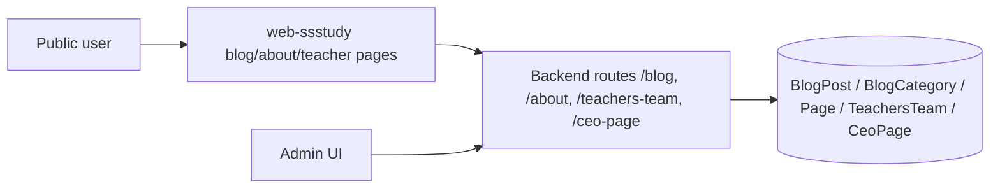

# 1. Thông tin module
- Tên module: Content pages / Blog / Configuration
- Mục tiêu nghiệp vụ: cho phép người dùng xem bài viết, danh mục blog, trang giới thiệu, đội ngũ giáo viên và trang CEO; cho phép admin quản trị cấu hình nội dung tĩnh và blog.
- Phạm vi đặc tả: các chức năng có bằng chứng trực tiếp từ source: danh sách bài viết công khai, chi tiết bài viết, danh mục blog, trang giới thiệu về SSStudy, trang giáo viên và quản trị nội dung ở admin.
- Source liên quan:
  - [api-develop/app/controllers/BlogController.js](../../../../api-develop/app/controllers/BlogController.js)
  - [api-develop/app/controllers/BlogCategoryController.js](../../../../api-develop/app/controllers/BlogCategoryController.js)
  - [api-develop/app/controllers/AboutController.js](../../../../api-develop/app/controllers/AboutController.js)
  - [api-develop/app/controllers/PageController.js](../../../../api-develop/app/controllers/PageController.js)
  - [api-develop/app/controllers/CeoPageController.js](../../../../api-develop/app/controllers/CeoPageController.js)
  - [api-develop/app/controllers/TeachersTeamController.js](../../../../api-develop/app/controllers/TeachersTeamController.js)
  - [api-develop/app/routes/routes.js](../../../../api-develop/app/routes/routes.js)
  - [web-admin/src/components/Master.js](../../../../web-admin/src/components/Master.js)
  - [web-ssstudy/src/app/tin-tuc/[alias]/[slug]/page.tsx](../../../../web-ssstudy/src/app/tin-tuc/[alias]/[slug]/page.tsx)
  - [web-ssstudy/src/app/(gioi-thieu)/ve-chung-toi/_components/MySelfIntroPageClient.tsx](../../../../web-ssstudy/src/app/(gioi-thieu)/ve-chung-toi/_components/MySelfIntroPageClient.tsx)
  - [web-ssstudy/src/app/giao-vien/TeacherIntro.tsx](../../../../web-ssstudy/src/app/giao-vien/TeacherIntro.tsx)
- Màn hình liên quan:
  - web-admin: /blog, /blog-category, /settings, /teachers-team, /admin-ceo
  - web-ssstudy: /ban-tin, /tin-tuc/[alias]/[slug], /gioi-thieu, /giao-vien
- API liên quan:
  - /blog/list-public
  - /blog/detail
  - /blog-category/list
  - /blog-category/list-public
  - /about/detail
  - /page/detail
  - /ceo-page/detail
  - /teachers-team/detail
- Entity/table/dữ liệu liên quan:
  - BlogPost
  - BlogCategory
  - Page
  - CeoPage
  - TeachersTeam
- Mức độ xác minh: Trung bình – cao, chủ yếu có bằng chứng ở backend và public UI; phần CRUD admin có bằng chứng nhưng scope/validation cụ thể chưa được kiểm tra sâu toàn bộ.
- Bằng chứng bổ sung: AboutController và CeoPageController có luồng create/update/detail để lưu nội dung tĩnh và thông tin CEO; TeachersTeamController có logic upsert/update thay vì chỉ read-only, nên phần admin CRUD có thể được ghi nhận ở mức hiện trạng.

# 2. Actor và phân quyền

| Actor/Role | Permission | Chức năng | Điều kiện truy cập | Bằng chứng source | Ghi chú |
|---|---|---|---|---|---|
| Public / Guest | Xem nội dung blog và trang tĩnh | Xem danh sách bài viết, danh mục, bài chi tiết, trang giới thiệu, đội ngũ giáo viên | Public route trong backend | [api-develop/app/routes/routes.js](../../../../api-develop/app/routes/routes.js), [web-ssstudy/src/app/tin-tuc/[alias]/[slug]/page.tsx](../../../../web-ssstudy/src/app/tin-tuc/[alias]/[slug]/page.tsx) | Có endpoint public rõ ràng |
| Admin / Manager | Quản trị nội dung tĩnh và blog | CRUD blog, CRUD category, cập nhật page/about/ceo/teachers-team | Qua admin UI và middleware auth/scope chung | [web-admin/src/components/Master.js](../../../../web-admin/src/components/Master.js), [api-develop/app/routes/CheckToken.js](../../../../api-develop/app/routes/CheckToken.js), [api-develop/app/routes/CheckScope.js](../../../../api-develop/app/routes/CheckScope.js) | Scope chi tiết cần xác nhận |

# 3. Danh sách chức năng

| Mã chức năng | Tên chức năng | Route/Màn hình | API | Controller/Service | Trạng thái xác minh |
|---|---|---|---|---|---|
| CNT-01 | Xem danh sách blog và danh mục | /ban-tin, /tin-tuc/[alias]/[slug] | /blog/list-public, /blog-category/list | BlogController, BlogCategoryController | Đã xác nhận |
| CNT-02 | Xem chi tiết bài viết | /tin-tuc/[alias]/[slug] | /blog/detail | BlogController | Đã xác nhận |
| CNT-03 | Xem trang giới thiệu | /gioi-thieu | /about/detail | AboutController | Đã xác nhận |
| CNT-04 | Xem trang giáo viên | /giao-vien | /teachers-team/detail | TeachersTeamController | Đã xác nhận |
| CNT-05 | Xem trang CEO / intro | /gioi-thieu/ceo-nguyen-tien-dat | /ceo-page/detail | CeoPageController | Đã xác nhận |
| CNT-06 | Quản trị blog và cấu hình nội dung ở admin | /blog, /blog-category, /settings, /teachers-team, /admin-ceo | /blog/*, /blog-category/*, /about/*, /page/*, /ceo-page/*, /teachers-team/* | BlogController, AboutController, PageController, CeoPageController, TeachersTeamController | Có bằng chứng, cần xác nhận scope và validation chi tiết |

# 4. Đặc tả từng chức năng

## CNT-01 Xem danh sách blog và danh mục
- Mục đích: hiển thị danh sách bài viết và danh mục cho người dùng truy cập trang tin tức.
- Actor/quyền: Public user.
- Điều kiện trước: backend có dữ liệu blog và blog category chưa bị xóa.
- Route/màn hình/action khởi đầu: /ban-tin và /tin-tuc/[alias]/[slug].
- Dữ liệu đầu vào và validation: page, limit, category_id, keyword, sort_by, sort_order, category_name. [CẦN XÁC NHẬN] cho validation chi tiết ở frontend.
- Luồng chính: người dùng mở trang tin tức -> frontend gọi /blog/list-public và /blog-category/list -> backend query BlogPost/BlogCategory -> response -> frontend render danh sách bài viết và sidebar.
- Luồng thay thế/ngoại lệ: nếu không có dữ liệu, response rỗng và UI hiển thị trạng thái trống.
- Business rule: chỉ trả dữ liệu có deleted_at = null và status = true ở một số hàm.
- API liên quan: /blog/list-public, /blog-category/list.
- Màn hình liên quan: [web-ssstudy/src/app/tin-tuc/[alias]/page.tsx](../../../../web-ssstudy/src/app/tin-tuc/[alias]/page.tsx).
- Dữ liệu liên quan: BlogPost, BlogCategory.
- Bằng chứng source: [api-develop/app/controllers/BlogController.js](../../../../api-develop/app/controllers/BlogController.js), [api-develop/app/routes/routes.js](../../../../api-develop/app/routes/routes.js).
- [CẦN XÁC NHẬN]: điều kiện filter theo category/level/subject và thứ tự sắp xếp có phải là nghiệp vụ chính thức hay chỉ dựa trên code hiện tại.
- [RỦI RO / TECHNICAL DEBT]: logic phân trang và filter được triển khai riêng trong controller, có thể gây không nhất quán giữa các route /category và /detail.

## CNT-02 Xem chi tiết bài viết
- Mục đích: cho phép người dùng mở một bài viết cụ thể bằng slug/alias.
- Actor/quyền: Public user.
- Điều kiện trước: bài viết tồn tại và có alias/slug phù hợp.
- Route/màn hình/action khởi đầu: /tin-tuc/[alias]/[slug].
- Dữ liệu đầu vào và validation: id hoặc alias/slug từ URL; frontend gọi /blog/detail với payload id và web_user. [CẦN XÁC NHẬN] cho schema input chi tiết.
- Luồng chính: frontend gọi /blog/detail -> controller lấy BlogPost -> tăng view_count / trả dữ liệu -> frontend render nội dung.
- Luồng thay thế/ngoại lệ: bài viết không tồn tại -> notFound.
- Business rule: bài viết chỉ được trả khi không bị xóa.
- API liên quan: /blog/detail.
- Màn hình liên quan: [web-ssstudy/src/app/tin-tuc/[alias]/[slug]/page.tsx](../../../../web-ssstudy/src/app/tin-tuc/[alias]/[slug]/page.tsx).
- Dữ liệu liên quan: BlogPost.
- Bằng chứng source: [api-develop/app/controllers/BlogController.js](../../../../api-develop/app/controllers/BlogController.js).
- [CẦN XÁC NHẬN]: logic tăng view_count và cách sử dụng web_user có đúng nghiệp vụ hay không.
- [RỦI RO / TECHNICAL DEBT]: controller sử dụng nhiều hàm phụ trợ và chưa thấy một contract chung cho response body.

## CNT-03 Xem trang giới thiệu
- Mục đích: hiển thị nội dung giới thiệu về SSStudy bằng cấu hình page content.
- Actor/quyền: Public user.
- Điều kiện trước: PageModel có record key = about hoặc controller tạo mặc định.
- Route/màn hình/action khởi đầu: /gioi-thieu.
- Dữ liệu đầu vào và validation: page key about; content_configs JSON. [CẦN XÁC NHẬN] cho schema và quy tắc update.
- Luồng chính: frontend gọi /about/detail -> controller đọc PageModel bằng key about -> parse content_configs -> render banner/introduction/history.
- Luồng thay thế/ngoại lệ: nếu không có page, controller tạo cấu hình rỗng mới và trả về mặc định.
- Business rule: content_configs được lưu dưới dạng JSON string.
- API liên quan: /about/detail.
- Màn hình liên quan: [web-ssstudy/src/app/(gioi-thieu)/ve-chung-toi/_components/MySelfIntroPageClient.tsx](../../../../web-ssstudy/src/app/(gioi-thieu)/ve-chung-toi/_components/MySelfIntroPageClient.tsx).
- Dữ liệu liên quan: Page.
- Bằng chứng source: [api-develop/app/controllers/AboutController.js](../../../../api-develop/app/controllers/AboutController.js).
- [CẦN XÁC NHẬN]: cấu trúc JSON banner/introduction/history có phải là nghiệp vụ chính thức hay chỉ là cấu hình nội bộ.
- [RỦI RO / TECHNICAL DEBT]: việc lưu content_configs dạng JSON string có thể khó bảo trì và khó validate.

## CNT-04 Xem trang giáo viên
- Mục đích: hiển thị thông tin đội ngũ giáo viên và các highlight từ admin.
- Actor/quyền: Public user.
- Điều kiện trước: TeachersTeam record có dữ liệu.
- Route/màn hình/action khởi đầu: /giao-vien.
- Dữ liệu đầu vào và validation: không thấy validation phức tạp; endpoint detail lấy dữ liệu đầu tiên hoặc theo _id nếu có.
- Luồng chính: frontend gọi /teachers-team/detail -> controller trả về title/content/images/highlights -> UI render.
- Luồng thay thế/ngoại lệ: nếu không có dữ liệu, UI render empty state.
- Business rule: query filter deleted_at = null.
- API liên quan: /teachers-team/detail.
- Màn hình liên quan: [web-ssstudy/src/app/giao-vien/TeacherIntro.tsx](../../../../web-ssstudy/src/app/giao-vien/TeacherIntro.tsx), [web-ssstudy/src/app/giao-vien/TeacherHighlights.tsx](../../../../web-ssstudy/src/app/giao-vien/TeacherHighlights.tsx).
- Dữ liệu liên quan: TeachersTeam.
- Bằng chứng source: [api-develop/app/controllers/TeachersTeamController.js](../../../../api-develop/app/controllers/TeachersTeamController.js).
- [CẦN XÁC NHẬN]: có bao nhiêu bản ghi teachers team và có rule phân biệt nhiều bản ghi hay không.
- [RỦI RO / TECHNICAL DEBT]: controller update sử dụng logic fallback tạo mới hoặc update record đầu tiên; có thể gây dữ liệu bị ghi đè khi có nhiều record.

## CNT-05 Xem trang CEO / intro
- Mục đích: hiển thị thông tin CEO riêng cho trang giới thiệu.
- Actor/quyền: Public user.
- Điều kiện trước: có dữ liệu CeoPage cho page_id.
- Route/màn hình/action khởi đầu: /gioi-thieu/ceo-nguyen-tien-dat.
- Dữ liệu đầu vào và validation: page_id default 1.
- Luồng chính: frontend gọi /ceo-page/detail -> controller lấy dữ liệu theo page_id -> UI render name/description/avatar/achievements.
- Luồng thay thế/ngoại lệ: nếu không có dữ liệu, controller trả lỗi thông báo chưa khai báo.
- Business rule: dữ liệu được lưu ở model CeoPage.
- API liên quan: /ceo-page/detail.
- Màn hình liên quan: [web-ssstudy/src/app/(gioi-thieu)/ceo-nguyen-tien-dat/page.tsx](../../../../web-ssstudy/src/app/(gioi-thieu)/ceo-nguyen-tien-dat/page.tsx).
- Dữ liệu liên quan: CeoPage.
- Bằng chứng source: [api-develop/app/controllers/CeoPageController.js](../../../../api-develop/app/controllers/CeoPageController.js).
- [CẦN XÁC NHẬN]: có bao nhiêu page_id và cách quản lý nhiều CEO page trong UI hiện tại.
- [RỦI RO / TECHNICAL DEBT]: controller create/update dùng avatar upload nhưng không thấy validation file rõ ràng.

# 5. Sơ đồ luồng

# 6. Mapping UI – API – Backend – dữ liệu

| Chức năng | Web Admin | Web SSStudy | Route | API | Controller | Service | Entity/Table | Permission | Tình trạng xác minh | Ghi chú |
|---|---|---|---|---|---|---|---|---|---|---|
| Xem blog | /blog | /ban-tin | /blog/list-public | /blog/list-public | BlogController | BlogPostModel | BlogPost, BlogCategory | Public | Đã xác nhận | Có danh mục và pagination |
| Xem chi tiết bài viết | /blog | /tin-tuc/[alias]/[slug] | /blog/detail | /blog/detail | BlogController | BlogPostModel | BlogPost | Public | Đã xác nhận | Có view count |
| Quản trị blog/category | /blog, /blog-category | — | /blog/list, /blog-category/list | /blog/*, /blog-category/* | BlogController, BlogCategoryController | BlogPostModel | BlogPost, BlogCategory | Authenticated + scope | Có bằng chứng | Scope chi tiết cần xác nhận |
| Trang giới thiệu | /settings | /gioi-thieu | /about/detail | /about/detail | AboutController | PageModel | Page | Public | Đã xác nhận | Dữ liệu lưu trong content_configs |
| Trang giáo viên | /teachers-team | /giao-vien | /teachers-team/detail | /teachers-team/detail | TeachersTeamController | TeachersTeamModel | TeachersTeam | Public | Đã xác nhận | Có highlight và images |
| Trang CEO | /admin-ceo | /gioi-thieu/ceo-nguyen-tien-dat | /ceo-page/detail | /ceo-page/detail | CeoPageController | CeoPage | CeoPage | Public/Admin | Đã xác nhận | Cần xác nhận nhiều page_id |

# 7. Test scenario gợi ý
- Xem blog list khi không có dữ liệu category.
- Mở bài viết detail từ URL slug hợp lệ và invalid slug.
- Gọi /about/detail khi PageModel chưa tồn tại và khi đã tồn tại.
- Gọi /teachers-team/detail với và không có dữ liệu.
- Gọi /ceo-page/detail với page_id mặc định và custom.
