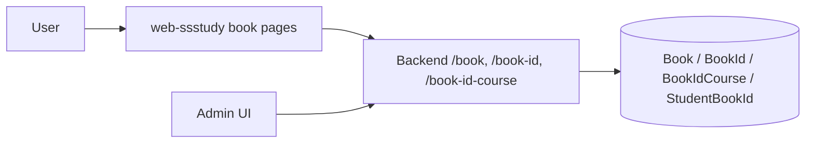

# 1. Thông tin module
- Tên module: Book / Book ID / Course bundle
- Mục tiêu nghiệp vụ: cho phép người dùng xem danh sách sách, xem chi tiết sách, tìm kiếm mã sách/book-id và xem khóa học bundle liên quan; cho phép admin quản trị sách, mã sách và course bundle.
- Phạm vi đặc tả: các chức năng có bằng chứng trực tiếp từ source: danh sách sách công khai, chi tiết sách, danh sách sách liên quan, tìm kiếm book-id, xem course bundle liên quan, quản trị sách/book-id/book-id-course ở admin.
- Source liên quan:
  - [api-develop/app/controllers/BookController.js](../../../../api-develop/app/controllers/BookController.js)
  - [api-develop/app/controllers/BookIdController.js](../../../../api-develop/app/controllers/BookIdController.js)
  - [api-develop/app/controllers/BookIdCourseController.js](../../../../api-develop/app/controllers/BookIdCourseController.js)
  - [api-develop/app/routes/routes.js](../../../../api-develop/app/routes/routes.js)
  - [web-admin/src/components/Master.js](../../../../web-admin/src/components/Master.js)
  - [web-ssstudy/src/app/sach/page.tsx](../../../../web-ssstudy/src/app/sach/page.tsx)
  - [web-ssstudy/src/app/sach-id/page.tsx](../../../../web-ssstudy/src/app/sach-id/page.tsx)
  - [web-ssstudy/src/app/account/my-course/MyCourseForm.tsx](../../../../web-ssstudy/src/app/account/my-course/MyCourseForm.tsx)
- Màn hình liên quan:
  - web-admin: /book, /book-id, /book-id-course
  - web-ssstudy: /sach, /sach-id, /account/my-course
- API liên quan:
  - /book/list
  - /book/detail
  - /book/list-related
  - /book-id/list-public
  - /book-id/detail
  - /book-id-course/list-owned
  - /book-id-course/list-public
  - /book-id-course/detail
- Entity/table/dữ liệu liên quan:
  - Book
  - BookId
  - BookIdCourse
  - BookReview
  - UserBuyData
  - StudentBookId
- Mức độ xác minh: Trung bình – cao; backend và public frontend có bằng chứng rõ ràng, admin CRUD có bằng chứng nhưng một số action/validation cụ thể chưa được kiểm tra sâu.
- Bằng chứng bổ sung: BookController.detail kiểm tra ownership bằng UserBuyDataModel, BookIdController.search kiểm tra quyền sở hữu và expired_date qua StudentBookId/StudentClassroom, và BookIdCourseController.detail xác nhận bundle ownership theo classroom_attached.

# 2. Actor và phân quyền

| Actor/Role | Permission | Chức năng | Điều kiện truy cập | Bằng chứng source | Ghi chú |
|---|---|---|---|---|---|
| Public / Guest | Xem sách và book-id công khai | Xem danh sách sách, chi tiết sách, danh sách liên quan | Public route trong backend | [api-develop/app/routes/routes.js](../../../../api-develop/app/routes/routes.js), [web-ssstudy/src/app/sach/page.tsx](../../../../web-ssstudy/src/app/sach/page.tsx) | Các endpoint public được đăng ký |
| Authenticated student | Xem course bundle đã sở hữu, tìm kiếm book-id | Search book ID, xem khóa học liên quan, xác định is_bought | Dùng req.user và StudentBookIdModel | [api-develop/app/controllers/BookIdController.js](../../../../api-develop/app/controllers/BookIdController.js), [web-ssstudy/src/app/account/my-course/MyCourseForm.tsx](../../../../web-ssstudy/src/app/account/my-course/MyCourseForm.tsx) | Có bằng chứng về ownership |
| Admin / Manager | Quản trị sách/key/course bundle | CRUD book, book-id, book-id-course | Qua admin UI và middleware auth/scope | [web-admin/src/components/Master.js](../../../../web-admin/src/components/Master.js) | Scope chi tiết cần xác nhận |

# 3. Danh sách chức năng

| Mã chức năng | Tên chức năng | Route/Màn hình | API | Controller/Service | Trạng thái xác minh |
|---|---|---|---|---|---|
| BOOK-01 | Xem danh sách sách | /sach | /book/list | BookController.list | Đã xác nhận |
| BOOK-02 | Xem chi tiết sách | /sach/[alias] | /book/detail | BookController.detail | Đã xác nhận |
| BOOK-03 | Xem sách liên quan | /sach/[alias] | /book/list-related | BookController.listRelated | Đã xác nhận |
| BOOK-04 | Tìm kiếm book-id / mã sách | /sach-id | /book-id/list-public, /book-id/detail | BookIdController.search, BookIdController.detail | Đã xác nhận |
| BOOK-05 | Xem course bundle và ownership | /account/my-course | /book-id-course/list-owned, /book-id-course/detail | BookIdCourseController | Có bằng chứng |
| BOOK-06 | Quản trị sách / book-id / book-id-course ở admin | /book, /book-id, /book-id-course | /book/*, /book-id/*, /book-id-course/* | BookController, BookIdController, BookIdCourseController | Có bằng chứng |

# 4. Đặc tả từng chức năng

## BOOK-01 Xem danh sách sách
- Mục đích: hiển thị danh sách sách cho người dùng truy cập trang sách.
- Actor/quyền: Public user.
- Điều kiện trước: có dữ liệu Book chưa bị xóa.
- Route/màn hình/action khởi đầu: /sach.
- Dữ liệu đầu vào và validation: keyword, page, limit, subject_id, category_id, is_featured, teacher_id, level, sort_key, sort_value, label_id. [CẦN XÁC NHẬN] cho validation chi tiết ở frontend.
- Luồng chính: frontend gọi /book/list -> controller lọc điều kiện -> query BookModel -> trả records và totalRecord -> UI render danh sách.
- Luồng thay thế/ngoại lệ: nếu không có dữ liệu, response rỗng.
- Business rule: chỉ trả Book có deleted_at = null; có hỗ trợ filter theo subject/category/teacher/level và label.
- API liên quan: /book/list.
- Màn hình liên quan: [web-ssstudy/src/app/sach/page.tsx](../../../../web-ssstudy/src/app/sach/page.tsx).
- Dữ liệu liên quan: Book.
- Bằng chứng source: [api-develop/app/controllers/BookController.js](../../../../api-develop/app/controllers/BookController.js).
- [CẦN XÁC NHẬN]: điều kiện filter và sắp xếp theo giáo viên/subject/category có nằm trong nghiệp vụ chính thức hay không.
- [RỦI RO / TECHNICAL DEBT]: controller có một số đoạn mã debug và logic sử dụng req.user.user_group không có guard riêng; cần kiểm tra nhất quán.

## BOOK-02 Xem chi tiết sách
- Mục đích: cho phép người dùng mở một sách cụ thể và xem thông tin liên quan.
- Actor/quyền: Public user.
- Điều kiện trước: Book ID tồn tại.
- Route/màn hình/action khởi đầu: /sach/[alias].
- Dữ liệu đầu vào và validation: id từ params; controller dùng BookModel.db.findOne và kiểm tra buy status nếu req.user tồn tại.
- Luồng chính: frontend gọi /book/detail -> backend lấy Book -> nạp teacher/classroomAttached/bookRelates/classroomRelates -> trả is_bought -> UI render.
- Luồng thay thế/ngoại lệ: nếu không tìm thấy Book, trả lỗi hệ thống chung.
- Business rule: nếu user đã mua hoặc có ownership thì is_bought = true; logic này dựa trên UserBuyDataModel.
- API liên quan: /book/detail.
- Màn hình liên quan: [web-ssstudy/src/app/sach/[alias]/page.tsx](../../../../web-ssstudy/src/app/sach/[alias]/page.tsx).
- Dữ liệu liên quan: Book, UserBuyData, Classroom.
- Bằng chứng source: [api-develop/app/controllers/BookController.js](../../../../api-develop/app/controllers/BookController.js).
- [CẦN XÁC NHẬN]: quy định mua/ownership cho sách và cách gắn vào classroom có phải là nghiệp vụ chính thức hay không.
- [RỦI RO / TECHNICAL DEBT]: logic dùng req.user có thể gây lỗi nếu req.user không tồn tại và các dữ liệu liên quan được nạp theo nhiều nguồn.

## BOOK-04 Tìm kiếm book-id / mã sách
- Mục đích: cho phép người dùng nhập book-id để xác thực sở hữu hoặc truy cập bundle khóa học.
- Actor/quyền: Authenticated student.
- Điều kiện trước: người dùng đã đăng nhập và có dữ liệu StudentBookId/StudentClassroom.
- Route/màn hình/action khởi đầu: /sach-id.
- Dữ liệu đầu vào và validation: keyword từ form; controller search lấy book_code và kiểm tra ownership bằng StudentBookIdModel và StudentClassroomModel.
- Luồng chính: frontend gọi /book-id/list-public hoặc /book-id/detail -> backend tìm BookId record -> kiểm tra quyền truy cập theo user context -> trả dữ liệu và trạng thái allowed/active.
- Luồng thay thế/ngoại lệ: nếu keyword không hợp lệ -> error; nếu user chưa sở hữu -> không được phép.
- Business rule: sách/khóa học bundle gắn với user và classroom; logic active/expired được tính dựa trên exprired_date.
- API liên quan: /book-id/list-public, /book-id/detail.
- Màn hình liên quan: [web-ssstudy/src/app/sach-id/page.tsx](../../../../web-ssstudy/src/app/sach-id/page.tsx).
- Dữ liệu liên quan: BookId, StudentBookId, StudentClassroom.
- Bằng chứng source: [api-develop/app/controllers/BookIdController.js](../../../../api-develop/app/controllers/BookIdController.js).
- [CẦN XÁC NHẬN]: timeout/expired_date và relationship giữa book-id và classroom được triển khai như thế nào trong vận hành thực tế.
- [RỦI RO / TECHNICAL DEBT]: controller chứa nhiều logic xử lý phụ quan trọng và chưa thấy một service layer thống nhất.

# 5. Sơ đồ luồng

# 6. Mapping UI – API – Backend – dữ liệu

| Chức năng | Web Admin | Web SSStudy | Route | API | Controller | Service | Entity/Table | Permission | Tình trạng xác minh | Ghi chú |
|---|---|---|---|---|---|---|---|---|---|---|
| Danh sách sách | /book | /sach | /book/list | /book/list | BookController | BookModel | Book | Public | Đã xác nhận | Có filter và pagination |
| Chi tiết sách | /book | /sach/[alias] | /book/detail | /book/detail | BookController | BookModel | Book, UserBuyData | Public/Authenticated | Đã xác nhận | Có is_bought |
| Sách liên quan | /book | /sach/[alias] | /book/list-related | /book/list-related | BookController | BookModel | Book | Public | Đã xác nhận | Dùng book_id/category |
| Book ID / mã sách | /book-id | /sach-id | /book-id/detail | /book-id/detail | BookIdController | BookIdModel | BookId, StudentBookId | Authenticated | Đã xác nhận | Có kiểm tra ownership |
| Course bundle | /book-id-course | /account/my-course | /book-id-course/list-owned | /book-id-course/list-owned | BookIdCourseController | BookIdCourseModel | BookIdCourse, StudentBookId | Authenticated | Có bằng chứng | Cần xác nhận flow đầy đủ |

# 7. Test scenario gợi ý
- Gọi /book/list với filter subject/category/teacher.
- Gọi /book/detail cho book có user buy data và không có.
- Gọi /book-id/detail với keyword hợp lệ/không hợp lệ.
- Gọi /book-id-course/list-owned với user đã sở hữu và chưa sở hữu.
