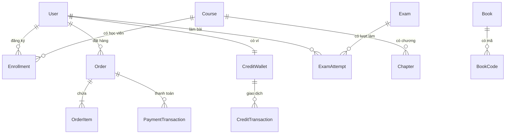

# Kiến trúc cơ sở dữ liệu mục tiêu — SSStudy

## 1. Mục đích tài liệu
Tài liệu này mô tả thiết kế cơ sở dữ liệu mục tiêu để xây dựng hệ thống SSStudy từ đầu, bao gồm chiến lược chọn database theo domain, hướng dẫn thiết kế model, ranh giới dữ liệu và nguyên tắc triển khai.

---

## 2. Chiến lược database hybrid

SSStudy sử dụng chiến lược hybrid:
- **PostgreSQL** cho các domain cần tính nhất quán giao dịch cao.
- **MongoDB** cho các domain nội dung linh hoạt, schema lồng nhau.

### 2.1 Phân chia domain

| Domain | Database | Lý do chọn |
|---|---|---|
| Người dùng (User, Role, Permission) | PostgreSQL | Identity core, tham chiếu từ nhiều domain |
| Xác thực (RefreshToken, Session, PasswordResetToken) | PostgreSQL | Cần revocation và timeout chính xác |
| Đơn hàng, thanh toán (Order, OrderItem, PaymentTransaction) | PostgreSQL | ACID transaction, audit tài chính |
| Ví/credit (CreditWallet, CreditTransaction) | PostgreSQL | Ledger bất biến, không cho phép mâu thuẫn |
| Coupon, áp dụng coupon | PostgreSQL | Ràng buộc chống reuse, consistency |
| Enrollment / Membership | PostgreSQL | Unique constraint, tham chiếu order |
| Kết quả thi (Attempt, Result) | PostgreSQL | Audit, không cho sửa kết quả đã lưu |
| Sách, mã kích hoạt (Book, BookCode, Activation) | PostgreSQL | Unique constraint trên mã, tracking trạng thái |
| Blog, nội dung tĩnh | MongoDB | Schema linh hoạt, ít quan hệ |
| Câu hỏi, đề thi phức tạp (ExamQuestion, Option) | MongoDB | Cấu trúc lồng nhau, parts/subparts |
| Tài liệu upload (Document, FileAsset) | MongoDB | Metadata linh hoạt |
| Cấu hình hệ thống (AppConfig, SiteConfig) | MongoDB | Key-value linh hoạt |

---

## 3. Thiết kế domain model theo module

### 3.1 Authentication / User

#### Model: User
| Field | Kiểu dữ liệu | Bắt buộc | Ý nghĩa | Validation |
|---|---|---|---|---|
| id | UUID | Có | Khóa chính | Auto-generate |
| fullname | varchar(255) | Có | Họ tên | Không rỗng |
| email | varchar(255) | Có | Email đăng nhập | Format email, unique |
| phone | varchar(20) | Không | Số điện thoại | Unique nếu có |
| studentCode | varchar(50) | Không | Mã học sinh | Unique nếu có |
| passwordHash | varchar(255) | Có | Mật khẩu đã hash | Không lưu plain text |
| status | enum | Có | Trạng thái tài khoản | active, inactive, blocked, pending_verify |
| roleId | UUID FK | Có | Vai trò chính | Tham chiếu Role |
| avatarUrl | varchar(500) | Không | Ảnh đại diện | URL hợp lệ |
| createdAt | timestamp | Có | Thời điểm tạo | Auto |
| updatedAt | timestamp | Có | Thời điểm cập nhật | Auto |

#### Model: Role
| Field | Kiểu dữ liệu | Bắt buộc | Ý nghĩa |
|---|---|---|---|
| id | UUID | Có | Khóa chính |
| code | varchar(50) | Có | Mã role: student, admin, superAdmin, teacher, supporter, financialAdmin |
| name | varchar(100) | Có | Tên hiển thị |

#### Model: Permission
| Field | Kiểu dữ liệu | Bắt buộc | Ý nghĩa |
|---|---|---|---|
| id | UUID | Có | Khóa chính |
| code | varchar(100) | Có | Mã permission: MODULE_ACTION |
| description | text | Không | Mô tả |

#### Model: RolePermission (bảng trung gian)
| Field | Kiểu dữ liệu | Bắt buộc | Ý nghĩa |
|---|---|---|---|
| roleId | UUID FK | Có | Tham chiếu Role |
| permissionId | UUID FK | Có | Tham chiếu Permission |

#### Model: RefreshToken
| Field | Kiểu dữ liệu | Bắt buộc | Ý nghĩa |
|---|---|---|---|
| id | UUID | Có | Khóa chính |
| token | varchar(500) | Có | Token opaque, unique |
| userId | UUID FK | Có | Người sở hữu |
| expiresAt | timestamp | Có | Thời điểm hết hạn |
| revokedAt | timestamp | Không | Null nếu chưa thu hồi |
| createdAt | timestamp | Có | Thời điểm tạo |

#### Index / Constraint đề xuất
| Bảng | Index / Constraint | Mục đích |
|---|---|---|
| User | UNIQUE(email) | Không trùng email |
| User | UNIQUE(phone) WHERE phone IS NOT NULL | Không trùng phone |
| User | UNIQUE(studentCode) WHERE studentCode IS NOT NULL | Không trùng mã học sinh |
| RefreshToken | UNIQUE(token) | Token duy nhất |
| RefreshToken | INDEX(userId, expiresAt) | Tìm kiếm nhanh theo user |

---

### 3.2 Classroom / Khóa học

#### Model: Course
| Field | Kiểu dữ liệu | Bắt buộc | Ý nghĩa |
|---|---|---|---|
| id | UUID | Có | Khóa chính |
| code | varchar(50) | Có | Mã khóa học, unique |
| name | varchar(255) | Có | Tên khóa học |
| description | text | Không | Mô tả |
| teacherId | UUID FK | Không | Giáo viên phụ trách |
| subjectId | UUID FK | Không | Môn học |
| groupId | UUID FK | Không | Nhóm lớp |
| type | enum | Có | online, offline |
| price | numeric(12,2) | Có | Giá hiện tại |
| originalPrice | numeric(12,2) | Không | Giá gốc |
| isPublished | boolean | Có | Đã xuất bản |
| isActive | boolean | Có | Đang hoạt động |
| ordering | int | Không | Thứ tự hiển thị |
| thumbnailUrl | varchar(500) | Không | Ảnh đại diện |
| createdAt | timestamp | Có | |
| updatedAt | timestamp | Có | |

#### Model: Chapter
| Field | Kiểu dữ liệu | Bắt buộc | Ý nghĩa |
|---|---|---|---|
| id | UUID | Có | Khóa chính |
| courseId | UUID FK | Có | Thuộc khóa học |
| title | varchar(255) | Có | Tiêu đề chương |
| ordering | int | Không | Thứ tự |

#### Model: Enrollment (StudentCourse)
| Field | Kiểu dữ liệu | Bắt buộc | Ý nghĩa |
|---|---|---|---|
| id | UUID | Có | Khóa chính |
| courseId | UUID FK | Có | Khóa học |
| userId | UUID FK | Có | Học viên |
| orderId | UUID FK | Không | Đơn hàng kích hoạt |
| enrolledAt | timestamp | Có | Thời điểm đăng ký |
| expiresAt | timestamp | Không | Thời điểm hết hạn |
| status | enum | Có | active, expired, cancelled |

#### Index / Constraint đề xuất
| Bảng | Index / Constraint | Mục đích |
|---|---|---|
| Course | UNIQUE(code) | Mã khóa học duy nhất |
| Enrollment | UNIQUE(courseId, userId) | Không đăng ký trùng |
| Enrollment | INDEX(userId, status, expiresAt) | Kiểm tra quyền truy cập nhanh |

---

### 3.3 Order / Payment

#### Model: Order
| Field | Kiểu dữ liệu | Bắt buộc | Ý nghĩa |
|---|---|---|---|
| id | UUID | Có | Khóa chính |
| userId | UUID FK | Có | Người mua |
| status | enum | Có | pending, paid, cancelled, refunded |
| totalAmount | numeric(12,2) | Có | Tổng tiền |
| discountAmount | numeric(12,2) | Không | Số tiền giảm |
| finalAmount | numeric(12,2) | Có | Số tiền thực thanh toán |
| couponId | UUID FK | Không | Coupon đã áp |
| paymentMethod | enum | Không | wallet, bank_transfer, payos, cod |
| note | text | Không | Ghi chú |
| createdAt | timestamp | Có | |
| updatedAt | timestamp | Có | |

#### Model: OrderItem
| Field | Kiểu dữ liệu | Bắt buộc | Ý nghĩa |
|---|---|---|---|
| id | UUID | Có | Khóa chính |
| orderId | UUID FK | Có | Thuộc đơn hàng |
| productType | enum | Có | course, bundle, book |
| productId | UUID | Có | ID sản phẩm |
| productName | varchar(255) | Có | Tên lưu tại thời điểm mua |
| unitPrice | numeric(12,2) | Có | Đơn giá tại thời điểm mua |
| quantity | int | Có | Số lượng |

#### Model: PaymentTransaction
| Field | Kiểu dữ liệu | Bắt buộc | Ý nghĩa |
|---|---|---|---|
| id | UUID | Có | Khóa chính |
| orderId | UUID FK | Có | Thuộc đơn hàng |
| gateway | enum | Có | payos, wallet, bank |
| gatewayTransactionId | varchar(255) | Không | ID giao dịch bên ngoài |
| status | enum | Có | pending, success, failed |
| amount | numeric(12,2) | Có | Số tiền giao dịch |
| webhookPayload | jsonb | Không | Payload webhook gốc |
| idempotencyKey | varchar(255) | Có | Khóa idempotency |
| processedAt | timestamp | Không | Thời điểm xử lý |
| createdAt | timestamp | Có | |

#### Model: CreditWallet
| Field | Kiểu dữ liệu | Bắt buộc | Ý nghĩa |
|---|---|---|---|
| id | UUID | Có | Khóa chính |
| userId | UUID FK | Có | Chủ ví, unique |
| balance | numeric(12,2) | Có | Số dư hiện tại |
| updatedAt | timestamp | Có | |

#### Model: CreditTransaction
| Field | Kiểu dữ liệu | Bắt buộc | Ý nghĩa |
|---|---|---|---|
| id | UUID | Có | Khóa chính |
| walletId | UUID FK | Có | Ví liên quan |
| type | enum | Có | top_up, deduct, refund |
| amount | numeric(12,2) | Có | Số tiền |
| referenceId | UUID | Không | ID đơn hàng hoặc tham chiếu |
| note | text | Không | Ghi chú |
| createdAt | timestamp | Có | |

#### Index / Constraint đề xuất
| Bảng | Index / Constraint | Mục đích |
|---|---|---|
| PaymentTransaction | UNIQUE(idempotencyKey) | Chống xử lý trùng webhook |
| PaymentTransaction | INDEX(orderId, status) | Tra cứu nhanh |
| CreditWallet | UNIQUE(userId) | Mỗi user có một ví |

---

### 3.4 Exam / Testing

#### Model: Exam
| Field | Kiểu dữ liệu | Bắt buộc | Ý nghĩa |
|---|---|---|---|
| id | UUID | Có | Khóa chính |
| title | varchar(255) | Có | Tên đề thi |
| description | text | Không | Mô tả |
| type | enum | Có | practice, official, word_exam |
| durationMinutes | int | Không | Thời gian làm bài |
| totalScore | numeric | Không | Tổng điểm tối đa |
| isPublished | boolean | Có | Đã xuất bản |
| hasPassword | boolean | Có | Có mật khẩu không |
| passwordHash | varchar | Không | Mật khẩu bảo vệ đề |
| courseId | UUID FK | Không | Gắn với khóa học |
| createdAt | timestamp | Có | |
| updatedAt | timestamp | Có | |

#### Model: ExamAttempt
| Field | Kiểu dữ liệu | Bắt buộc | Ý nghĩa |
|---|---|---|---|
| id | UUID | Có | Khóa chính |
| examId | UUID FK | Có | Đề thi |
| userId | UUID FK | Có | Người làm |
| status | enum | Có | in_progress, submitted, scored |
| startedAt | timestamp | Có | |
| submittedAt | timestamp | Không | |
| score | numeric | Không | Điểm (sau chấm) |
| totalCorrect | int | Không | Số câu đúng |

#### Index / Constraint đề xuất
| Bảng | Index / Constraint | Mục đích |
|---|---|---|
| ExamAttempt | INDEX(examId, userId, status) | Kiểm tra lượt làm hiện tại |

---

### 3.5 Book / BookCode

#### Model: Book
| Field | Kiểu dữ liệu | Bắt buộc | Ý nghĩa |
|---|---|---|---|
| id | UUID | Có | Khóa chính |
| code | varchar(50) | Có | Mã sách, unique |
| name | varchar(255) | Có | Tên sách |
| description | text | Không | Mô tả |
| isPublished | boolean | Có | Xuất bản |
| coverUrl | varchar(500) | Không | Ảnh bìa |
| price | numeric(12,2) | Không | Giá nếu bán |
| createdAt | timestamp | Có | |

#### Model: BookCode (mã kích hoạt)
| Field | Kiểu dữ liệu | Bắt buộc | Ý nghĩa |
|---|---|---|---|
| id | UUID | Có | Khóa chính |
| bookId | UUID FK | Có | Thuộc sách |
| code | varchar(100) | Có | Mã kích hoạt, unique |
| status | enum | Có | available, activated, expired |
| activatedByUserId | UUID FK | Không | Ai đã kích hoạt |
| activatedAt | timestamp | Không | Thời điểm kích hoạt |
| expiresAt | timestamp | Không | Hạn kích hoạt |

#### Index / Constraint đề xuất
| Bảng | Index / Constraint | Mục đích |
|---|---|---|
| BookCode | UNIQUE(code) | Mã kích hoạt duy nhất |
| BookCode | INDEX(bookId, status) | Tìm kiếm mã theo trạng thái |

---

## 4. Quan hệ tổng thể

---

## 5. Nguyên tắc thiết kế dữ liệu

- Không hard-delete dữ liệu nghiệp vụ quan trọng (order, payment, attempt) — dùng soft-delete hoặc trạng thái cancelled/archived.
- Giá sản phẩm trong `OrderItem` phải là giá tại thời điểm mua, không tham chiếu live price.
- `PaymentTransaction.idempotencyKey` bắt buộc để chống xử lý trùng webhook.
- Mã kích hoạt (BookCode) chỉ dùng một lần — kiểm tra trạng thái trước khi activate.
- Mọi bảng phải có `createdAt`; các bảng quan trọng thêm `updatedAt`.
- UUID làm khóa chính thay vì auto-increment integer để dễ distribute và bảo mật.

---

## 6. Chiến lược migration dữ liệu

Khi xây dựng hệ thống mới, nếu cần chuyển dữ liệu từ hệ thống cũ:

1. **Chuẩn bị**: inventory collection cũ, mapping field, xác định dữ liệu cần giữ.
2. **Chuyển đổi**: script migration với validation từng record, ghi log lỗi chi tiết.
3. **Đối soát**: so sánh số lượng record trước và sau migration.
4. **Rollback**: giữ dữ liệu cũ cho đến khi hệ thống mới ổn định.
5. **Cutover**: chuyển traffic sau khi đối soát thành công.

Nguyên tắc:
- Migration phải idempotent — chạy lại không gây lỗi.
- Không chạy migration trên production khi có traffic cao.
- Kiểm thử đầy đủ trên UAT trước khi chạy production.
