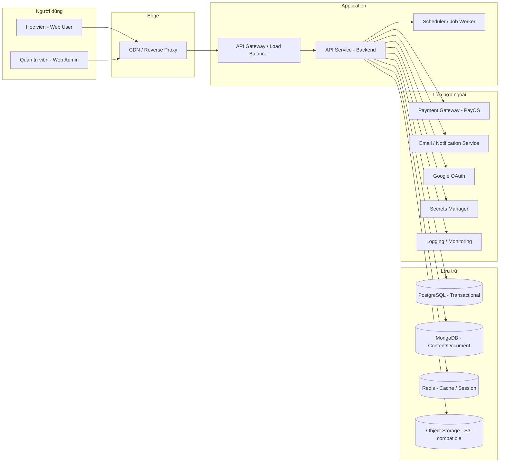

# Hạ tầng mục tiêu — SSStudy

## 1. Mục đích tài liệu
Tài liệu này mô tả hạ tầng mục tiêu để triển khai hệ thống SSStudy từ đầu. Nội dung tập trung vào kiến trúc đề xuất, thành phần cần có, hướng dẫn môi trường và vận hành — không mô tả hiện trạng cũ.

---

## 2. Tổng quan kiến trúc mục tiêu



---

## 3. Thành phần hạ tầng đề xuất

| Thành phần | Đề xuất công nghệ | Mục đích | Ghi chú |
|---|---|---|---|
| Database giao dịch | PostgreSQL (managed) | Order, payment, credit, membership, exam result | Cần ACID, foreign key, transactional boundary |
| Database nội dung | MongoDB (managed) | Blog, nội dung tĩnh, câu hỏi, tài liệu document | Schema linh hoạt, read-heavy |
| Cache / Session | Redis (managed, cluster mode) | Cache response, rate limit, session tạm thời | Không lưu dữ liệu quan trọng lâu dài |
| Object storage | S3-compatible (AWS S3 hoặc tương đương) | Lưu file upload, tài liệu, ảnh banner, media | Dùng signed URL cho nội dung bảo vệ |
| CDN | CloudFront hoặc tương đương | Cache static asset, giảm latency | Cấu hình TTL phù hợp cho content public |
| API Gateway / LB | AWS ALB hoặc tương đương | Routing, SSL termination, rate limiting | Kết hợp với WAF nếu cần |
| Backend runtime | Node.js / Docker container | Chạy API service | Containerize để dễ scale và deploy |
| Scheduler / Job Worker | Container riêng hoặc serverless function | Chạy job định kỳ và background task | Tách biệt khỏi API fleet |
| Email / Notification | SMTP service hoặc SES / SendGrid | Gửi email xác thực, đặt lại mật khẩu, thông báo | Cấu hình qua môi trường |
| Payment gateway | PayOS | Thanh toán nội địa | Webhook phải xác thực chữ ký |
| Google OAuth | Google OAuth 2.0 | Đăng nhập bằng Google | Client ID/Secret lưu trong secrets manager |
| Secrets Manager | AWS Secrets Manager hoặc Vault | Lưu secret, API key, connection string | Không hard-code trong repo |
| Monitoring / Logging | OpenTelemetry + Loki/Grafana hoặc CloudWatch | Log, metric, trace, alert | Tập trung log từ tất cả service |
| CI/CD | GitHub Actions hoặc GitLab CI | Build, test, deploy tự động | Phân tách pipeline theo môi trường |

---

## 4. Chiến lược database

### 4.1 Phân chia theo domain

| Domain | Database đề xuất | Lý do |
|---|---|---|
| Order, Payment, Credit, Coupon | PostgreSQL | Cần ACID transaction, tính nhất quán cao |
| Membership / Enrollment | PostgreSQL | Ràng buộc tham chiếu, không cho phép trùng lặp |
| Exam Attempt / Result | PostgreSQL | Cần tính toàn vẹn, audit |
| User / Auth | PostgreSQL | Identity core, FK từ nhiều domain |
| Blog / Content tĩnh | MongoDB | Schema linh hoạt, ít quan hệ phức tạp |
| Câu hỏi, đề thi phức tạp | MongoDB | Cấu trúc lồng nhau, subdocument |
| Metadata tài liệu upload | MongoDB hoặc PostgreSQL | Tùy thiết kế, ưu tiên nhất quán |

### 4.2 Nguyên tắc database

- Mỗi domain có ranh giới rõ ràng về nguồn dữ liệu (source of truth).
- Không truy cập DB trực tiếp từ controller — phải qua repository/service layer.
- Dùng transaction cho mọi luồng tài chính.
- Index các trường thường dùng filter/search/join.
- Backup định kỳ và kiểm thử drill restore.
- Không lưu secret/key trong cấu hình môi trường plain text.

---

## 5. Môi trường triển khai

| Môi trường | Mục đích | Ghi chú |
|---|---|---|
| Local | Phát triển và debug cá nhân | Docker Compose cho toàn bộ dependencies |
| DEV | Tích hợp nội bộ, chạy tự động CI | Deploy tự động khi merge vào nhánh dev |
| UAT | Kiểm thử nghiệm thu, QA, demo | Dữ liệu test, không dùng payment thật |
| PROD | Môi trường chính thức | Deploy có phê duyệt, monitoring đầy đủ |

### 5.1 Cài đặt môi trường local

Yêu cầu tối thiểu:
- Docker và Docker Compose
- Node.js phiên bản LTS
- File `.env.local` từ template `.env.example` (không commit file `.env` thật)

Khởi động:
```bash
docker compose up -d   # Khởi động PostgreSQL, MongoDB, Redis
npm install
npm run dev
```

Biến môi trường cần thiết:
```
DATABASE_URL=postgresql://...
MONGO_URI=mongodb://...
REDIS_URL=redis://...
JWT_SECRET=...
PAYOS_CLIENT_ID=...
PAYOS_API_KEY=...
GOOGLE_CLIENT_ID=...
GOOGLE_CLIENT_SECRET=...
AWS_S3_BUCKET=...
AWS_S3_REGION=...
SMTP_HOST=...
SMTP_PORT=...
SMTP_USER=...
SMTP_PASS=...
```

---

## 6. Bảo mật hạ tầng

- HTTPS bắt buộc trên tất cả môi trường ngoài local.
- HSTS header bật trên production.
- CORS giới hạn origin theo danh sách trắng môi trường.
- Rate limiting cho các endpoint xác thực và thanh toán.
- Input validation và sanitization trên mọi request.
- Webhook payment phải xác thực chữ ký (signature) và kiểm tra idempotency key.
- Không log thông tin nhạy cảm như password, secret, dữ liệu thẻ.
- Audit log cho các hành động quan trọng: thanh toán, cấp quyền, thay đổi role.
- Secrets phải lưu trong secrets manager, không hard-code trong code hoặc config file.

---

## 7. CI/CD

### 7.1 Luồng CI/CD đề xuất

```
Push code → Lint & Test → Build image → Push to registry → Deploy to target env
```

### 7.2 Nguyên tắc CI/CD

- Tách pipeline cho từng môi trường (dev, UAT, prod).
- Deploy lên production cần phê duyệt thủ công.
- Rollback phải thực hiện được trong vòng 5 phút.
- Container image phải được scan lỗ hổng bảo mật trước khi deploy.
- Infrastructure-as-Code (Terraform hoặc CloudFormation) cho tài nguyên cloud.
- Secrets không được lưu trong CI/CD config mà phải inject từ secrets manager.

---

## 8. Logging và Monitoring

### 8.1 Yêu cầu logging

- Mọi request HTTP phải có log: method, path, status code, response time, user ID nếu có.
- Lỗi phải log đầy đủ: stack trace, context, request ID.
- Audit log cho: tạo/hủy order, thanh toán, cấp/thu hồi quyền, thay đổi role người dùng.
- Không log: password, token, dữ liệu thẻ, thông tin cá nhân nhạy cảm.

### 8.2 Yêu cầu monitoring

- Health check endpoint cho mỗi service: `GET /health`.
- Alert khi error rate tăng đột biến.
- Alert khi response time vượt ngưỡng SLO.
- Dashboard theo dõi: số order/ngày, tỷ lệ thanh toán thành công, số lỗi 5xx.
- Job scheduler phải log execution status và alert khi thất bại.

---

## 9. Backup và Restore

- PostgreSQL: snapshot hàng ngày, point-in-time recovery.
- MongoDB: snapshot hàng ngày, logical export theo collection.
- Object storage: versioning bật trên bucket quan trọng.
- Kiểm thử drill restore ít nhất mỗi tháng.
- Thời gian giữ backup: tối thiểu 30 ngày.
- Runbook restore phải được ghi thành tài liệu và thử nghiệm.

---

## 10. Khả năng mở rộng (Scalability)

- API service được containerize, có thể scale ngang (horizontal scaling).
- Job worker tách biệt khỏi API fleet để không ảnh hưởng hiệu năng API.
- Cache Redis cho các truy vấn read-heavy (danh sách khóa học, nội dung tĩnh).
- CDN cache static asset và response công khai.
- Database connection pooling cấu hình phù hợp theo tải.
- Upload file lớn dùng presigned URL trực tiếp từ client lên S3, tránh qua API server.
