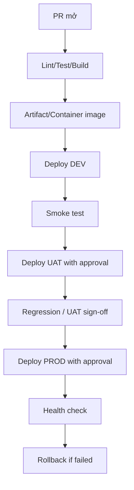

# SSStudy Infrastructure — Target Recommendation

## 1. Purpose and scope
- Purpose: provide a concise, implementation-ready infrastructure recommendation to support the SSStudy SRS modules.
- Scope: target architecture, recommended managed services, deployment patterns, security and observability guidance. This document is target-first and does not treat existing source code as the basis for design.

## 2. Overview — Target architecture

```mermaid
flowchart LR
   CDN[CDN / Reverse Proxy] --> Frontend[Frontend Static / Next.js]
   CDN --> APIGW[API Gateway / ALB]
   APIGW --> App[API service fleet]
   App --> Mongo[(Managed Document DB)]
   App --> Cache[(Managed Cache)]
   App --> ObjectStorage[(Object Storage)]
   App --> EmailSvc[Email / SMS / Notification]
   App --> Secrets[Secrets Manager]
   App --> Observability[Monitoring / Logging]
   App --> Jobs[Scheduler / Job Runner]
```

Key recommendations:
- Use managed services for stateful components where possible (managed document DB, managed cache, object storage).
- Frontend delivered via CDN; server-rendered frontend (Next.js) should be deployed as static + edge functions where appropriate.
- API layer behind an API Gateway/ALB with JWT/OAuth bearer authentication and rate limiting.
- Scheduler and background jobs run in isolated workers with idempotency and retry policies.

## 3. Recommended components

| Component | Recommendation | Rationale |
|---|---|---|
| Document DB | Managed document DB (MongoDB Atlas or compatible) with TLS, backups, point-in-time restore | Simplicity for document models while supporting ACID-ish transactions for critical flows via two-phase operations or multi-document transactions where supported |
| Cache | Managed Redis (clustered) with auth and TLS | Low-latency cache and transient state, use for session and rate-limiting only |
| Object storage | S3-compatible with lifecycle rules and CDN | Store media and large assets; use signed URLs for protected content |
| API layer | Containerized microservices behind API Gateway / ALB | Scalability, centralized auth and routing |
| Auth provider | JWT short-lived access + refresh tokens; optional OAuth2 for social login | Stateless access tokens reduce server load; implement refresh and revocation policy |
| Scheduler | Dedicated worker pool (serverless or container) with job queue (e.g., managed SQS) | Ensure idempotency and retries; separate from request-serving fleet |
| CI/CD | Pipeline with staging/promote workflow and canary/rolling deploys, automated infra-as-code | Reduce risky large rollouts and enable rollback |
| Secrets management | Managed secrets store (AWS Secrets Manager / HashiCorp Vault) | No secrets in repo or config files |
| Observability | Centralized logs, metrics, tracing (OpenTelemetry) and alerting | Support SLOs and incident response |

## 4. Database guidance

- Model design: document model for content and learning artifacts, relational design for transactional flows (orders/payments) if needed.
- Backups: daily snapshots, and verify periodic restore drills.
- Indexing: design indexes for frequent queries (user lookups, course listing, book lookup).
- Transactions: define transactional boundaries for payment/order flows; use DB transactions where supported or implement compensating operations.

## 5. Security and operations

- Use HTTPS everywhere and enforce HSTS.
- Validate and verify external webhooks (signature verification, timestamp + nonce, idempotency keys).
- Implement rate-limiting, request validation, and input sanitization.
- Audit critical actions (payments, refunds, permission changes) with structured logs.

## 6. Deployment patterns

- Environment separation: dev, staging, production with config per environment and secrets injected at deploy time.
- Use IaC (Terraform/CloudFormation) for infra reproducibility.
- Adopt CI pipeline that runs unit/integration tests and infra checks before promotion.

## 7. Legacy note

- This document is target-first. Any legacy evidence from prior codebases is intentionally not used as the primary design input. If a small set of legacy details is required for migration, collect them in `docs/legacy-notes.md` and treat them as optional migration references only.

## 8. Next steps

- Align `docs/business-rules.md` with critical domain invariants that affect infra decisions (e.g., payment idempotency, data retention).
- Create a deployment runbook and disaster recovery plan tied to the recommended managed services.

| Library | Version | Dự án sử dụng | Mục đích | Rủi ro/ghi chú | Bằng chứng |
|---|---:|---|---|---|---|
| react | ^16.14.0 | web-admin | UI admin | Version khá cũ | web-admin/package.json |
| react-scripts | 3.2.0 | web-admin | Build/toolchain | Cũ, có thể ảnh hưởng security | web-admin/package.json |
| axios | ^0.19.2 | web-admin | API client | Cần retry/error handling | web-admin/package.json |
| react-redux | ^7.2.6 | web-admin | State management | Không trực tiếp liên quan hạ tầng | web-admin/package.json |
| @react-oauth/google | ^0.12.1 | web-admin | Google OAuth | Cần review client ID/env | web-admin/package.json |

### 4.3 Web SSStudy

| Library | Version | Dự án sử dụng | Mục đích | Rủi ro/ghi chú | Bằng chứng |
|---|---:|---|---|---|---|
| next | ^16.0.10 | web-ssstudy | SSR/SSG frontend | Newer major version; cần verify compatibility | web-ssstudy/package.json |
| axios | ^1.6.2 | web-ssstudy | API client | Cần shared config and timeout | web-ssstudy/package.json |
| redux toolkit | ^2.0.1 | web-ssstudy | State management | Không trực tiếp liên quan hạ tầng | web-ssstudy/package.json |
| react-pdf | ^10.3.0 | web-ssstudy | Document preview | Cần storage/CDN review | web-ssstudy/package.json |

### 4.4 Dev tools

| Library | Version | Dự án sử dụng | Mục đích | Rủi ro/ghi chú | Bằng chứng |
|---|---:|---|---|---|---|
| docker | N/A | api-develop, web-admin, web-ssstudy | Containerization | Có Dockerfile nhưng chưa thấy compose orchestration | Dockerfile trong từng project |
| pm2 | N/A | api-develop | Process management | Dùng cho deploy production | api-develop/README.md, api-develop/DEPLOY_SETUP.md |
| Jenkins | N/A | api-develop, web-admin, web-ssstudy | CI/CD | Có pipeline nhưng chưa thấy approval/rollback formal | Jenkinsfile |
| GitLab CI | N/A | api-develop, web-admin, web-ssstudy | CI/CD | Có pipeline cho build/deploy | .gitlab-ci.yml |

## 5. Database và dữ liệu

| Hạng mục | AS-IS | Bằng chứng | Rủi ro | Đề xuất |
|---|---|---|---|---|
| Database engine | MongoDB | api-develop/package.json, api-develop/db/mongo.js, api-develop/config/uat.json | Không có bằng chứng về backup policy/restore runbook | Dùng managed MongoDB-compatible service và cấu hình backup/restore |
| Driver/ORM | Mongoose | api-develop/package.json, api-develop/db/mongo.js | Mongoose 5 cũ; cần review compatibility | Nâng cấp/kiểm thử trong môi trường staging |
| Connection config | URI và options từ config/default.json hoặc config/uat.json | api-develop/config/uat.json | Có hard-coded credential trong README cũ và config mẫu; cần loại bỏ | Dùng secrets manager và env injection |
| Migration/seeder | [CẦN XÁC NHẬN] | Không thấy script migration/seeder rõ ràng | Khó rollback và deploy dữ liệu | Tạo migration và seed workflow riêng |
| Transaction | [CẦN XÁC NHẬN] | Không thấy kết quả rõ ràng trong source | Có thể gây inconsistency cho payment/order | Định nghĩa transaction policy cho critical flows |
| Connection pool | poolSize/maxPoolSize trong config | api-develop/config/uat.json | Cần test under load | Tuning theo workload |
| Backup/restore | [CẦN XÁC NHẬN] | Không thấy script/guide backup rõ ràng | [RỦI RO / TECHNICAL DEBT] | Tạo backup schedule và restore drill |
| Domain/model chính | User, Classroom, Chapter, Book, BookId, Order, Payment, Blog | api-develop/app/controllers và app/models | Source rộng; không có inventory dữ liệu đầy đủ | Tạo inventory data model và ownership |

## 6. External service và integration

| Tích hợp | Mục đích | Hướng gọi | Cấu hình cần có | Callback/Webhook | Bảo mật cần kiểm tra | Bằng chứng | Trạng thái |
|---|---|---|---|---|---|---|---|
| PayOS | Thanh toán | Backend API -> PayOS SDK | Client ID, API key, checksum key | /hook/payment | Signature/verification, idempotency | api-develop/config/payOS.js, api-develop/app.js | Đã xác minh |
| SMTP | Gửi email | Backend -> nodemailer | Host, port, user, password | Không có | Secret management, TLS | api-develop/config/config.js.example, api-develop/package.json | Đã xác minh |
| AWS SDK / S3 | Storage/upload | Backend -> AWS SDK | Access key/secret/region/bucket | Không có | Least privilege, bucket policy, object lifecycle | api-develop/package.json, api-develop/config/config.js.example | Một phần |
| Google OAuth | Đăng nhập bằng Google | Frontend/Backend | Client ID, secret, redirect URL | Redirect callback | Secret storage và redirect allow-list | web-admin/.env, api-develop/config/config.js.example | Đã xác minh |
| OneSignal | Push notification | Backend -> OneSignal SDK | App ID/key | Không có | Secret storage | api-develop/package.json | Đã xác minh |
| File/CDN domain | Media/static | Frontend/Backend | CDN domain | Không có | HTTPS, cache policy | api-develop/config/config.js.example, web-ssstudy/next.config.mjs | Một phần |
| Scheduler/job | Cron/task | Backend internal | CRON config | Không có | Retry và alert | api-develop/app.js, api-develop/package.json | Đã xác minh |
| Analytics / monitoring | [CẦN XÁC NHẬN] | [CẦN XÁC NHẬN] | [CẦN XÁC NHẬN] | [CẦN XÁC NHẬN] | [CẦN XÁC NHẬN] | Không thấy evidence rõ | Cần xác nhận |

## 7. Environment variables và configuration inventory

| Biến cấu hình | Dự án sử dụng | Mục đích | Bắt buộc | Ví dụ an toàn | DEV/UAT/PROD khác nhau thế nào | Bằng chứng |
|---|---|---|---|---|---|---|
| PORT | api-develop | Port chạy backend | Có | 3000 | Có thể khác nhau theo môi trường | api-develop/app.js, api-develop/config/uat.json |
| NODE_ENV | api-develop, web-ssstudy, web-admin | Chế độ runtime | Có | production | DEV/STAGING/PROD dùng env riêng | web-ssstudy/.env.*, api-develop/ecosystem.config.js |
| NEXT_PUBLIC_API_URL | web-ssstudy | API base URL cho frontend | Có | https://api.example.com | DEV/UAT/PROD khác nhau | web-ssstudy/.env.* |
| NEXT_PUBLIC_EXAM_URL | web-ssstudy | URL exam service | Có | https://exam.example.com | Có thể khác nhau | web-ssstudy/.env.* |
| REACT_APP_BASE_URL | web-admin | URL admin frontend | Có | https://admin.example.com | Có thể khác nhau | web-admin/.env |
| REACT_APP_SSSTUDY_URL | web-admin | URL user site | Có | https://www.example.com | Có thể khác nhau | web-admin/.env |
| REACT_APP_GOOGLE_CLIEN_ID | web-admin, web-ssstudy | Google OAuth client ID | Có | google-client-id | DEV/UAT/PROD nên tách client | web-admin/.env, web-ssstudy/next.config.mjs |
| PAYOS.CLIENT_ID / API_KEY / CHECKSUM_KEY | api-develop | Payment | Có | payos-client-id | Phải phân môi trường | api-develop/config/config.js.example |
| SMTP.USERNAME / PASSWORD | api-develop | Email | Có | smtp-user | Không commit vào repo | api-develop/config/config.js.example |
| AMAZON.S3.* | api-develop | Storage | Có | s3-bucket-name | DEV/UAT/PROD nên khác nhau | api-develop/config/config.js.example |
| REDIS host/port/password | api-develop | Cache | Có | redis.internal | Có thể dùng host riêng | api-develop/config/uat.json |
| MONGODB URI/credentials | api-develop | Database | Có | mongodb://host:27017/db | Không lưu trong source | api-develop/config/uat.json |
| CORS/domain allow-list | api-develop | Cross-origin | Có | https://app.example.com | Cần tách theo môi trường | api-develop/app.js |
| LOG_LEVEL | api-develop | Logging verbosity | Có | debug | Có thể khác nhau | api-develop/config/uat.json |

## 8. Hướng dẫn cài môi trường local

### 8.1 Yêu cầu máy local
- Git
- Node.js [CẦN XÁC NHẬN] theo project hiện tại; source cho thấy nhiều version khác nhau:
  - api-develop/README.md: 14.19.1
  - web-admin/BUILD_GUIDE.md: 16.20.1
  - web-ssstudy/README.md: 18.18.1
  - api-develop/Dockerfile: 16.20.2
  - web-ssstudy/Dockerfile: 20
- Redis local hoặc container Redis
- Docker Desktop [khuyến nghị để chạy Redis/email helper nếu cần]
- Kết nối mạng để kết nối DB remote nếu dùng môi trường hiện tại

### 8.2 Backend API
1. Vào thư mục api-develop.
2. Cài dependency:
   - npm install
3. Tạo config từ template hoặc inject từ Jenkins/secret:
   - api-develop/config/config.js.example
   - api-develop/config/uat.json
4. Chạy backend:
   - npm start
   - hoặc node app.js
5. Port mặc định theo source:
   - 4548 ở config UAT
   - 4549 ở README
   - [RỦI RO / TECHNICAL DEBT] do không thống nhất

### 8.3 Frontend admin
1. Vào thư mục web-admin.
2. Cài dependency:
   - npm install --legacy-peer-deps
3. Tạo hoặc chỉnh file env:
   - .env
   - src/config/config.js hoặc src/config/config.js.example
4. Chạy:
   - npm start
5. Build production:
   - npm run build

### 8.4 Frontend user
1. Vào thư mục web-ssstudy.
2. Cài dependency:
   - npm install
3. Chọn env phù hợp:
   - .env.development
   - .env.staging
   - .env.production
4. Chạy development:
   - npm run dev
5. Build production:
   - npm run build

### 8.5 Database và cache local
- Redis: có thể chạy bằng Docker hoặc cài local.
- MongoDB: source hiện tại chủ yếu nhắm tới MongoDB remote; local MongoDB không phải bước bắt buộc theo README cũ.
- [CẦN XÁC NHẬN] việc có cần local MongoDB hay chỉ dùng remote DB cho dev.

### 8.6 Kiểm tra thành công
- Backend trả về response trên port phù hợp.
- Frontend có thể gọi API và render tương đối.
- Redis ping thành công.
- MongoDB connection thành công.

## 9. Hướng dẫn chạy bằng Docker

### 9.1 AS-IS
- Có Dockerfile cho api-develop, web-admin và web-ssstudy.
- Không thấy docker-compose.yml trong workspace.
- Không thấy compose orchestration cho toàn bộ stack (frontend + backend + db + redis).

### 9.2 TARGET recommendation
- Mục tiêu nên dùng docker-compose hoặc container orchestration cho môi trường DEV/UAT.
- Tách riêng:
  - api service
  - web-admin service
  - web-ssstudy service
  - mongo service
  - redis service
  - reverse proxy / ingress
- [CẦN XÁC NHẬN] liệu có cần chạy toàn bộ stack bằng Docker local hay chỉ chạy backend+db+cache.

## 10. Kiến trúc TARGET đề xuất

### 10.1 Giai đoạn tối thiểu: DEV/UAT
- Frontend static hosting: S3 + CloudFront hoặc Nginx/EC2 đơn giản.
- API: container trên EC2 hoặc ECS Fargate nhẹ.
- Database: managed MongoDB-compatible service.
- Cache: managed Redis.
- Secret: Secrets Manager/Parameter Store.
- Logging: CloudWatch/ELK hoặc managed logging.
- CI/CD: GitLab/Jenkins + deploy staging tự động.

### 10.2 Giai đoạn Production cơ bản
- Route 53 + ACM + CloudFront cho frontend.
- ALB + ECS Fargate hoặc EC2 autoscaling cho backend.
- RDS/managed MongoDB-compatible service cho DB.
- ElastiCache Redis cho cache.
- S3 cho static assets/uploads.
- CloudWatch + alerting.
- WAF + HTTPS.
- Backup policy và restore drill.

### 10.3 Giai đoạn scale cao hơn
- Multi-AZ, autoscaling, queue/event bus cho background job.
- S3 lifecycle, CDN caching, image optimization.
- Separate worker services for scheduled jobs.
- Advanced observability and secrets rotation.

| Service AWS | Có bắt buộc không | Dùng để làm gì | Module phụ thuộc | Điều kiện cần dùng | Alternative đơn giản hơn | Ưu tiên |
|---|---|---|---|---|---|---|
| Route 53 | Có | DNS | Frontend/API | Khi dùng domain riêng | [CẦN XÁC NHẬN] | Nên có |
| ACM | Có | SSL/TLS | Frontend/API | Khi dùng HTTPS | Self-signed/Let's Encrypt | Bắt buộc |
| CloudFront | Không bắt buộc | CDN/static assets | Frontend/static assets | Khi traffic lớn hoặc cần cache global | Nginx/EC2 | Nên có |
| S3 | Có | Static frontend và file assets | web-admin/web-ssstudy | Khi deploy frontend tĩnh | Nginx/EC2 | Bắt buộc |
| ALB | Có | Load balancer API | api-develop | Khi nhiều instances/container | Nginx/EC2 single | Bắt buộc khi scale |
| ECS Fargate | Không bắt buộc | Container runtime | api-develop | Khi cần orchestration nhẹ | EC2 single | Nên có |
| ElastiCache Redis | Không bắt buộc | Cache | api-develop | Khi Redis cần HA | Redis self-hosted | Nên có |
| CloudWatch | Có | Logging/metrics/alerts | api-develop | Khi có môi trường production | PM2 logs + host logs | Bắt buộc |
| Secrets Manager | Có | Secret storage | API/CI/CD | Khi có nhiều secret | Jenkins/host env vars | Bắt buộc |
| WAF | Không bắt buộc | Protection | API/frontend | Khi public exposure lớn | Nginx basic rate limit | Nên có |
| SES | Không bắt buộc | Email outbound | SMTP | Khi dùng AWS mail service | Existing SMTP | Tùy chọn |
| SQS/EventBridge | Không bắt buộc | Background jobs/events | Scheduled jobs | Khi có queue growth | Direct worker process | Tùy chọn |
| AWS Backup | Có | Backup | DB/storage | Khi production | Manual backup | Bắt buộc |

## 11. Mô hình môi trường DEV / UAT / PROD

| Hạng mục | DEV | UAT | PROD | Ghi chú |
|---|---|---|---|---|
| Domain | [CẦN XÁC NHẬN] | [CẦN XÁC NHẬN] | [CẦN XÁC NHẬN] | Source hiện có chưa xác nhận domain production chính thức |
| Backend | Local/EC2/container | EC2/container + staging config | Container/VM/ALB | Có pipeline cho Docker/PM2/EC2 |
| Frontend admin | Local/preview | S3/hosting hoặc container | S3/CloudFront hoặc container | Source có CI cho S3 deploy |
| Frontend user | Local/preview | Staging build | Production build | Có env file riêng |
| Database | Local/remote | Dedicated UAT DB | Dedicated PROD DB | Cần tách riêng |
| Storage | Local/dev bucket | UAT bucket | PROD bucket | Không thấy bucket name thực tế |
| Secret | Local env | Jenkins credentials/secret store | Secrets Manager | [RỦI RO / TECHNICAL DEBT] |
| Logging | Console/file | Centralized logs | Centralized logs + alerts | Hiện chưa có evidence central logging |
| Payment config | Sandbox/test keys | UAT keys | PROD keys | [CẦN XÁC NHẬN] |
| Email config | SMTP test | SMTP UAT | SMTP PROD | [CẦN XÁC NHẬN] |
| Monitoring | Minimal | Basic | Alerting + dashboards | [RỦI RO / TECHNICAL DEBT] |
| Backup | Manual | Scheduled | Scheduled + restore test | Chưa có evidence |
| Access control | Local accounts | Limited team access | Least privilege + IAM | [RỦI RO / TECHNICAL DEBT] |

## 12. CI/CD đề xuất

### 12.1 Hiện trạng
- api-develop có Jenkinsfile và Jenkinsfile.docker, plus .gitlab-ci.yml.
- web-admin có Jenkinsfile và .gitlab-ci.yml cho deploy S3.
- web-ssstudy có Jenkinsfile và .gitlab-ci.yml cho EC2 deploy via PM2/rsync.
- Có bằng chứng về build artifact, containerization và deployment automation.

### 12.2 Target đề xuất
- PR validation: lint/test/build.
- Build artifact per app.
- Deploy DEV tự động.
- Deploy UAT có approval.
- Deploy PROD có approval và manual gate.
- Migration DB trước/ sau deploy cần step riêng.
- Rollback bằng versioned image/artifact.
- Health check sau deploy.

## 13. Logging, monitoring và alerting

### 13.1 AS-IS
- Có dependency log4js và logstash udp.
- Backend dùng console logs và monitor.notifyErrorFunction.
- PM2 logs được đề cập cho production.
- Chưa thấy dashboard/alerting/central log platform rõ ràng.

### 13.2 TARGET recommendation
- Collect logs từ backend/frontend/container vào một nơi tập trung.
- Alert cho:
  - backend lỗi 5xx
  - DB connection failure
  - Redis unavailable
  - payment callback lỗi
  - upload lỗi
  - job/scheduler lỗi
- Metrics: request rate, error rate, CPU/memory, disk, queue length.

## 14. Backup, restore và disaster recovery

| Hạng mục | AS-IS | Rủi ro | Đề xuất |
|---|---|---|---|
| Database backup | [CẦN XÁC NHẬN] | [RỦI RO / TECHNICAL DEBT] | Tạo snapshot/backup schedule cho MongoDB và Redis |
| File storage backup | [CẦN XÁC NHẬN] | [RỦI RO / TECHNICAL DEBT] | Dùng versioning/lifecycle cho S3/object storage |
| Retention | [CẦN XÁC NHẬN] | [RỦI RO / TECHNICAL DEBT] | Định rõ retention 7/30/90 ngày |
| Restore test | [CẦN XÁC NHẬN] | [RỦI RO / TECHNICAL DEBT] | Thực hiện drill ít nhất hàng quý |
| RPO/RTO | [CẦN XÁC NHẬN] | [RỦI RO / TECHNICAL DEBT] | Khuyến nghị RPO 1 giờ, RTO 4 giờ ở mức cơ bản |
| Deploy migration | Không thấy runbook | [RỦI RO / TECHNICAL DEBT] | Backup trước deploy lớn và migration |

## 15. Security checklist

| Mục | Hiện trạng | Rủi ro | Khuyến nghị | Ưu tiên |
|---|---|---|---|---|
| Secret management | Có env/config mẫu, nhưng không thấy secret store production | [RỦI RO / TECHNICAL DEBT] | Dùng Secrets Manager/Parameter Store/Jenkins credentials | Cao |
| IAM least privilege | Chỉ thấy AWS CLI config và GitLab secret | [RỦI RO / TECHNICAL DEBT] | Tách role cho deploy và runtime | Cao |
| HTTPS | Có evidence domain và env URL, nhưng không xác nhận SSL implementation | [CẦN XÁC NHẬN] | Bắt buộc HTTPS cho frontend và API | Cao |
| CORS | app.js set Access-Control-Allow-Origin * | [RỦI RO / TECHNICAL DEBT] | Hạn chế allow-list per environment | Cao |
| JWT/token | Backend có token verification | [CẦN XÁC NHẬN] | Định nghĩa expiry, refresh strategy, storage an toàn | Cao |
| Password hashing | [CẦN XÁC NHẬN] | [RỦI RO / TECHNICAL DEBT] | Xác nhận thuật toán hashing và salt | Cao |
| Rate limiting | [CẦN XÁC NHẬN] | [RỦI RO / TECHNICAL DEBT] | Thêm rate limit cho auth/payment/webhook | Cao |
| WAF | [CẦN XÁC NHẬN] | [RỦI RO / TECHNICAL DEBT] | Thêm WAF cho public endpoints | Trung bình |
| SQL injection | MongoDB/Mongoose, không thấy raw SQL | [RỦI RO / TECHNICAL DEBT] | Giữ ODM và validate input | Trung bình |
| Upload validation | multer + config có thể dùng | [RỦI RO / TECHNICAL DEBT] | Whitelist MIME/type/size, virus scan nếu cần | Cao |
| Webhook signature | PayOS webhook route có thể cần verify | [CẦN XÁC NHẬN] | Verify signature/idempotency | Cao |
| Payment callback | /hook/payment route | [RỦI RO / TECHNICAL DEBT] | Log + replay protection + ownership check | Cao |
| Ownership check | [CẦN XÁC NHẬN] | [RỦI RO / TECHNICAL DEBT] | Kiểm tra quyền sở hữu cho order/classroom | Cao |
| Encryption at rest/in transit | [CẦN XÁC NHẬN] | [RỦI RO / TECHNICAL DEBT] | Enforce TLS + DB encryption | Cao |
| Database private network | [CẦN XÁC NHẬN] | [RỦI RO / TECHNICAL DEBT] | Đặt DB trong private subnet/k8s/ VPC | Cao |
| Audit log | [CẦN XÁC NHẬN] | [RỦI RO / TECHNICAL DEBT] | Log admin action và payment webhook | Trung bình |
| Dependency vulnerability scan | [CẦN XÁC NHẬN] | [RỦI RO / TECHNICAL DEBT] | Dùng dependabot/Snyk/OWASP | Trung bình |

## 16. Runbook vận hành

### 16.1 Deploy release
- Chuẩn bị artifact/image.
- Chạy build và test.
- Deploy DEV trước.
- Deploy UAT sau approval.
- Deploy PROD sau approval.
- Kiểm tra health check và error log.

### 16.2 Rollback
- Dùng versioned image/artifact.
- Rollback container/app và giữ DB không đổi nếu possible.
- Xác minh service health sau rollback.

### 16.3 Database migration
- Backup trước migration.
- Chạy migration trong UAT trước.
- Giám sát error log và query duration.
- Rollback plan phải có.

### 16.4 Xử lý lỗi payment callback
- Kiểm tra webhook log và IDempotency.
- Xác nhận signature/ownership.
- Reconcile order status bằng admin tooling hoặc script.

### 16.5 Xử lý lỗi upload/file storage
- Kiểm tra bucket/object storage permissions.
- Kiểm tra MIME/size validation.
- Kiểm tra CDN/domain và public URL.

### 16.6 Khôi phục database
- Restore từ backup.
- Verify application connectivity.
- Rebuild index/cache nếu cần.

### 16.7 Rotate secret
- Rotate SMTP/PAYOS/AWS credentials.
- Update CI/CD secret và deployment env.
- Validate no stale secret remains.

### 16.8 Kiểm tra service health
- Backend endpoint / health nếu có; nếu chưa có, thiết lập endpoint healthcheck.
- Frontend respond successfully.
- DB/Redis reachable.
- Payment webhook log accessible.

## 17. Danh sách cần xác nhận

### 17.1 Hạ tầng hiện tại
- Domain production/dev/uat thực tế là gì?
- Mỗi môi trường dùng host nào: EC2, container, S3, hoặc hybrid?
- Có reverse proxy/Nginx/ALB/ingress không?

### 17.2 Database
- Dùng MongoDB cluster nào? self-hosted hay managed?
- Backup/restore plan hiện tại là gì?
- Có index, replica set, sharding không?

### 17.3 AWS/cloud
- Có tài khoản AWS thật không? Service nào đang dùng?
- Bucket S3 thực tế, region, lifecycle policy gì?
- Có CloudFront, ACM, WAF, IAM role không?

### 17.4 Domain/DNS/SSL
- Domain nào đang chạy cho admin/user/api?
- SSL certificate hiện tại là gì?
- Có DNS và routing riêng cho từng môi trường không?

### 17.5 Payment
- PayOS đang dùng sandbox hay production?
- Có webhook verification và reconciliation runbook không?

### 17.6 File storage
- Upload lưu local hay object storage?
- Hạn mức dung lượng, expiration, CDN domain gì?

### 17.7 CI/CD
- Pipeline nào đang dùng chính thức: Jenkins hay GitLab CI?
- Approval flow cho UAT/PROD là gì?
- Rollback procedure có thực tế không?

### 17.8 Backup
- Backup schedule cho DB/storage hiện tại là gì?
- Có restore drill không?

### 17.9 Monitoring
- Có dashboard/alerting không?
- Log centralization có thực hiện không?

### 17.10 Security
- Secret được lưu ở đâu?
- Có WAF/rate limit/2FA cho admin không?
- Có policy cho upload và webhook verification không?

### 17.11 Chi phí/vận hành
- Chi phí vận hành hiện tại và dự kiến theo môi trường?
- Ai là owner cho infra, DB, payment, CI/CD?

## 18. Lộ trình triển khai hạ tầng đề xuất

| Phase | Việc cần làm | Output | Phụ thuộc | Rủi ro | Tiêu chí hoàn thành |
|---|---|---|---|---|---|
| Phase 0: Xác minh hiện trạng | Làm inventory infra, xác nhận domain, DB, secret, CI/CD | Inventory chính thức | Source + thông tin vận hành | Chậm xác nhận | Danh sách service/host/env rõ ràng |
| Phase 1: Local development ổn định | Đồng bộ Node version, env example, Docker local, Redis, Mongo | Dev setup repeatable | Source + máy dev | Version mismatch | Một dev mới có thể chạy được |
| Phase 2: DEV/UAT | Tách env, secrets, staging deployment, backup, health check | DEV/UAT ready | Secret store + host | Cấu hình sai | Deploy staging tự động |
| Phase 3: Production baseline | HTTPS, ALB/CDN, monitoring, backup, WAF | PROD baseline | Domain + cloud account | Chi phí và vận hành | Prod có monitoring + backup |
| Phase 4: Monitoring, backup, security hardening | Alert, audit log, vulnerability scan, rotate secrets | Hardened infra | Production baseline | Tác động vận hành | Alert và runbook sẵn sàng |
| Phase 5: Scale/performance | Autoscaling, queue, caching, optimization | Scalable system | Traffic và business growth | Over-engineering | Load test đạt mục tiêu |
