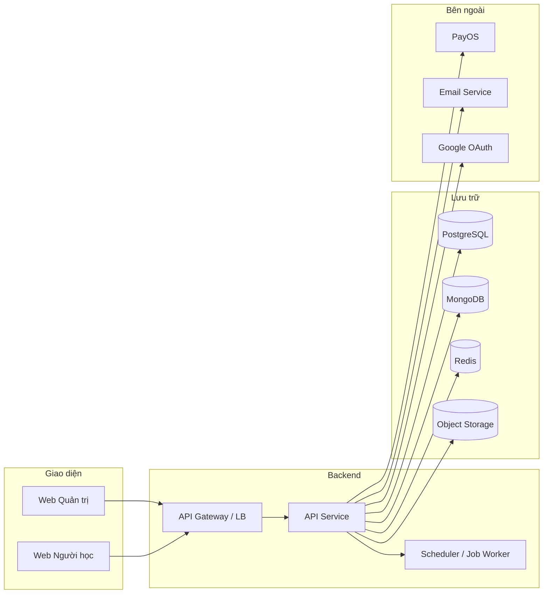
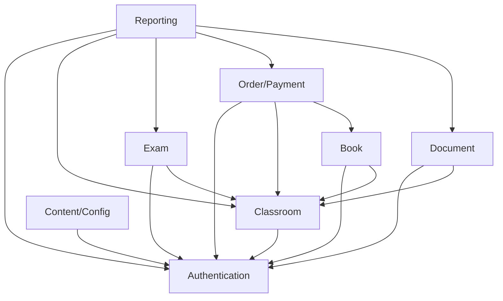

# Kiến trúc mục tiêu — SSStudy

## 1. Mục đích tài liệu
Tài liệu này mô tả kiến trúc mục tiêu của hệ thống SSStudy để AI Agent và developer biết code nên đặt ở đâu, module nào phụ thuộc module nào và quy tắc kiến trúc nào phải tuân thủ khi xây dựng hệ thống từ đầu.

---

## 2. Tổng quan hệ thống

SSStudy là hệ thống luyện thi đại học gồm các thành phần chính:

| Thành phần | Mục đích | Người dùng |
|---|---|---|
| Web người học (Web User) | Truy cập khóa học, tài liệu, đề thi, giỏ hàng, lịch sử | Học viên |
| Web quản trị (Web Admin) | Quản lý nội dung, người dùng, đơn hàng, cấu hình | Admin, giáo viên, vận hành |
| Backend API | Cung cấp dữ liệu, thực thi nghiệp vụ, xác thực, phân quyền | Gọi từ cả hai web |
| Database | Lưu trữ dữ liệu giao dịch và nội dung | Hệ thống |
| File storage | Lưu tài liệu, ảnh, media | Hệ thống |
| Payment gateway | Xử lý thanh toán và webhook | Học viên, hệ thống |
| Email / Notification | Gửi email xác thực, thông báo | Học viên, admin |
| Scheduler / Job worker | Xử lý tác vụ định kỳ, hết hạn membership | Hệ thống |

---

## 3. Sơ đồ kiến trúc tổng thể

---

## 4. Kiến trúc backend mục tiêu

### 4.1 Mô hình tổ chức

- **Modular monolith**: tất cả module trong một ứng dụng, tách biệt theo domain.
- Không microservice ở giai đoạn đầu — sẽ tách sau khi hệ thống ổn định.
- Mỗi module gồm: `controller`, `service`, `repository`, `dto`, `validation`.
- `shared/` dùng cho: auth middleware, error handler, logger, config, utils.

### 4.2 Nguyên tắc layer

| Layer | Trách nhiệm | Không được làm |
|---|---|---|
| Controller | Nhận request, validate đầu vào, gọi service, trả response | Không chứa business rule, không gọi DB trực tiếp |
| Service | Business logic, orchestration, kiểm tra permission | Không gọi controller khác, không truy cập DB trực tiếp |
| Repository | Truy cập DB, mapping data | Không chứa business logic |
| DTO / Validation | Định nghĩa shape của request/response | |

---

## 5. Ranh giới module và phụ thuộc

| Module | Trách nhiệm chính | Không được làm | Được phép phụ thuộc |
|---|---|---|---|
| **Authentication** | Đăng ký, đăng nhập, token, phân quyền, quản lý user | Không xử lý nội dung nghiệp vụ | Không phụ thuộc module khác |
| **Classroom** | Khóa học, chương, bài học, membership, progress | Không xử lý thanh toán trực tiếp | Authentication |
| **Document** | Tài liệu, danh mục, quyền xem, upload | Không triển khai exam | Authentication, Classroom |
| **Exam** | Đề thi, câu hỏi, lượt làm, chấm điểm, kết quả | Không xử lý thanh toán | Authentication, Classroom |
| **Order/Payment** | Giỏ hàng, đơn hàng, coupon, payment, credit | Không quyết định nghiệp vụ nội dung | Authentication, Classroom, Book |
| **Content/Config** | Blog, landing page, cấu hình hệ thống | Không xử lý exam hoặc payment | Authentication |
| **Book** | Sách, mã kích hoạt, bundle khóa học | Không thay thế Classroom | Authentication, Classroom, Order |
| **Reporting** | Báo cáo, import/export, job scheduler, tích hợp | Không sửa dữ liệu nguồn | Authentication, tất cả module (chỉ đọc) |

### 5.1 Dependency rules

- `Authentication` không phụ thuộc module nào — là module nền tảng.
- Các module nghiệp vụ phụ thuộc `Authentication` để kiểm tra token và permission.
- `Classroom` là module trung tâm — `Document`, `Exam`, `Book` đều có thể tham chiếu.
- `Order/Payment` phụ thuộc `Classroom` và `Book` để xác định sản phẩm, không phụ thuộc nội dung.
- `Reporting` chỉ đọc dữ liệu từ các module khác qua service — không ghi.
- **Không tạo dependency vòng** giữa hai module.
- Module khác muốn dùng dữ liệu phải đi qua service/API của module sở hữu.

### 5.2 Sơ đồ dependency

---

## 6. Quy tắc API

- REST naming rõ ràng: `GET /api/v1/courses`, `POST /api/v1/courses/{id}/enroll`.
- Pagination cho mọi endpoint trả danh sách: `page`, `limit`, `total`.
- Filter và search dùng query params.
- Error response thống nhất theo `CLAUDE.md`.
- Idempotency key bắt buộc cho payment webhook.
- Ownership check: user chỉ xem/sửa dữ liệu của mình.
- Admin endpoint phân biệt với user endpoint: `/api/v1/admin/...`.

---

## 7. Quy tắc bảo mật kiến trúc

- Mọi API endpoint cần xác thực phải kiểm tra token ở middleware.
- Permission kiểm tra ở service layer, không chỉ frontend.
- Không trust giá, điểm, quyền từ request body.
- Upload phải validate file type và size trước khi lưu.
- Webhook payment phải xác thực chữ ký (signature).
- Rate limiting cho endpoint xác thực và thanh toán.

---

## 8. Kiến trúc frontend mục tiêu

### 8.1 Web người học (Next.js)
- Dùng App Router của Next.js.
- Server-Side Rendering cho trang cần SEO (danh sách khóa học, blog).
- Client-Side Rendering cho trang tương tác cao (làm bài thi, giỏ hàng).
- API client tập trung trong `services/`.
- Auth guard ở middleware Next.js, không chỉ component.

### 8.2 Web quản trị (React / Next.js)
- Dashboard, form quản lý, bảng dữ liệu.
- Permission-based menu và route guard.
- Shared component dùng chung với web người học nếu phù hợp.

---

## 9. Quy tắc reporting, import, export, scheduler

- Job/scheduler chỉ chứa orchestration — business rule phải nằm trong service layer.
- Export lớn phải thực thi async: tạo export request → job xử lý → thông báo khi xong.
- Import phải ghi `ImportBatch`, lỗi theo dòng, không dừng khi gặp lỗi một dòng.
- Integration đi qua adapter/service riêng — không gọi API ngoài trực tiếp từ controller.
- Mọi integration callback phải có log và retry policy.
- Reporting không được làm sai lệch dữ liệu nguồn.

---

## 10. Checklist review kiến trúc

- [ ] Module boundaries rõ ràng.
- [ ] Không có dependency vòng.
- [ ] Controller không gọi DB trực tiếp.
- [ ] Business rule nằm ở backend service.
- [ ] API response theo chuẩn `CLAUDE.md`.
- [ ] Validation và error handling đầy đủ.
- [ ] Permission kiểm tra ở backend.
- [ ] Audit log cho hành động quan trọng.
- [ ] Test coverage cho service layer chính.

---

## 11. Quy tắc khi thêm module mới

- Tạo module mới chỉ khi nghiệp vụ rõ ràng và đã có SRS.
- Tuân thủ dependency rules — không phụ thuộc vòng.
- Cập nhật `business-rules.md` nếu có rule mới.
- Cập nhật tài liệu này (dependency diagram, module boundary).
- Không lặp lại nghiệp vụ đã có trong module khác.
