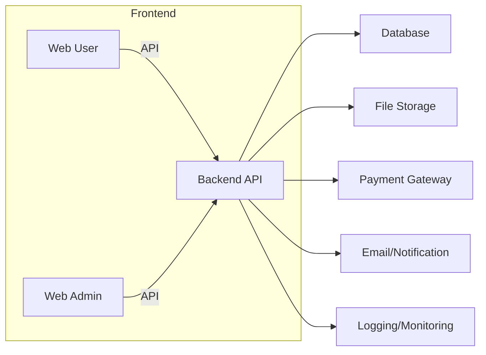

# architecture.md — Kiến trúc mục tiêu SSStudy

## 1. Mục đích tài liệu
Tài liệu này mô tả kiến trúc mục tiêu của hệ thống SSStudy để AI Agent và developer biết code nên đặt ở đâu, module nào phụ thuộc module nào và quy tắc kiến trúc nào phải tuân thủ.

## 2. Bối cảnh hệ thống
- SSStudy là hệ thống luyện thi đại học.
- Có frontend người học (web user).
- Có trang quản trị (web admin).
- Có backend API.
- Có nội dung học, đề thi, tài liệu, khóa học, đơn hàng và thanh toán.

## 3. Kiến trúc tổng thể mục tiêu
- Web user: giao diện người học, truy cập bài học, đề thi, tài liệu, giỏ hàng, lịch sử, profile.
- Web admin: giao diện quản lý nội dung, quản lý khóa học, quản lý đề thi, quản lý đơn hàng và người dùng.
- Backend API: cung cấp dữ liệu cho cả web user và web admin.
- Database: cân nhắc PostgreSQL cho transactional domain; MongoDB có thể dùng cho content/document nếu cần.
- File storage: lưu file upload, tài liệu, ảnh banner, media.
- Payment gateway: cổng thanh toán hoặc payment provider.
- Email/notification: gửi email xác thực, thông báo thanh toán, thông báo hệ thống.
- Logging/monitoring: log lỗi, audit, health check.
- CI/CD: build/test/deploy tự động, review mã.

## 4. Sơ đồ kiến trúc Mermaid

## 5. Kiến trúc backend mục tiêu
- Mô hình: modular monolith trước, không microservice ở giai đoạn đầu.
- Chia module theo nghiệp vụ (authentication, classroom, document, exam, order/payment, content/config, book/bundle).
- Mỗi module gồm: controller, service, repository, dto, validation.
- Shared/common dùng cho auth, error, logging, config, utils.
- Không gọi DB trực tiếp từ controller.
- Không đặt business rule ở frontend.

## 6. Kiến trúc frontend mục tiêu
- Web user: module pages, module components, service gọi API, store/state.
- Web admin: dashboard, form quản lý, service API, shared component.
- Route/module/page/component/service/store rõ ràng.
- Base/shared UI components dùng chung cho cả web user và admin nếu phù hợp.
- Không duplicate component cục bộ nếu có thể dùng shared component.
- API client tập trung.
- Guard/permission rõ ràng ở cả frontend và backend.

## 7. Module boundaries
| Module | Trách nhiệm | Không được làm | Phụ thuộc được phép | API public/internal | Ghi chú |
|---|---|---|---|---|---|
| Authentication | Đăng ký, đăng nhập, phân quyền, token | Không xử lý content riêng | Không | Public/Internal | Core auth |
| Classroom | Khóa học, membership, progress | Không quản lý order/payment trực tiếp | User, Order, Exam | Public/Internal | Core domain |
| Document | Tài liệu, quyền xem, upload | Không triển khai exam | Classroom, User | Public/Internal | Content domain |
| Exam | Đề thi, attempt, chấm điểm | Không xử lý thanh toán | Classroom, User, Document | Public/Internal | Core học tập |
| Order/Payment | Cart, order, coupon, payment | Không quyết định nghiệp vụ content | User, Course, Credit | Public/Internal | Commerce |
| Content/Config | Blog, landing, cấu hình | Không xử lý exam | User, Admin | Public | Hỗ trợ |
| Book/Bundle | Sách, mã sách, gói | Không thay thế classroom | Product, Classroom, Order | Public/Internal | Commerce |
| Reporting/Import/Export/Integration/Scheduler | Báo cáo, import/export, job, scheduler, tích hợp ngoài | Không lưu business rule rời rạc ở scheduler; không thao tác dữ liệu khi chưa xác thực | Auth, Classroom, Exam, Order, Document, Content | Internal | Phụ trợ vận hành |

## 8. Dependency rules
- Auth có thể được module khác phụ thuộc.
- Classroom là core domain.
- Document phụ thuộc classroom/membership nếu tài liệu PRO.
- Exam phụ thuộc classroom/membership và question/result.
- Order/payment phụ thuộc user, product/course/bundle, coupon, credit.
- Content/config là module hỗ trợ.
- Book/bundle kết nối với classroom/course và commerce.
- Reporting/Import/Export/Integration/Scheduler phụ thuộc vào Auth, Classroom, Exam, Order và Document để lấy dữ liệu.
- Không để dependency vòng.

## 9. Architecture principles for reporting/import/export/integration/scheduler
- Job/scheduler chỉ chứa orchestration; business rule phải nằm trong service/domain layer.
- Export lớn phải thực thi async qua export request và job.
- Import phải ghi import batch, line result và validation chi tiết.
- Integration phải đi qua adapter/service riêng; callback phải có log và retry policy.
- Reporting không được làm sai lệch dữ liệu nguồn.

## 9. API design rules
- REST naming rõ ràng.
- Pagination/filter/search.
- Error response chuẩn.
- Validation response rõ.
- Idempotency cho payment/webhook.
- Ownership check cho dữ liệu user.

## 10. Database architecture
- Hiện trạng legacy: MongoDB/Mongoose.
- Khuyến nghị mục tiêu: cân nhắc PostgreSQL cho transactional domain như order/payment/result.
- MongoDB có thể giữ cho content/document linh hoạt nếu dùng hybrid.
- Tham chiếu `docs/03-infrastructure/SSSTUDY-DATABASE-ARCHITECTURE-ASSESSMENT.md`.

## 11. Security architecture
- Authentication phải xác thực trước mọi API cần user.
- Role/permission kiểm tra ở backend.
- Ownership rule cho dữ liệu người dùng.
- Token/session quản lý an toàn.
- CORS giới hạn.
- Rate limit cho endpoint nhạy cảm.
- Upload validation kiểm tra file type/size.
- Payment webhook verification.

## 12. Deployment architecture
- Local: môi trường dev.
- DEV: môi trường nội bộ.
- UAT: môi trường kiểm thử.
- PROD: môi trường chính thức.
- AWS/cloud tham chiếu `docs/03-infrastructure/SSSTUDY-INFRASTRUCTURE-AS-IS-AND-TARGET.md`.

## 13. Quy tắc khi mở rộng module mới
- Tạo module mới chỉ khi nghiệp vụ rõ.
- Tuân thủ dependency rules.
- Cập nhật business-rules và architecture.
- Không lặp nghiệp vụ đã có.

## 14. Quy tắc migration từ source cũ
- Source cũ chỉ tham khảo.
- Dùng legacy reference cho nghiệp vụ và dữ liệu.
- Không copy code, trừ khi một logic rõ ràng chưa có trong tài liệu.

## 15. Checklist review kiến trúc
- Module boundaries rõ.
- Không dependency vòng.
- Controller không gọi DB trực tiếp.
- Business rule nằm backend.
- API response chuẩn.
- Validation và error handling.
